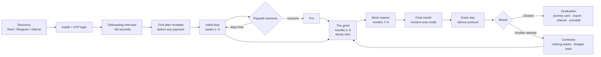
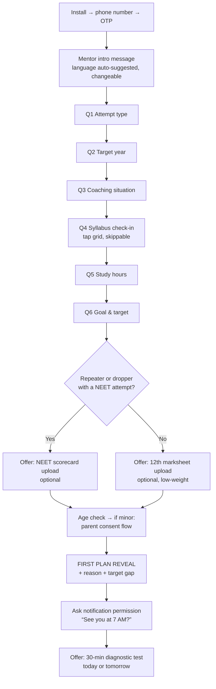
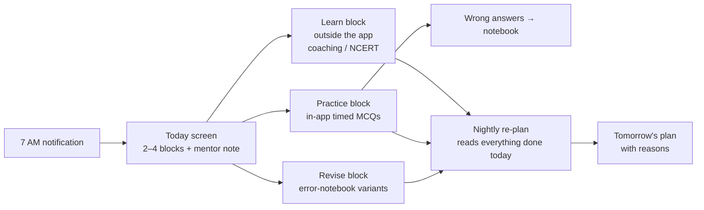
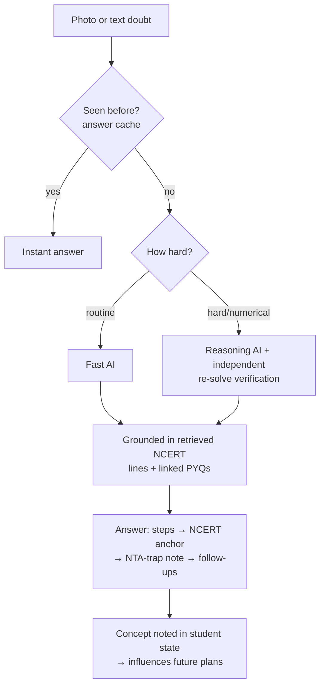
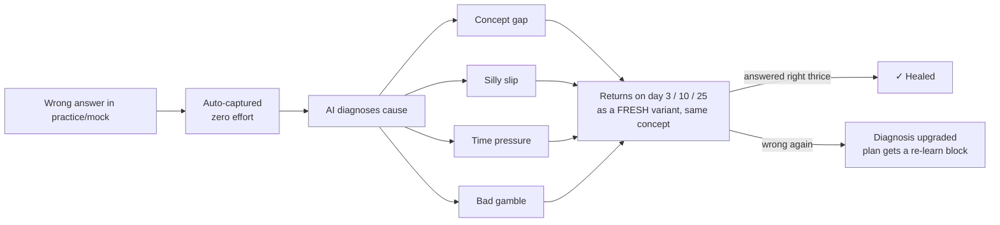
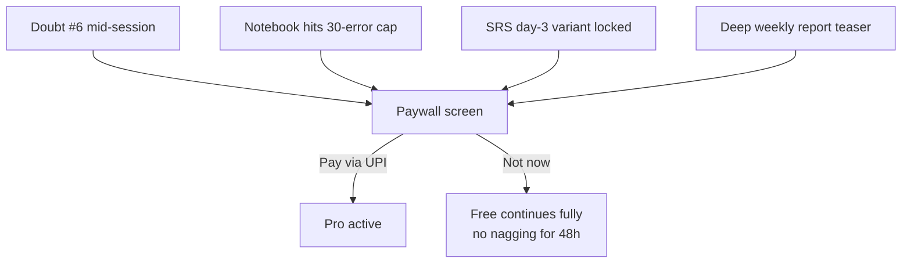
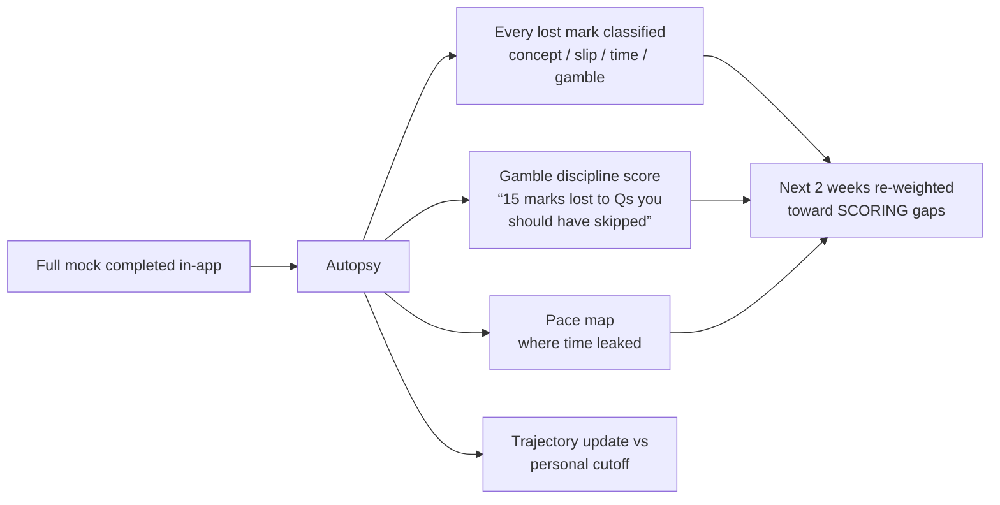
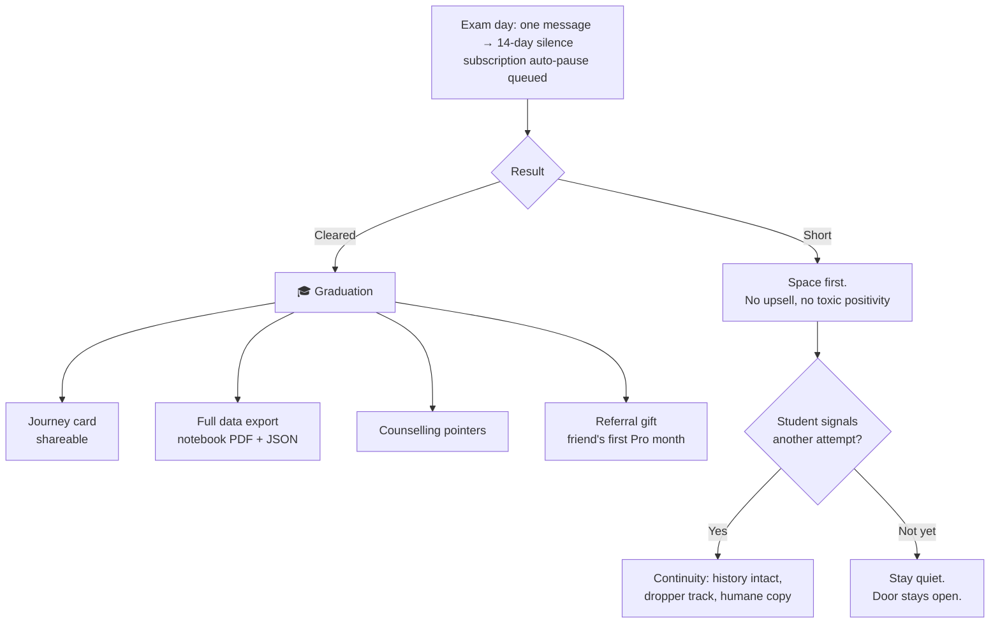

# MARG AI — Product Specification v2.0

**Product:** A fully digital, AI-only personal mentor for NEET aspirants (Android-first).
**This document:** the complete product definition — student lifecycle, every feature,
every screen, every rule. It deliberately contains **no implementation details**.
System architecture, API design, data modeling, and all technical decisions are owned
by the implementing agent (Claude Code), which should plan them from this document.

---

## 1. Vision & product principles

MARG AI replaces the one thing money can't usually buy in NEET prep: **a personal mentor
who knows you.** It does not teach (no lectures, no faculty, ever). It plans each
student's day, gives them the right practice, answers their doubts at any hour, and makes
sure they never repeat a mistake — all adapted nightly to that one student.

**Principles (every feature must obey these):**

1. **Evidence rule** — the app never says anything about a student it cannot back with
   that student's own data. Every recommendation shows its reason. A claim about students
   in general may rest on the collective record (§9.6) and is worded as such; it never
   stands in for knowledge of this student.
2. **Trust rule** — verified answers only; honest pricing; one-tap cancel; instant
   refunds; no dark patterns; uploaded documents deleted after reading.
3. **Mentor voice** — warm, direct, Hinglish-capable, never guilt-tripping, never fake-human.
   The app is proudly AI: "never annoyed, never asleep."
4. **Habit before features** — the daily loop (plan → practice → doubts → notebook →
   re-plan) is the product; everything else serves it.
5. **Phone-first reality** — mid-range Android, patchy internet, one-hand use.
6. **The exam ends** — the product is designed for a graceful exit (graduation), not
   artificial retention.

**Business model:** Free tier (genuinely useful) + Pro subscription.
List ₹499/month; founding price ₹299/month; annual ₹2,999. Payments via UPI autopay.

---

## 2. Who it's for

- **Droppers/repeaters** (primary launch segment): self-directed, desperate for structure,
  often self- or parent-funded, live in Telegram/YouTube communities.
- **Coaching students** (PW/Aakash/Allen/online): use MARG as the companion —
  direction, practice intelligence, doubt backup, mistake repair.
- **Self-study freshers**: MARG is their sequencer and mentor from chapter one.
- **The parent** (frequent payer): needs trust and visibility, not features.

---

## 3. Technology constraints (fixed) — everything else is Claude Code's to design

- Mobile app: **Flutter** (latest stable), Android first; iOS/web later from same codebase.
- Backend: **Java (latest LTS) + Spring Boot 4.x**.
- Database: **PostgreSQL 18** (with vector search capability for retrieval).
- Cloud: **AWS, ap-south-1 (Mumbai)**; AI models via **Amazon Bedrock**
  (cost-efficient model for routine work, stronger reasoning model for hard problems,
  batch processing for nightly jobs, aggressive caching everywhere).
- Payments: **Razorpay** (UPI autopay). OTP SMS: Indian DLT-compliant provider (e.g. MSG91).
  Push: **FCM**. Analytics: PostHog.
- Non-negotiable product-level technical behaviors: answers are judged server-side;
  numerical AI answers are independently verified before display; every AI answer is
  grounded in NCERT retrieval; uploaded document images are deleted within 24 hours;
  per-user AI cost circuit breakers exist; all copy is externalized for EN/HI/Hinglish.

*Claude Code: plan the architecture, APIs, schemas, pipelines, and infrastructure
yourself from this document. Propose the plan before building.*

---

## 4. The student lifecycle (end to end)



### Phase 0 — Discovery & install
Acquisition is organic by design: product-output Reels/Shorts (mistake autopsies,
doubt-solve clips), NEET Telegram/Discord communities, mid-size educator affiliates,
and graduation referrals. Play Store listing promises ONE thing: *a personal AI mentor
for NEET.* App must be small and fast on a ₹10k phone.

### Phase 1 — Onboarding (§5) → first plan in minutes, value before money.

### Phase 2 — Habit formation (weeks 1–3)
Morning notification → Today screen → blocks done in/around the app → first doubt
solved (“the 2 AM moment”) → first weekly trajectory card (deliberately humble:
“Early days — this number gets honest as I know you better”). Paywall appears only
at natural friction (§6.9), never as a wall.

### Phase 3 — The grind (months 2–6)
Where competitors lose students and MARG earns its keep: nightly re-planning absorbs
real life (weddings, bad weeks), the error notebook crosses critical mass and starts
visibly “healing” mistakes, and **slump care** (§6.6) quietly saves the month-4 dip.

### Phase 4 — Mock season (months 7–9)
The plan's center of gravity shifts from learning to testing: weekly then twice-weekly
full mocks, each followed by an **autopsy** — every lost mark classified, gamble
discipline scored, and the plan re-weighted toward *scoring* gaps (different from
knowledge gaps). Trajectory now speaks in the student's own target: “on this trend you
clear last year's cutoff for your category by ~22 marks.”

### Phase 5 — Final month
The app changes personality: no new content; revision-only plans built from the
student's **danger zones** (open errors) + high-yield recall; daily volume *decreases*;
sleep is protected. T-3 days: light recall only. Eve of exam: one message —
“You've healed 214 errors since August. You're ready. Phone down by 10.”

### Phase 6 — Exam, silence, and the fork
Exam morning: a single good-luck message, then **notification silence** (no streaks, no
nudges) for two weeks. Subscription **auto-pauses** at period end — no silent June
renewals. After results:

- **Fork A — cleared:** genuine celebration → **graduation package**: shareable journey
  card (marks gained, errors healed, streak record), full personal-data export
  (notebook as PDF + JSON), counselling pointers, and a referral gift for a friend's
  first Pro month. The uninstall is a graduation — and our best marketing.
- **Fork B — falling short:** acknowledgment without toxic positivity, space, and —
  only when the student signals interest — the continuity offer: “Your notebook, your
  patterns, your 9 months of data — nothing resets. We start from everything we learned.”
  Re-onboards into the dropper track with history intact.

---

## 5. Onboarding — the 90-second interview (full specification)

**Goals:** feel like meeting a mentor, not filling a form; produce a personalized plan
before any payment ask; collect only what powers features.



### 5.1 The exact interview (chat-style, one question per bubble, tap-to-answer)

**Q1. “Which one is you?”** — First attempt (Class 12) · First attempt (Class 11, 2-yr) ·
Dropper (1st repeat) · Repeater (2nd+). *(Sets the plan archetype.)*

**Q2. “Target exam?”** — NEET {next year} · NEET {year after}. *(Sets the clock; drives
exam-season behavior.)*

**Q3. “How are you preparing?”** — Coaching classroom · Coaching online (PW/Aakash/Allen/
Unacademy/other — one more tap) · Self-study · Mix. *(Decides learn-block style and
batch-sync features.)*

**Q4. “Quick syllabus check-in — tap what's true. Skip anytime.”** — the syllabus grid:
chapters as chips, three states (Not started / Ongoing / Done), plus long-press to mark
“feels weak”. Physics → Chemistry → Biology tabs. Target: under 2 minutes. *(Seeds
chapter status + weak map; refined forever after by behavior.)*

**Q5. “Hours you can really give?”** — Weekdays slider (1–12h) + Weekends slider.
Mentor reacts honestly: “6h weekdays + 10h weekends — good. I plan for real hours,
not hero hours.”

**Q6. “What are we aiming at?”** — Goal: Govt MBBS seat · Private also fine · BDS/other ·
Just qualify. State (picker). Category (General/OBC/SC/ST/EWS) — **optional**, with the
inline note: *“Cutoffs differ by category — I use this only to compute your real target.
Skip if you prefer.”*

**Q7. Previous scores (branch):**
- **Dropper/repeater:** “What did NEET give you last time?” — manual entry (score/rank)
  **or the scorecard upload** (§5.2). If neither: “No problem — the diagnostic will tell us.”
- **Fresher:** “Board exams done? You can show me your 12th marksheet — it helps a little.
  (NEET is a different game, so I won't judge you by it.)” (§5.3)

**Then:** DOB (for minors: parent phone + consent OTP before any document upload
unlocks). Language confirm (English / हिन्दी / Hinglish).

### 5.2 NEET scorecard upload (repeaters/droppers) — high value

Flow: camera with frame guide → AI reads → **confirmation screen** showing extracted
fields (total marks, AIR, category & category rank, subject percentiles, year) → student
fixes any misread → confirm → **photo deleted**, only the confirmed numbers kept.
Promise shown at upload: *“I read the numbers, confirm them with you, and delete the
photo. I keep only what I need to plan your prep.”*

What it powers: true subject-wise baseline (percentiles beat self-assessment), the
personal target line (“last year you were 34 marks below the MH OBC cutoff”), and a
smarter dropper plan that starts from evidence, not chapter one.

### 5.3 12th marksheet upload (freshers) — honest low-weight signal

Same capture-confirm-delete flow; extracts board, PCB marks. Explicitly treated as a
*soft* prior only (board skills ≠ NEET skills); the mentor says so. Its real value is
saved typing + context. **The diagnostic test (§5.4) is the true calibrator for freshers.**

### 5.4 Diagnostic test (optional, everyone, strongly encouraged)

~30 questions / ~30 minutes across the syllabus, adaptive difficulty. Offered right
after the first-plan reveal (“today or tomorrow morning?”) and placed as day-1 block if
deferred. Output: ability estimates per subject/topic that immediately sharpen the plan —
and the student's first taste of practice + instant explanations.

### 5.5 First plan reveal (the onboarding payoff)

Within seconds of the interview: tomorrow's plan, with the mentor's reasoning and the
target line. Example copy:

> “Here's tomorrow. Your 512 → a govt seat needs ~590. That gap lives mostly in
> Physics — so that's where we start. See you at 7 AM?”

Then the notification permission ask — tied to that promise, not abstract.

### 5.6 Onboarding wireframes

```
┌──────────────────────────┐   ┌──────────────────────────┐   ┌──────────────────────────┐
│  ●●○ MARG AI             │   │  Syllabus check-in  (2/3)│   │  Scorecard — confirm      │
│                          │   │  [Physics][Chem][Bio]    │   │                          │
│  🎓 “Hi! I'm your NEET   │   │  Kinematics      [Done]  │   │  Total marks      512    │
│  mentor. 90 seconds of   │   │  Laws of Motion  [Done]  │   │  AIR           88,412    │
│  questions, then I plan  │   │  Work & Energy [Ongoing] │   │  Category         OBC    │
│  your prep. Ready?”      │   │  Rotation   [Not started]│   │  Phys percentile 71.2 ✎  │
│                          │   │   └ long-press = weak ⚠  │   │  Chem percentile 84.0    │
│  Which one is you?       │   │  Optics ⚠   [Ongoing]    │   │  Bio  percentile 91.3    │
│ ┌──────────────────────┐ │   │  ...                     │   │                          │
│ │ Dropper (1st repeat) │ │   │                          │   │  “All correct?”          │
│ ├──────────────────────┤ │   │        [ Skip ]          │   │  [ Fix a field ]         │
│ │ Fresher (Class 12)   │ │   │        [ Next → ]        │   │  [ ✓ Confirm & delete    │
│ │ Fresher (2-year)     │ │   │                          │   │      the photo ]         │
│ │ Repeater (2nd+)      │ │   │                          │   │                          │
└──────────────────────────┘   └──────────────────────────┘   └──────────────────────────┘
```

---

## 6. Feature specifications

### 6.1 Today & the adaptive daily planner (home screen, the heart)

**Purpose:** a fresh, personal, explained plan every morning — the structure and
accountability self-study students lack and batches can't personalize.

**Daily loop:**



**Block types:** Learn (directs outside study: chapter + NCERT sections + why today),
Practice (timed in-app MCQ set), Revise (notebook variants due), and later Mock.
Every block carries a one-line **reason drawn from the student's data** (Evidence rule).

**Two sources (CS-1):** the planner reads two things — the *collective record* of each
topic (how NEET students in general experience it: struggle, realistic pacing, exam
momentum, common misconceptions, season effects; §9.6) and the *student's own data*. On
day one the collective dominates; as the student's practice, diagnostic and doubt history
accumulate on a topic, their own data takes over, and where the two disagree at sufficient
evidence the student's data wins. Every reason line says which source it rests on: “most
students underestimate this chapter — I've given it extra room” is a collective claim and
is worded as one; “4/10 on Tuesday, all sign-convention slips” is personal. Early copy is
honest about the ramp — the plan sharpens as the app learns the student — and names the
diagnostic as the fastest way to shift the weight from “students like you” to “you”.
Collective-backed confidence never masquerades as personal knowledge.

**Nightly re-planning behavior (product rules, not implementation):**
- Reads: what was done/skipped, accuracy & speed, doubts asked, notebook dues, mood,
  streak, days-to-exam, batch position, backbone (what's next in the syllabus for this
  archetype, weighted by real NTA marks data).
- Missed days → reprioritize, never guilt-stack; the mentor note says what was traded:
  *“We lost the weekend — Thermo moves out, Human Physiology doubles. More marks there.”*
- A plan must exist every single morning, no exceptions.
- Plan volume respects the student's declared hours; exam proximity shifts the
  learn/practice/revise mix (see Phases 4–5).

**Negotiable plan (chat):** the student can talk to the planner — “cousin's wedding
Fri–Sun” → the week rebalances and the mentor explains the trade. Any plan change
made in chat is reflected immediately on Today.

**Streaks & weekly trajectory:** streak = any day with ≥1 block done (protects the
habit, not vanity hours). Weekly card: predicted score range vs the student's own
target cutoff + one insight (“Physics accuracy up 9 points — the Optics drills worked”).

```
┌──────────────────────────┐
│ Tue, 3 Sep     🔥 12-day │
│ ─────────────────────────│
│ 🎓 “We lost the weekend —│
│ I moved Thermo out and   │
│ doubled Human Physiology.│
│ More marks there.”       │
│ ─────────────────────────│
│ ▶ PHYSICS · Ray Optics   │
│   25 timed MCQs · 40 min │
│   why: 4/10 Tue, all sign│
│   -convention slips      │
│ ▶ BIOLOGY · Genetics     │
│   Revise 6 errors · 15min│
│ ▶ CHEM · Chemical Bonding│
│   NCERT 4.1–4.4 + recall │
│ ─────────────────────────│
│ 📈 On trend: 528–551     │
│ target 590 · gap closing │
│ [😊 today?]   [Talk 💬]  │
└──────────────────────────┘
```

### 6.2 Practice sessions (in-app, always)

**Purpose:** practice is where personalization data is born — so it always happens
inside the app.

Rules: per-question timer; one-hand answer taps; instant verdict + step solution +
NCERT anchor chip; question difficulty served in the student's stretch band (never
demoralizing, never irrelevant — and never beyond real NEET patterns: “skipping the
exotic stuff — NTA has never asked it”); session summary with accuracy, speed vs
your norm, and what went to the notebook. Works offline for the current day's blocks;
results sync later. Question sources: 15+ years of PYQs with verified solutions +
NCERT-style generated questions (verified), tagged to the syllabus.

### 6.3 The doubt solver (hero feature)

**Purpose:** the 2 AM mentor — any question, photographed or typed, any language mix,
answered in seconds with textbook grounding.



**Answer contract (what the student sees, always in their language):**
step-by-step solution → “NCERT anchor: Class 11 Bio, Ch 6, §6.4” (tappable) →
“How NTA twists this” (only when a real PYQ backs it — Evidence rule) → two
tap-to-ask follow-ups. Numericals never shown unverified; on rare verification
failure the app says honestly “I couldn't verify this one — flagged for review.”
Every answer has a Report flag (feeds a human audit queue — the one founder-human loop).

**Memory behavior:** three Optics doubts this week → Thursday's plan grows an Optics
block, and the mentor says why. **Free tier:** 5 solves/day (repeat/cached questions
count half). **Pro:** unlimited with a generous fair-use cap on the heaviest model —
beyond it, answers arrive “in a few minutes” rather than being refused.

```
┌──────────────────────────┐
│ 📷 Doubt                 │
│ [photo of Q displayed]   │
│ ─────────────────────────│
│ Step 1  Resolve forces…  │
│ Step 2  τ = r × F …      │
│ Step 3  ⇒ a = 2.4 m/s²  │
│ ✅ verified              │
│ 📘 NCERT: Cl.11 Phys     │
│    Ch 7, §7.9  [open]    │
│ ⚡ NTA trap: they flip   │
│    the friction direction│
│    (asked in 2019, 2023) │
│ ─────────────────────────│
│ [Why r×F here?]          │
│ [Harder variant?]   🚩   │
│ Solves left today: 3/5   │
└──────────────────────────┘
```

### 6.4 The error notebook & spaced repetition

**Purpose:** automate the topper's hand-written mistake register — capture, diagnose,
and heal every error.



**Cause-specific treatment:** concept gap → re-learn + easy-first drills; silly slip →
awareness drills & checking habits (not more content); time pressure → pacing sets;
gamble → skip-discipline training. Low-confidence diagnoses ask the student one tap
(“Knew it / Guessed / Ran out of time”) — and the student's correction always wins.

**Patterns, spoken plainly:** “31% of your Physics errors are unit-conversion slips —
~12 marks recoverable. Friday has a drill.” / “Your accuracy drops 18% after 9 PM.”

**Views:** summary (by subject & cause), entries (question · your pick vs right ·
cause chip, tappable to correct), Healed ✓ gallery (motivation), and **Danger Zones** —
open errors sorted by exam weightage: the most valuable last-week revision list a student
can own. **Free tier:** last 30 errors, no SRS scheduling. **Pro:** full notebook + SRS.

### 6.5 Trajectory & the personal target

Weekly predicted-score band, always expressed against *this student's* goal:
“On this trend you clear last year's MH OBC cutoff by ~15 marks.” Includes one
anonymous peer line for belonging: “ahead of 62% of droppers on the app.” Early weeks
are deliberately humble; precision grows with data (Evidence rule). Never framed as
a promise — it's a trend, and the copy says so.

### 6.6 Wellbeing: mood, energy & slump care

One-tap optional daily mood chip (😊/😐/😞). Independently, the app watches behavior
(shrinking sessions, falling accuracy, dark days) and infers slumps. On low days:
lighter plan (flashcards/recall), streak protection, and honest mentor copy —
“Rough patch is month-4 normal. Today we protect the streak, not chase marks.”
The app never diagnoses, never claims to be a counselor, and if a student's messages
suggest serious distress, it responds with care and points to real help — mentor voice,
human resources.

### 6.7 Batch sync (“your batch is on it”)

How the app knows where a coaching student's class is — five layers, best available wins:
onboarding self-report → **batch timetable photo** (capture-confirm-delete, weeks of
lookahead in one shot) → silent inference from doubts/behavior → a 5-second weekly
confirm card (“Did your batch finish Rotational Motion? What's next?”) → at scale,
batch-mates' answers pre-fill each other. The plan only *says* “your batch is on it”
when confidence is high; otherwise the block simply names the chapter (Trust rule).
Self-study students skip all this — MARG itself is their sequencer.

### 6.8 Documents (one pattern, three uses)

A single product pattern — **photograph → AI reads → student confirms → photo deleted** —
used for: NEET scorecards (repeaters, §5.2), 12th marksheets (freshers, §5.3), and
batch timetables (§6.7). Later (Phase 2): external mock-test scorecards from any test
series. Minors require completed parent consent before any upload. Extracted fields
are always shown for correction; nothing is silently trusted.

### 6.9 Monetization: free tier, Pro & the paywall

**Free forever:** full adaptive planner · 5 doubt-solves/day · notebook (last 30
errors) · streaks & weekly trajectory. Genuinely useful — free users are our
word-of-mouth engine.

**Pro — list ₹499/mo, founding ₹299/mo, annual ₹2,999:** unlimited doubts ·
full notebook + SRS healing · deep weekly report · priority speed.

**Paywall placement (moments of felt value, never ambush):**



One honest screen: ₹499 struck → ₹299 founding · annual ₹2,999 highlighted ·
“No hidden charges · Cancel anytime in one tap · Instant refunds (7 days).”
Cancel = 2 taps, zero retention screens. Refund = automatic. Subscription auto-pauses
after the student's exam date — no silent June renewals. From January, annual is
front-and-center (exam-panic season).

```
┌──────────────────────────┐
│  Unlock your full mentor │
│  ─────────────────────── │
│  ₹4̶9̶9̶  ₹299/mo founding │
│  ★ ₹2,999/year (₹250/mo) │
│  ─────────────────────── │
│  ✓ Unlimited doubts      │
│  ✓ Full notebook + SRS   │
│  ✓ Deep weekly report    │
│  ✓ Priority speed        │
│  ─────────────────────── │
│  No hidden charges.      │
│  Cancel in one tap.      │
│  7-day instant refund.   │
│  [  Continue with UPI  ] │
│  [      Not now        ] │
└──────────────────────────┘
```

### 6.10 Notifications (max 2/day, mentor voice, deep-linked)

Morning plan (default 7:00, adjustable) · streak-save (20:30 only if nothing done) ·
SRS due (≤1/day) · weekly trajectory (Sun 19:00). Exam protocol: T-0 one good-luck
message, then 14 days of silence. All copy localized, never guilt-based.

### 6.11 Profile, settings & account

Language switch (regenerates future content, not history) · target editor · plan-hours
editor · subscription management (status, cancel, refund) · **data export** (notebook
PDF + full JSON) · account deletion (clear confirmation; PII purged on schedule) ·
support (WhatsApp/email) · legal & privacy (plain-language, incl. the document-deletion
promise and the note that AI processing may occur outside India).

---

## 7. Exam season & the ending (detailed flows)

### 7.1 Mock autopsy (Phase-4 signature moment)



### 7.2 The ending



Copy rules for Fork B: acknowledge plainly; never “everything happens for a reason”;
never sell in the first conversation; the continuity offer is framed as an asset the
student already owns, not a product pitch.

---

## 8. Screens catalog

Bottom navigation: **Today · Practice · Doubts · Notebook · Profile**.

1. Splash/Login (OTP; auto-read; bulletproof retry)
2. Onboarding interview (chat steps; syllabus grid; hours sliders; goal picker)
3. Scorecard / marksheet / timetable capture + confirmation (shared pattern)
4. Parent-consent step (minors)
5. First-plan reveal
6. Diagnostic test intro + session
7. Today (blocks, mentor note, streak, trajectory mini-card, mood chip, plan chat)
8. Practice session + summary
9. Doubt capture (camera-first) + answer view + history
10. Notebook: summary · entries · Healed ✓ · Danger Zones
11. Weekly report (deep version Pro)
12. Paywall · subscription management
13. Profile & settings (language, target, hours, export, delete, support, legal)
14. Exam-mode variants of Today (revision-only, final-week, exam-eve)
15. Result flows: graduation package · continuity re-onboarding

Wireframes for the key screens appear inline in §5–6; Claude Code may refine layouts
but must preserve: reasons visible on every block, anchors on every answer, honest
paywall contents, one-hand reachability, and the mentor-note position at top of Today.

---

## 9. The content foundation (what powers the product)

Product-level description of the assets behind the features (Claude Code designs how
they're built and stored):

1. **Syllabus map** — official NEET syllabus as a structured tree with prerequisite
   links between chapters; each node carries real-exam weightage computed from 15+
   years of NTA papers, and default learn-times that recalibrate from real student data.
2. **NCERT layer** — the ~12 NEET-relevant NCERT books (EN + HI), addressable down to
   the paragraph, powering every answer's “NCERT anchor.” Editions tracked; the app
   must always reflect the current edition. (Licensing conversation with NCERT is a
   founder workstream; the product only ever *explains and anchors*, never republishes
   pages.)
3. **Question bank** — all official PYQs with step-by-step verified solutions we own,
   linked to NCERT paragraphs and tagged with what each wrong option reveals (this is
   what makes error diagnosis smart); plus verified NCERT-style generated questions to
   guarantee ≥30 usable questions per topic across difficulty bands.
4. **Exam intelligence** — per-topic weightage, repeat-pattern (“NTA trap”) notes backed
   by actual PYQs, and cutoff tables by year/category/state for the personal target.
5. **Plan backbone** — archetype tracks (2-year, 1-year fresher, dropper, repeater)
   over the syllabus map; educator-reviewed once before launch; pacing self-corrects
   from measured student data every season.
6. **Collective intelligence** (CS-1) — per-topic *collective records* describing how
   NEET students in general experience each topic: how consistently it is called hard,
   realistic pacing against the naive estimate, NTA's recent emphasis, named common
   misconceptions with the PYQ distractors that expose them, month-relative season
   effects, and topper/teacher consensus on how to study it — each with a confidence
   and a source summary, versioned by season. Compiled before we have users, from our
   own PYQ bank and from founder-collected public discourse and published study advice,
   then founder-reviewed before the planner may use it (the same governance as the
   taxonomy). The planner and error diagnosis read it as a prior that yields to the
   student's own data (§6.1, §6.4). Boundaries: signals about students, never content —
   no other platform's questions, answers or material is ingested or reproduced; nothing
   paywalled or login-gated; derived signals with aggregate source counts only, never
   quotes or identifiable students; no live crawling. Records are aggregate priors, not
   cohorts: the §12 exclusion of community and leaderboards beyond the single percentile
   line is untouched.

---

## 10. Personalization charter (cross-feature rules)

1. Every claim about the student cites their data (the “because” line).
2. Difficulty is served in the student's stretch band per topic — and filtered to real
   NEET relevance.
3. The mentor remembers out loud (“yesterday's Genetics doubts — 3 checks today”).
4. Plans are negotiable in plain language; the mentor states trade-offs.
5. Low-energy days get lighter plans; streaks are protected, not weaponized.
6. Progress is always relative to the student's own target (goal, category, state) —
   with one optional anonymous peer percentile for belonging.
7. Corrections from the student always override AI judgments and are remembered.
8. The AI never pretends to be human, never diagnoses health, never shames.
9. Collective claims are attributed as collective (“most students…”); personal claims
   require personal data — the two are never blended into a false personal claim (§9.6).

---

## 11. Success metrics (what “working” means)

- **Activation:** install → first plan < 5 min (target ≥70% of installs); first doubt
  within 48h (≥40%).
- **Habit:** D7 retention ≥35%; median ≥4 active days/week for week-4 cohort.
- **Value:** doubt answer helpfulness (report rate <1%, follow-up engagement);
  errors healed per active month; % plan blocks completed.
- **Money:** free→Pro conversion 3–5% of registered; founding-annual share ≥40% from Jan;
  refund rate <5%; auto-pause working = zero June complaint tickets.
- **Trust:** OTP success ≥98% first attempt; crash-free ≥99.5%; zero unverified
  numericals served (hard gate).
- **Cost health:** answer-cache hit rate (target 55% at launch → 75% by season end);
  AI cost per active free user and per Pro user tracked weekly.

---

## 12. Phase 2 (explicitly NOT in this build)

On-demand AI-animated video answers with EN/HI narration (from verified solutions only;
cached library that compounds) · voice viva mode · parent weekly digest (web link,
no install) · external mock-scorecard ingestion · web app (review surface first) ·
iOS · community/leaderboards beyond the single percentile line · referral & graduation
automation · Pro+ tier (₹499–599) · JEE vertical on the same engine.

---

## 13. Note to Claude Code (the implementing agent)

This document is the product contract. You own and must propose (plan-first, before
building): system architecture, service design, API contracts, data models, AI
pipeline design (routing, caching, verification, batch jobs), content-pipeline
tooling, infrastructure layout on AWS ap-south-1, testing strategy, and an evaluation
harness that enforces the “zero unverified numericals / grounded answers only” rules
as automated gates. Respect the fixed technology constraints in §3 (latest stable
versions: Spring Boot 4.x, PostgreSQL 18, current Flutter) and the non-negotiable
product behaviors listed there. Where this document is silent, choose the boring,
maintainable option and record the decision. Where this document conflicts with
itself or with feasibility, surface the conflict — do not silently resolve it.
