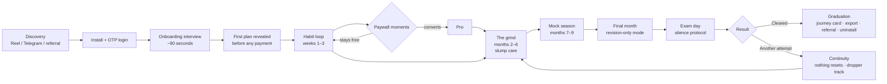
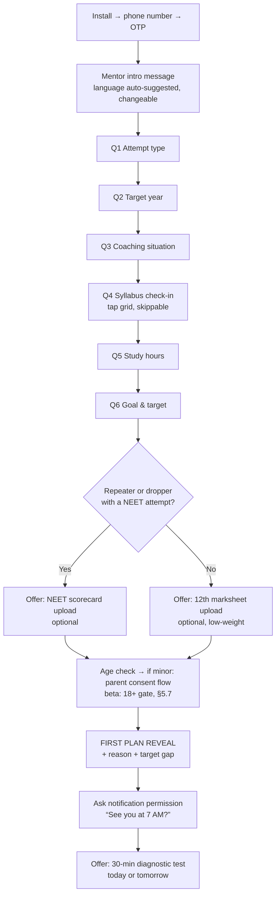
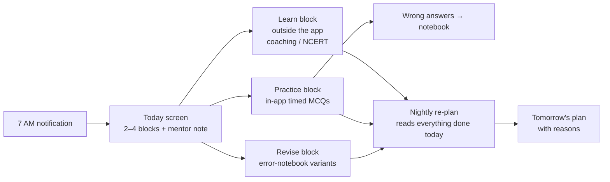
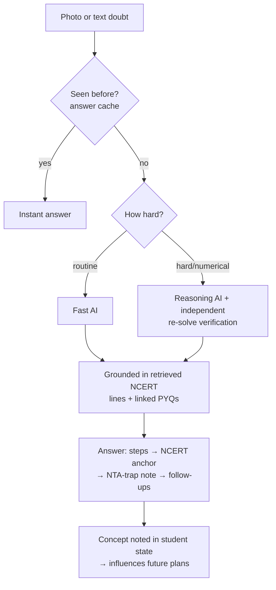
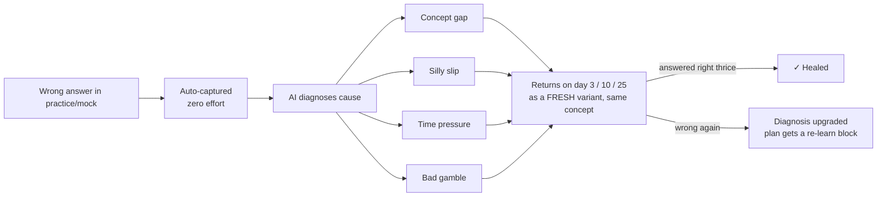
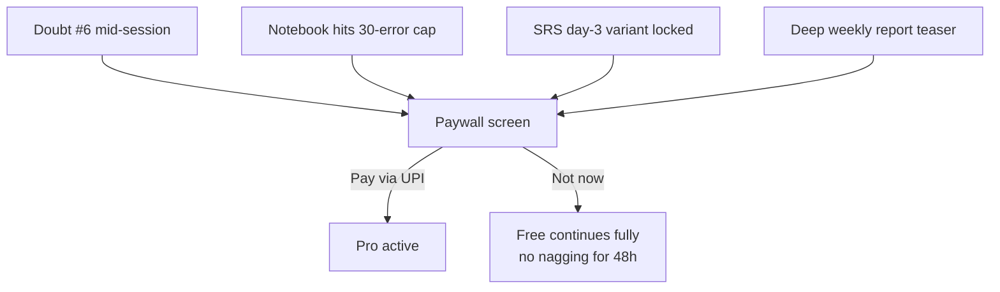
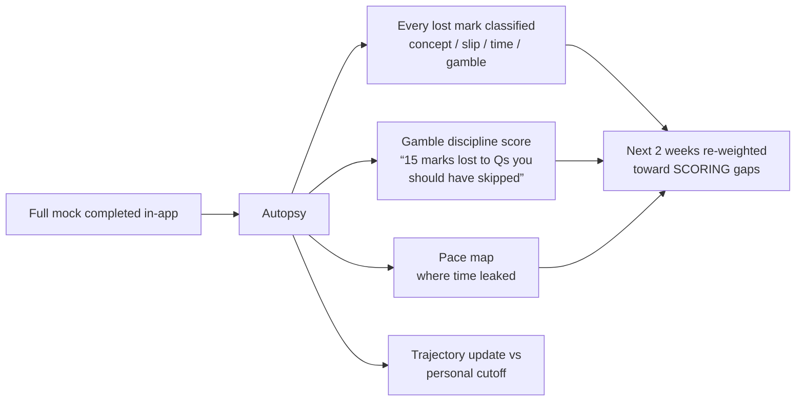
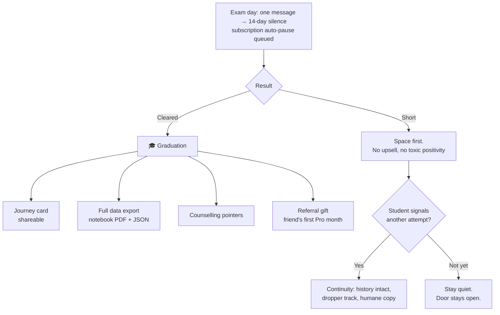

# MARG AI — Product Specification v2.0

**Product:** A fully digital, AI-only personal mentor for NEET aspirants (Android-first).
**This document:** the complete product definition — student lifecycle, every feature,
every screen, every rule. It deliberately contains **no implementation details**.
System architecture, API design, data modeling, and all technical decisions are owned
by the implementing agent (Claude Code), which should plan them from this document.

---

## 1. Vision & product principles

MARG AI replaces the one thing money can't usually buy in NEET prep: **a personal mentor
who knows you.** It does not lecture — no lecture library, no recorded courses, no live
classes, no faculty, ever; teaching support is short written primers and curated free
lectures (§6.1, §9). It plans each
student's day, gives them the right practice, answers their doubts at any hour, and makes
sure they never repeat a mistake — all adapted nightly to that one student.

**Principles (every feature must obey these):**

1. **Evidence rule** — the app never says anything about a student it cannot back with
   that student's own data. Every recommendation shows its reason. A claim about students
   in general may rest on the collective record (§9.6) and is worded as such; it never
   stands in for knowledge of this student.
2. **Trust rule** — verified answers only; honest pricing; one-tap cancel; instant
   refunds; no dark patterns; uploaded documents deleted after reading.
3. **Mentor voice** — warm, direct, Hinglish-capable, never guilt-tripping, never fake-human.
   The app is proudly AI: "never annoyed, never asleep."
4. **Habit before features** — the daily loop (plan → practice → doubts → notebook →
   re-plan) is the product; everything else serves it.
5. **Phone-first reality** — mid-range Android, patchy internet, one-hand use.
6. **The exam ends** — the product is designed for a graceful exit (graduation), not
   artificial retention.

**Business model:** Free tier (genuinely useful) + Pro subscription.
List ₹499/month; founding price ₹299/month; annual ₹2,999. Payments via UPI autopay.

---

## 2. Who it's for

**Primary target: self-learners** (CS-4) — students preparing without a coaching
institute. Coaching students remain
fully supported, but when a trade-off arises, design for the student preparing alone:
MARG replaces what coaching gives them one need at a time — structure (the plan), teaching
support (primers and curated lectures), doubt clearing, tests and ranking (past-paper mocks,
private percentile), discipline (streaks, slump care, the Sunday review) and exam temperament
(autopsy, drills).

- **Droppers/repeaters** (primary launch segment): self-directed, desperate for structure,
  often self- or parent-funded, live in Telegram/YouTube communities.
- **Coaching students** (PW/Aakash/Allen/online): use MARG as the companion —
  direction, practice intelligence, doubt backup, mistake repair.
- **Self-study freshers**: MARG is their sequencer and mentor from chapter one.
- **The parent** (frequent payer): needs trust and visibility, not features.

---

## 3. Technology constraints (fixed) — everything else is Claude Code's to design

- Mobile app: **Flutter** (latest stable), Android first; iOS/web later from same codebase.
- Backend: **Java (latest LTS) + Spring Boot 4.x**.
- Database: **PostgreSQL 18** (with vector search capability for retrieval).
- Cloud: **AWS, ap-south-1 (Mumbai)** for infrastructure (RDS, S3, ECS, SSM, SES);
  AI models via direct provider APIs — **Anthropic API** (cost-efficient model for
  routine work, stronger reasoning model for hard problems, batch processing for
  nightly jobs, aggressive caching everywhere) and a dedicated embeddings
  provider. Amazon Bedrock hosts the embeddings model and is configured as a completion
  **fallback only**, switched on by configuration during a provider outage — never the
  primary for completions (CS-2 §4.11).
- Payments: **Razorpay** (UPI autopay). Sign-in: **phone OTP by SMS** through an Indian
  DLT-compliant provider (e.g. MSG91), the primary and only sign-in method; email OTP (SES)
  exists behind a configuration flag as the beta fallback (§5.7).
  Push: **FCM**. Analytics: PostHog.
- Non-negotiable product-level technical behaviors: answers are judged server-side;
  numerical AI answers are independently verified before display; every AI answer is
  grounded in NCERT retrieval; uploaded document images are deleted within 24 hours;
  per-user AI cost circuit breakers exist; all copy is externalized for EN/HI/Hinglish.

*Claude Code: plan the architecture, APIs, schemas, pipelines, and infrastructure
yourself from this document. Propose the plan before building.*

### 3.1 Reliability and privacy on real phones (CS-3, CS-5)

Slow, patchy mobile data is the normal condition for many students, not an edge case:

1. **Never lose a student's work.** Anything she does offline or on a failing connection
   is kept on the device and delivered later.
2. **Never show a dead screen.** No endless spinners, no blank pages; every wait or
   failure has clear, honest copy and a next step.
3. **Send less.** Payloads, images and downloads are as small as they can be without
   hurting quality.
4. **Depend on the network as little as possible at the moments that matter** —
   especially the 7 AM plan (§6.1).

**Acceptance (a beta gate):** on a simulated slow-3G profile the Today screen opens from
local data, a practice session completes, and a doubt answer begins streaming promptly,
with no endless spinner anywhere; a photo doubt captured in airplane mode sends itself
after the app is closed and reopened with a connection, and its answer's notification
opens it; a practice block completed offline syncs with no loss and streak and notebook
update correctly; photo payloads meet the size target with no doubt- or
document-extraction quality regression; with the nightly plan ready and connectivity at
night only, the morning Today screen opens instantly in airplane mode; and all of this
passes **on a low-cost Android phone**, not only an emulator.

**Device identity and privacy:** no permanent hardware identifiers (IMEI, serial numbers)
are ever collected; the app uses app-level install identifiers and Google Play's official
app-integrity check, consistent with Play policy and India's data-protection law.

**Unusual use** (an account active in distant places within a short time, use far beyond
normal patterns, rapid repeated sign-ins across phones — tunable signals) meets a gentle
ladder: a soft in-app message → re-verification (sign in again / OTP) → a temporary rate
limit. **No automatic bans:** any restriction beyond a rate limit needs founder review. The
fair-use cap and the per-user daily cost breaker bound cost regardless. Copy stays kind:
“Your plan is built only from your work — sharing your account mixes up your plan.”

---

## 4. The student lifecycle (end to end)


```mermaid
flowchart LR
    A[Discovery\nReel / Telegram / referral] --> B[Install + OTP login]
    B --> C[Onboarding interview\n~90 seconds]
    C --> D[First plan revealed\nbefore any payment]
    D --> E[Habit loop\nweeks 1–3]
    E --> F{Paywall moments}
    F -->|converts| G[Pro]
    F -->|stays free| E
    G --> H[The grind\nmonths 2–6\nslump care]
    E --> H
    H --> I[Mock season\nmonths 7–9]
    I --> J[Final month\nrevision-only mode]
    J --> K[Exam day\nsilence protocol]
    K --> L{Result}
    L -->|Cleared| M[Graduation\njourney card · export · referral · uninstall]
    L -->|Another attempt| N[Continuity\nnothing resets · dropper track]
    N --> H
```

### Phase 0 — Discovery & install
Acquisition is organic by design: product-output Reels/Shorts (mistake autopsies,
doubt-solve clips), NEET Telegram/Discord communities, mid-size educator affiliates,
and graduation referrals. Play Store listing promises ONE thing: *a personal AI mentor
for NEET.* App must be small and fast on a ₹10k phone.

### Phase 1 — Onboarding (§5) → first plan in minutes, value before money.

### Phase 2 — Habit formation (weeks 1–3)
Morning notification → Today screen → blocks done in/around the app → first doubt
solved (“the 2 AM moment”) → first weekly trajectory card (deliberately humble:
“Early days — this number gets honest as I know you better”). Paywall appears only
at natural friction (§6.9), never as a wall.

### Phase 3 — The grind (months 2–6)
Where competitors lose students and MARG earns its keep: nightly re-planning absorbs
real life (weddings, bad weeks), the error notebook crosses critical mass and starts
visibly “healing” mistakes, and **slump care** (§6.6) quietly saves the month-4 dip.

### Phase 4 — Mock season (months 7–9)
The plan's center of gravity shifts from learning to testing: weekly then twice-weekly
full mocks, each followed by an **autopsy** — every lost mark classified, gamble
discipline scored, and the plan re-weighted toward *scoring* gaps (different from
knowledge gaps). Trajectory now speaks in the student's own target: “on this trend you
clear last year's cutoff for your category by ~22 marks.”

### Phase 5 — Final month
The app changes personality: no new content; revision-only plans built from the
student's **danger zones** (open errors) + high-yield recall; daily volume *decreases*;
sleep is protected. T-3 days: light recall only. Eve of exam: one message —
“You've healed 214 errors since August. You're ready. Phone down by 10.”

### Phase 6 — Exam, silence, and the fork
Exam morning: a single good-luck message, then **notification silence** (no streaks, no
nudges) for two weeks. Subscription **auto-pauses** at period end — no silent June
renewals. After results:

- **Fork A — cleared:** genuine celebration → **graduation package**: shareable journey
  card (marks gained, errors healed, streak record), full personal-data export
  (notebook as PDF + JSON), counselling pointers, and a referral gift for a friend's
  first Pro month. The uninstall is a graduation — and our best marketing.
- **Fork B — falling short:** acknowledgment without toxic positivity, space, and —
  only when the student signals interest — the continuity offer: “Your notebook, your
  patterns, your 9 months of data — nothing resets. We start from everything we learned.”
  Re-onboards into the dropper track with history intact.

---

## 5. Onboarding — the 90-second interview (full specification)

**Goals:** feel like meeting a mentor, not filling a form; produce a personalized plan
before any payment ask; collect only what powers features.


```mermaid
flowchart TD
    S[Install → phone number → OTP] --> W[Mentor intro message\nlanguage auto-suggested, changeable]
    W --> Q1[Q1 Attempt type]
    Q1 --> Q2[Q2 Target year]
    Q2 --> Q3[Q3 Coaching situation]
    Q3 --> Q4[Q4 Syllabus check-in\ntap grid, skippable]
    Q4 --> Q5[Q5 Study hours]
    Q5 --> Q6[Q6 Goal & target]
    Q6 --> Q7{Repeater or dropper\nwith a NEET attempt?}
    Q7 -->|Yes| SC[Offer: NEET scorecard upload\noptional]
    Q7 -->|No| MS[Offer: 12th marksheet upload\noptional, low-weight]
    SC --> DOB[Age check → if minor: parent consent flow\nbeta: 18+ gate, §5.7]
    MS --> DOB
    DOB --> PLAN[FIRST PLAN REVEAL\n+ reason + target gap]
    PLAN --> NOTIF[Ask notification permission\n“See you at 7 AM?”]
    NOTIF --> DIAG[Offer: 30-min diagnostic test\ntoday or tomorrow]
```

### 5.1 The exact interview (chat-style, one question per bubble, tap-to-answer)

**Q1. “Which one is you?”** — First attempt (Class 12) · First attempt (Class 11, 2-yr) ·
Dropper (1st repeat) · Repeater (2nd+). *(Sets the plan archetype.)*

**Q2. “Target exam?”** — NEET {next year} · NEET {year after}. *(Sets the clock; drives
exam-season behavior.)*

**Q3. “How are you preparing?”** — Coaching classroom · Coaching online (PW/Aakash/Allen/
Unacademy/other — one more tap) · Self-study · Mix. *(Decides learn-block style and
batch-sync features.)*

**Q4. “Quick syllabus check-in — tap what's true. Skip anytime.”** — the syllabus grid:
chapters as chips, three states (Not started / Ongoing / Done), plus long-press to mark
“feels weak”. Physics → Chemistry → Biology tabs. Target: under 2 minutes. *(Seeds
chapter status + weak map; refined forever after by behavior.)*

**Q5. “Hours you can really give?”** — Weekdays slider (1–12h) + Weekends slider.
Mentor reacts honestly: “6h weekdays + 10h weekends — good. I plan for real hours,
not hero hours.”

**Q6. “What are we aiming at?”** — Goal: Govt MBBS seat · Private also fine · BDS/other ·
Just qualify. State (picker). Category (General/OBC/SC/ST/EWS) — **optional**, with the
inline note: *“Cutoffs differ by category — I use this only to compute your real target.
Skip if you prefer.”*

**Q7. Previous scores (branch):**
- **Dropper/repeater:** “What did NEET give you last time?” — manual entry (score/rank)
  **or the scorecard upload** (§5.2). If neither: “No problem — the diagnostic will tell us.”
- **Fresher:** “Board exams done? You can show me your 12th marksheet — it helps a little.
  (NEET is a different game, so I won't judge you by it.)” (§5.3)

**Then:** DOB (for minors: parent phone + consent OTP before any document upload
unlocks). Language confirm (English / हिन्दी / Hinglish).

### 5.2 NEET scorecard upload (repeaters/droppers) — high value

Flow: camera with frame guide → AI reads → **confirmation screen** showing extracted
fields (total marks, AIR, category & category rank, subject percentiles, year) → student
fixes any misread → confirm → **photo deleted**, only the confirmed numbers kept.
Promise shown at upload: *“I read the numbers, confirm them with you, and delete the
photo. I keep only what I need to plan your prep.”*

What it powers: true subject-wise baseline (percentiles beat self-assessment), the
personal target line (“last year you were 34 marks below the MH OBC cutoff”), and a
smarter dropper plan that starts from evidence, not chapter one.

### 5.3 12th marksheet upload (freshers) — honest low-weight signal

Same capture-confirm-delete flow; extracts board, PCB marks. Explicitly treated as a
*soft* prior only (board skills ≠ NEET skills); the mentor says so. Its real value is
saved typing + context. **The diagnostic test (§5.4) is the true calibrator for freshers.**

### 5.4 Diagnostic test (optional, everyone, strongly encouraged)

~30 questions / ~30 minutes across the syllabus, adaptive difficulty. Offered right
after the first-plan reveal (“today or tomorrow morning?”) and placed as day-1 block if
deferred. Output: ability estimates per subject/topic that immediately sharpen the plan —
and the student's first taste of practice + instant explanations.

### 5.5 First plan reveal (the onboarding payoff)

Within seconds of the interview: tomorrow's plan, with the mentor's reasoning and the
target line. Example copy:

> “Here's tomorrow. Your 512 → a govt seat needs ~590. That gap lives mostly in
> Physics — so that's where we start. See you at 7 AM?”

Then the notification permission ask — tied to that promise, not abstract.

### 5.6 Onboarding wireframes

```
┌──────────────────────────┐   ┌──────────────────────────┐   ┌──────────────────────────┐
│  ●●○ MARG AI             │   │  Syllabus check-in  (2/3)│   │  Scorecard — confirm      │
│                          │   │  [Physics][Chem][Bio]    │   │                          │
│  🎓 “Hi! I'm your NEET   │   │  Kinematics      [Done]  │   │  Total marks      512    │
│  mentor. 90 seconds of   │   │  Laws of Motion  [Done]  │   │  AIR           88,412    │
│  questions, then I plan  │   │  Work & Energy [Ongoing] │   │  Category         OBC    │
│  your prep. Ready?”      │   │  Rotation   [Not started]│   │  Phys percentile 71.2 ✎  │
│                          │   │   └ long-press = weak ⚠  │   │  Chem percentile 84.0    │
│  Which one is you?       │   │  Optics ⚠   [Ongoing]    │   │  Bio  percentile 91.3    │
│ ┌──────────────────────┐ │   │  ...                     │   │                          │
│ │ Dropper (1st repeat) │ │   │                          │   │  “All correct?”          │
│ ├──────────────────────┤ │   │        [ Skip ]          │   │  [ Fix a field ]         │
│ │ Fresher (Class 12)   │ │   │        [ Next → ]        │   │  [ ✓ Confirm & delete    │
│ │ Fresher (2-year)     │ │   │                          │   │      the photo ]         │
│ │ Repeater (2nd+)      │ │   │                          │   │                          │
└──────────────────────────┘   └──────────────────────────┘   └──────────────────────────┘
```

### 5.7 Sign-in, identity and sessions (CS-2 §4.2, CS-5; founder decision 2026-10-01)

**Sign-in:** **phone OTP by SMS is the primary and only sign-in method**, for beta and
launch, with auto-read, resend and bulletproof retry. Email OTP exists behind a
configuration flag as the beta fallback (switched on only if the SMS route is not live in
time). The identity model is provider-agnostic — one user, possibly several verified
credentials — so another method (e.g. Sign in with Apple on iOS) can be added later
without redesign.

**Identity:** the **verified phone number is the account's identity.** A phone number can
belong to only one MARG account; an account that began on the email fallback attaches a
verified phone when SMS is live and stays one user with its history intact — no path
creates a duplicate user. A subscription belongs to the **account**, never to a number or a
device, and follows it across phones.

**Sessions:** one active phone per account — signing in on a new phone signs the previous
phone out, with a clear message on both (“You've signed in on another phone”); Phase 2 web
allows one phone plus one browser. Work queued offline on the signed-out phone is never
discarded: it syncs when the same account next signs in on that phone (§3.1). A phone may hold several accounts (siblings) behind a simple account
switcher (§6.11); each account keeps its own plan, notebook, history and subscription,
switching never mixes data, and Pro on one account never unlocks Pro for another.

**Abuse protection:** OTP requests are rate-limited per number and capped per device per
day; free accounts per phone are capped (§6.9); unusual use follows the gentle ladder in
§3.1.

**Minors in the beta:** the beta cohort is recruited **18+**; DOB is still asked, with an
18+ gate for the beta. The parent-consent flow (§5.1: parent phone + consent OTP) is built
but stays switched off for the beta — unless the D60 revisit below switches it on — and
goes live at public launch. Someone under 18 who reaches the gate is stopped kindly (“MARG
opens to under-18s at launch”) and their account, phone number and answers are deleted at
once — nothing that identifies them is kept, not even for a waitlist. At the D60 gate the 18+ rule is revisited once: if the consent SMS template is
live and the legal review has cleared parental consent and the rules on monitoring
children, the consent flow is switched on and under-18s may join the later beta waves
(founder ruling 2026-10-01).

---

## 6. Feature specifications

### 6.1 Today & the adaptive daily planner (home screen, the heart)

**Purpose:** a fresh, personal, explained plan every morning — the structure and
accountability self-study students lack and batches can't personalize.

**Daily loop:**


```mermaid
flowchart LR
    N[7 AM notification] --> T[Today screen\n2–4 blocks + mentor note]
    T --> L[Learn block\noutside the app\ncoaching / NCERT]
    T --> P[Practice block\nin-app timed MCQs]
    T --> R[Revise block\nerror-notebook variants]
    P --> E[Wrong answers → notebook]
    L & P & R --> NIGHT[Nightly re-plan\nreads everything done today]
    NIGHT --> T2[Tomorrow's plan\nwith reasons]
```

**Block types:** Learn (directs outside study: chapter + NCERT sections + why today),
Practice (timed in-app MCQ set), Revise (notebook variants due), and later Mock.
A learn block carries teaching support (CS-4): for self-study students, the topic's
**concept primer** (“Read the primer, then 10 recall questions”, §9); for every student,
one or two **curated free lectures** for the chapter — title, channel, language, length,
optional start times — opened by link-out until the in-app player ships from the beta
backlog after the D60 gate (§12.1 item 7), then in YouTube's official embedded player,
with a “Was this helpful?” tap under each. A primer is also reachable
from any topic's detail view and from a doubt answer (“Read the basics of this topic”).
Teaching support is care, in every tier (§10).
Every block carries a one-line **reason drawn from the student's data or, attributed as such, from
the collective record** (Evidence rule; §9.6).

**Two sources (CS-1):** the planner reads two things — the *collective record* of each
topic (how NEET students in general experience it: struggle, realistic pacing, exam
momentum, common misconceptions, season effects; §9.6) and the *student's own data*. On
day one the collective dominates; as the student's practice, diagnostic and doubt history
accumulate on a topic, their own data takes over, and where the two disagree at sufficient
evidence the student's data wins. Every reason line says which source it rests on: “most
students underestimate this chapter — I've given it extra room” is a collective claim and
is worded as one; “4/10 on Tuesday, all sign-convention slips” is personal. Early copy is
honest about the ramp — the plan sharpens as the app learns the student — and names the
diagnostic as the fastest way to shift the weight from “students like you” to “you”.
Collective-backed confidence never masquerades as personal knowledge.

**Nightly re-planning behavior (product rules, not implementation):**
- Reads: what was done/skipped, accuracy & speed, doubts asked, notebook dues, mood,
  streak, days-to-exam, batch position, backbone (what's next in the syllabus for this
  archetype, weighted by real NTA marks data).
- Missed days → reprioritize, never guilt-stack; the mentor note says what was traded:
  *“We lost the weekend — Thermo moves out, Human Physiology doubles. More marks there.”*
- A plan must exist every single morning, no exceptions — and the 7 AM Today screen
  opens from **local data**: when the nightly plan is ready the app downloads it and its
  practice questions in the background at the first reasonable connection, respecting
  data-saver and battery-saver; if no prefetch happened it fetches on open, and the
  no-planless-morning fallback still applies (CS-3 §3.3).
- **Load follows reality** (CS-6 §2.3): daily load adapts to the student's actual
  completion over the recent past, not only the hours declared at onboarding, and the
  mentor says so honestly when it lightens or grows the days (“I've made your days a
  little lighter, since you've been finishing about 60%”). Load never drops so low that
  exam-critical coverage is lost silently; if her real pace and her target drift apart,
  the trajectory card and the Sunday review say so kindly, with options. Exam proximity
  shifts the learn/practice/revise mix (see Phases 4–5).
- **Mixed practice by default** (CS-2 §4.6): plans keep interleaving across subjects; a
  student may ask for a single-topic set, but the default stays mixed. After an error
  streak or on a low-mood day the plan serves one **confidence question** slightly below
  her band before returning to stretch difficulty. Each guard is tunable and measured
  (§10 rule 12).

**Making the plan feel personal (CS-6).** Every planner behaviour serves at least one of
six qualities and undermines none: **specific** (every reason uses her own data),
**responsive** (skips, struggles and doubts visibly change tomorrow, within a day),
**remembering** (the mentor refers back to specific recent moments), **controllable** (she
can push back and the plan listens), **honest** (it admits what it doesn't yet know) and
**stable** (it changes for good reasons, not randomly; big changes are explained).
- **Continuity:** day to day, most of the plan carries forward unless there is a clear,
  data-backed reason to change it (the level is a configuration value; default: a majority
  of tomorrow's blocks continue today's direction). Any substantial change — a subject
  swapped out, the load changed noticeably, a chapter moved — is explained in the mentor
  note. Larger changes are justified by slump days, negotiated life events, exam-season
  mode switches and repeated “too hard” signals.
- **Skip with a reason:** marking a block skipped offers one optional tap — *No time · Too
  hard · Already know this*. No time → a load adjustment, not a difficulty change; Too
  hard → an easier entry point next time (primer, easier questions, a confidence
  question); Already know this → a short check, which if passed raises the topic's ability
  estimate and retires the block, and if not, brings it back gently. Skipping without a
  reason is always allowed and never penalized.
- **The first seven days** are designed, because that is when a student decides whether
  the app “gets” her; each day shows visible learning and the mentor note names what
  changed: day 1 from onboarding answers, the collective prior and any scorecard (“Here's
  day one. I'll learn fast.”); day 2 adds the diagnostic (or invites it again gently if
  skipped — the ramp continues without it); day 3 the first practice mistakes and doubts
  (“Your first mistakes told me…”); days 4–5 skip reasons and completion pace (load and
  difficulty adjustments); day 6 the first mistake-healing returns; day 7 a short “what I
  learned about you this week” summary. Collective vs personal attribution follows the
  two-source rule throughout.
- **Remembering out loud:** the nightly snapshot keeps a few notable recent moments — a
  hard session, a streak milestone, a healed mistake, a negotiated change — so the mentor
  can refer to them naturally, specifically and occasionally, not in every block.
- **Reasons are traceable and never generic:** every block reason and mentor-note claim
  traces to specific data points in her history (or, attributed as such, the collective
  record); a reason that fails traceability is replaced by the deterministic fallback
  reason, and reasons that could apply to any student (“practice is important”) are
  rejected.

**Negotiable plan (chat):** the student can talk to the planner — “cousin's wedding
Fri–Sun” → the week rebalances and the mentor explains the trade. Any plan change
made in chat is reflected immediately on Today.

**Sunday review with the mentor (CS-4 §5.1):** a short weekly conversation (about five
minutes) in the plan chat, offered on Sunday evening: what went well, what slipped, the
week's pattern in plain words, and an agreed focus for next week, which the planner then
honours and which is visible on next week's plans. Every claim is backed by her own data;
it is honest and kind about missed days; skippable without penalty; in every tier (the
deep weekly report stays Pro).

**Streaks & weekly trajectory:** streak = consecutive days with ≥1 plan block done
(protects the habit, not vanity hours). Streak care is **repair, never loss** (CS-2 §4.5):
light-plan days on low mood or an inferred slump are framed as protecting the streak; a
broken streak is reported as a ratio (“12 of the last 14 days”), never as a loss; the
20:30 streak-save nudge names one small action and never threatens; no streak
leaderboards; identical in every tier; streaks retire gracefully in exam season. Weekly
card: predicted score range vs the student's own target cutoff + one insight (“Physics
accuracy up 9 points — the Optics drills worked”).

```
┌──────────────────────────┐
│ Tue, 3 Sep     🔥 12-day │
│ ─────────────────────────│
│ 🎓 “We lost the weekend —│
│ I moved Thermo out and   │
│ doubled Human Physiology.│
│ More marks there.”       │
│ ─────────────────────────│
│ ▶ PHYSICS · Ray Optics   │
│   25 timed MCQs · 40 min │
│   why: 4/10 Tue, all sign│
│   -convention slips      │
│ ▶ BIOLOGY · Genetics     │
│   Revise 6 errors · 15min│
│ ▶ CHEM · Chemical Bonding│
│   NCERT 4.1–4.4 + recall │
│ ─────────────────────────│
│ 📈 On trend: 528–551     │
│ target 590 · gap closing │
│ [😊 today?]   [Talk 💬]  │
└──────────────────────────┘
```

### 6.2 Practice sessions (in-app, always)

**Purpose:** practice is where personalization data is born — so it always happens
inside the app.

Rules: per-question timer; one-hand answer taps; instant verdict + step solution +
NCERT anchor chip; question difficulty served in the student's stretch band (never
demoralizing, never irrelevant — and never beyond real NEET patterns: “skipping the
exotic stuff — NTA has never asked it”); session summary with accuracy, speed vs
your norm, and what went to the notebook. Works offline for the current day's blocks —
their questions arrive with the prefetched plan (§6.1) — and results sync later. Question
sources: 15+ years of PYQs with verified solutions + NCERT-style generated questions
(verified), tagged to the syllabus.

**Timing and skip-strategy drills (CS-4 §5.2):** short drills that train exam temperament —
pacing against the clock, deciding when to skip, negative-marking discipline — built from
past-paper questions and the student's own gamble-score history from mock autopsies
(§7.1). The planner introduces them mainly in mock season and the final months; available
on demand; all tiers, with the full personalised drill history following the autopsy's
tiering (summary Free, full Pro). A student with a high gamble score gets targeted skip
drills, and drill results flow into the next mock's autopsy comparison.

### 6.3 The doubt solver (hero feature)

**Purpose:** the 2 AM mentor — any question, photographed or typed, any language mix,
answered in seconds with textbook grounding.


```mermaid
flowchart TD
    IN[Photo or text doubt] --> SEEN{Seen before?\nanswer cache}
    SEEN -->|yes| OUT[Instant answer]
    SEEN -->|no| DIFF{How hard?}
    DIFF -->|routine| FAST[Fast AI]
    DIFF -->|hard/numerical| DEEP[Reasoning AI + independent\nre-solve verification]
    FAST & DEEP --> GROUND[Grounded in retrieved NCERT\nlines + linked PYQs]
    GROUND --> OUT2[Answer: steps → NCERT anchor\n→ NTA-trap note → follow-ups]
    OUT2 --> MEM[Concept noted in student state\n→ influences future plans]
```

**Answer contract (what the student sees, always in their language):**
step-by-step solution → “NCERT anchor: Class 11 Bio, Ch 6, §6.4” (tappable) →
“How NTA twists this” (only when a real PYQ backs it — Evidence rule) → two
tap-to-ask follow-ups. Numericals never shown unverified; on rare verification
failure the app says honestly “I couldn't verify this one — flagged for review.”
Every answer has a Report flag (feeds a human audit queue — the one founder-human loop).

**Memory behavior:** three Optics doubts this week → Thursday's plan grows an Optics
block, and the mentor says why. **Free tier:** 5 solves/day (repeat/cached questions
count half; a follow-up counts half). **Pro is never refused** (CS-2 §4.3): unlimited
with a generous fair-use cap on the heaviest model, and when a Pro student reaches that
cap or the per-user cost breaker, the request is accepted and queued with honest copy
(“answer in a few minutes”) — never rejected. Only the free tier keeps a hard limit.

**Anchored follow-ups (CS-2 §4.4):** follow-ups are threaded under the doubt they belong
to, with its context kept; a thread has a sensible depth cap, after which the student is
invited to ask a new doubt. **There is no open, general-purpose chatbot** — the only other
conversation is the plan chat (§6.1).

**“Your turn” (CS-2 §4.6):** on a third doubt about the same concept within a short window,
the mentor sometimes answers “walk me through where you got stuck” before solving —
occasionally, tunable, measured.

**Doubts on a bad connection (CS-3 §3.1–§3.2):** a doubt can be photographed or typed with
no connection; it waits on the device marked “waiting for network” and sends itself when
a connection returns, even after the app is closed and reopened; when the answer arrives
she is notified (within the notification caps) and the notification opens it. She can see
and cancel queued doubts. A queued doubt counts toward the free limit when it is **sent**,
not when captured — if sending would exceed the limit, the usual limit behaviour applies
then. Queued photos follow the upload privacy rules: deleted from the device once sent,
and from the server per the existing retention. Every doubt photo and document capture
(scorecard, marksheet, timetable) is compressed before upload to the smallest size that
still reads reliably — typically a few hundred kilobytes, not several megabytes — and
compression may never lower extraction quality (the doubt and document evals show no
regression). Answers still require the server: there is no offline doubt-solving.

```
┌──────────────────────────┐
│ 📷 Doubt                 │
│ [photo of Q displayed]   │
│ ─────────────────────────│
│ Step 1  Resolve forces…  │
│ Step 2  τ = r × F …      │
│ Step 3  ⇒ a = 2.4 m/s²  │
│ ✅ verified              │
│ 📘 NCERT: Cl.11 Phys     │
│    Ch 7, §7.9  [open]    │
│ ⚡ NTA trap: they flip   │
│    the friction direction│
│    (asked in 2019, 2023) │
│ ─────────────────────────│
│ [Why r×F here?]          │
│ [Harder variant?]   🚩   │
│ Solves left today: 3/5   │
└──────────────────────────┘
```

### 6.4 The error notebook & spaced repetition

**Purpose:** automate the topper's hand-written mistake register — capture, diagnose,
and heal every error.


```mermaid
flowchart LR
    W[Wrong answer in practice/mock] --> CAP[Auto-captured\nzero effort]
    CAP --> DIAG[AI diagnoses cause]
    DIAG --> C1[Concept gap]
    DIAG --> C2[Silly slip]
    DIAG --> C3[Time pressure]
    DIAG --> C4[Bad gamble]
    C1 & C2 & C3 & C4 --> SRS[Returns on day 3 / 10 / 25\nas a FRESH variant, same concept]
    SRS -->|answered right thrice| HEAL[✓ Healed]
    SRS -->|wrong again| UP[Diagnosis upgraded\nplan gets a re-learn block]
```

**Cause-specific treatment:** concept gap → re-learn + easy-first drills; silly slip →
awareness drills & checking habits (not more content); time pressure → pacing sets;
gamble → skip-discipline training. Low-confidence diagnoses ask the student one tap
(“Knew it / Guessed / Ran out of time”) — and the student's correction always wins.

**Try once more (CS-2 §4.6):** on a near-miss answer the app occasionally offers one retry
before revealing the solution — not every time; tunable and measured.

**Patterns, spoken plainly:** “31% of your Physics errors are unit-conversion slips —
~12 marks recoverable. Friday has a drill.” / “Your accuracy drops 18% after 9 PM.”

**Views:** summary (by subject & cause), entries (question · your pick vs right ·
cause chip, tappable to correct), Healed ✓ gallery (motivation), and **Danger Zones** —
open errors sorted by exam weightage: the most valuable last-week revision list a student
can own. **Free tier:** last 30 errors, no SRS scheduling. **Pro:** full notebook + SRS.

### 6.5 Trajectory & the personal target

Weekly predicted-score band, always expressed against *this student's* goal:
“On this trend you clear last year's MH OBC cutoff by ~15 marks.” Includes one
anonymous peer line for belonging: “ahead of 62% of droppers on the app.” Early weeks
are deliberately humble; precision grows with data (Evidence rule). Never framed as
a promise — it's a trend, and the copy says so.

### 6.6 Wellbeing: mood, energy & slump care

One-tap optional daily mood chip (😊/😐/😞). Independently, the app watches behavior
(shrinking sessions, falling accuracy, dark days) and infers slumps. On low days:
lighter plan (flashcards/recall), streak protection, and honest mentor copy —
“Rough patch is month-4 normal. Today we protect the streak, not chase marks.”
The app never diagnoses, never claims to be a counselor, and if a student's messages
suggest serious distress, it responds with care and points to real help — mentor voice,
human resources.

**Wellbeing and crisis protocol (CS-2 §4.1) — blocking for beta.** For any input — a doubt
thread, the plan chat, a mood signal — indicating serious distress or self-harm risk, the
response is warm and human-toned, with no clinical diagnosis and no lecturing, and points
clearly to real help: **Tele-MANAS (14416, India's national mental-health helpline)** and
encouragement to talk to someone she trusts. The study context is set aside in that
moment: the same response never pushes practice or streaks. It never promises
confidentiality outcomes or describes what authorities may do, never ends or refuses the
conversation, and shows its resources accurately and kept current. Acceptance: eval cases
covering direct, indirect, Hinglish and Hindi phrasings, 100% producing the required
behaviour; the founder reviews the copy; the copy and data handling go to legal review.
Identical in every tier.

### 6.7 Batch sync (“your batch is on it”)

How the app knows where a coaching student's class is — five layers, best available wins:
onboarding self-report → **batch timetable photo** (capture-confirm-delete, weeks of
lookahead in one shot) → silent inference from doubts/behavior → a 5-second weekly
confirm card (“Did your batch finish Rotational Motion? What's next?”) → at scale,
batch-mates' answers pre-fill each other. The plan only *says* “your batch is on it”
when confidence is high; otherwise the block simply names the chapter (Trust rule).
Self-study students skip all this — MARG itself is their sequencer.

### 6.8 Documents (one pattern, three uses)

A single product pattern — **photograph → AI reads → student confirms → photo deleted** —
used for: NEET scorecards (repeaters, §5.2), 12th marksheets (freshers, §5.3), and
batch timetables (§6.7). Later (Phase 2): external mock-test scorecards from any test
series. Minors require completed parent consent before any upload. Extracted fields
are always shown for correction; nothing is silently trusted.

### 6.9 Monetization: free tier, Pro & the paywall

**Tier principles (CS-2 §1):** correctness and care are never tiered — answer quality,
verification, grounding, wellbeing support, streak care and the mentor's tone are
identical in Free, Pro and Pro+; tiers differ only in quantity (limits), speed, depth
features, formats (video, voice) and audiences (parents), and there is never a
model-selection menu. Pro+ sells formats and audiences, never better truth: a Pro and a
Pro+ student asking the same doubt get the identical verified solution. Public surfaces
show only what exists — until Pro+ ships, the app, site and store listing show Free and
Pro only. Free users are our word-of-mouth engine, so Free stays genuinely useful.

**Pricing (CS-2 §2).** *Beta (December 2026 → mid-January 2027):* free for every
participant — six weeks of Pro at no cost, no payments collected. *Public launch (late
January 2027):*

| Plan | Paywall display |
|---|---|
| Free | ₹0 |
| Pro, monthly | ~~₹499~~ **₹299/month** — labelled “founding price” |
| Pro, annual | ~~₹3,999~~ **₹2,999/year** — highlighted as best value (₹250/month equivalent) |

Rules: **grandfathering** — a subscriber who joins at a founding price keeps it for as long
as the subscription stays active (founding means founding); **founding expiry is triggered
by evidence, not a date** — when season-one data shows strong conversion and low churn the
founder closes founding prices for *new* signups, who then pay list (₹499/month,
₹3,999/year), and an intermediate launch offer (e.g. ₹399/month) is allowed; the switch is
a configuration change, never a release; annual is front-and-center from January
(exam-panic season); **GST** — season one charges none (below the threshold), and
pricing configuration can switch to GST-inclusive display when registration is required;
comparisons are always same-rung (list vs list, founding vs founding) on every surface.
*Pro+ (Phase 2, provisional until tested with students and parents; same grandfathering):*
monthly founding ₹479 / list ₹799; annual founding ₹4,999 / list ₹6,499.

**Entitlements (CS-2 §3; canonical).** Configuration-driven, so any feature can move
between tiers without a release:

| Feature | Free | Pro | Pro+ (Phase 2) |
|---|---|---|---|
| Onboarding, first plan, diagnostic test | ✓ | ✓ | ✓ |
| Snap a doubt during onboarding † | ✓ | ✓ | ✓ |
| Adaptive daily planner (nightly re-plan, reasons, plan chat) | ✓ Full | ✓ Full | ✓ Full |
| Practice engine (timed MCQs, instant solutions) | ✓ Full | ✓ Full | ✓ Full |
| Full past papers as timed mocks | ✓ | ✓ | ✓ |
| Mock autopsy | Summary | Full | Full |
| AI doubt solver | 5/day (cached = ½) | Unlimited (queued, never refused) | Unlimited |
| Follow-up questions on a doubt | Count ½ toward the limit | Unlimited | Unlimited |
| Answer quality and verification | Same | Same | Same |
| Explanation depth toggle † | ✓ (counts ½ toward the limit) | ✓ | ✓ |
| Voice input for doubts ‡ | ✓ | ✓ | ✓ |
| Error notebook | Last 30 errors | Full + mistake healing | Full + healing |
| Weekly report | Basic trajectory card | Deep report | Deep report |
| Mastery Map v1 † | ✓ | ✓ | ✓ |
| Streaks, mood and slump care | ✓ | ✓ | ✓ |
| Milestone cards, “I'm confused” button, focus timer † | ✓ | ✓ | ✓ |
| Wellbeing and crisis support | ✓ | ✓ | ✓ |
| Concept primers, curated lectures, Sunday review, drills, mock percentile (CS-4) | ✓ (drill history: summary) | ✓ | ✓ |
| Home-screen widget, shareable answer cards ‡ | ✓ | ✓ | ✓ |
| Mnemonics on demand ‡ | — | ✓ | ✓ |
| Priority speed at peak hours | — | ✓ | ✓ |
| Video answers (animated, EN/HI narration) | — | — | ✓ |
| Viva mode + teach-back | — | — | ✓ |
| Parent digest (weekly on WhatsApp) | — | — | ✓ |
| External mock-scorecard ingestion | — | — | ✓ |
| Personal formula/fact sheet | — | — | ✓ |
| Misconception flip cards | — | — | ✓ |
| WhatsApp support, data export | ✓ | ✓ | ✓ |
| One-tap cancel, 7-day refund | — | ✓ | ✓ |

† Phase 1 beta backlog (§12.1), shipped only if the D60 gate holds. ‡ Phase 2 addition to
Free/Pro (§12.2). The explanation depth toggle's free row follows the backlog's own guard
(“counts ½ on the free meter”; founder ruling 2026-10-01 on CS-2's table/§5 mismatch).

**Free-tier fairness (CS-5 §4):** free accounts per phone are capped (default 3,
configurable), and creating more shows a friendly message explaining the limit; the daily
free doubt allowance is counted **per phone as well as per account**, so switching free
accounts on one phone never multiplies it (Pro accounts on a shared phone are unaffected).
These limits are configuration values, tunable from beta data without a release.

**Terms (CS-5 §6.1):** a subscription is personal and non-transferable; the
one-active-phone rule (§5.7) is explained in plain language on the paywall and in
settings. **Sibling discount (CS-5 §6.2, Phase 2):** a second student account in the same
family at a discount (e.g. 50%), bought by the same payer — built in Phase 2 alongside the
parent digest.

**Paywall placement (moments of felt value, never ambush):**


```mermaid
flowchart TD
    D6[Doubt #6 mid-session] --> PW[Paywall screen]
    CAP[Notebook hits 30-error cap] --> PW
    SRSL[SRS day-3 variant locked] --> PW
    WK[Deep weekly report teaser] --> PW
    PW -->|Pay via UPI| PRO[Pro active]
    PW -->|Not now| FREE[Free continues fully\nno nagging for 48h]
```

One honest screen (CS-2 §4.8): ₹499 struck → ₹299 founding · ₹3,999 struck → annual
₹2,999 highlighted · “No hidden charges · Cancel in one tap · 7-day instant refund.”
Cancel = 2 taps, zero retention screens. Refund = automatic. Subscription auto-pauses
after the student's exam date — no silent June renewals. From January, annual is
front-and-center (exam-panic season).

```
┌──────────────────────────┐
│  Unlock your full mentor │
│  ─────────────────────── │
│  ₹4̶9̶9̶  ₹299/mo founding │
│  ★ ₹3̶9̶9̶9̶ ₹2,999/yr      │
│    (₹250/mo)             │
│  ─────────────────────── │
│  ✓ Unlimited doubts      │
│  ✓ Full notebook + SRS   │
│  ✓ Deep weekly report    │
│  ✓ Priority speed        │
│  ─────────────────────── │
│  No hidden charges.      │
│  Cancel in one tap.      │
│  7-day instant refund.   │
│  [  Continue with UPI  ] │
│  [      Not now        ] │
└──────────────────────────┘
```

### 6.10 Notifications (max 2/day, mentor voice, deep-linked)

Morning plan (default 7:00, adjustable) · streak-save (20:30 only if nothing done) ·
SRS due (≤1/day) · weekly trajectory (Sun 19:00). Exam protocol: T-0 one good-luck
message, then 14 days of silence. All copy localized, never guilt-based.

### 6.11 Profile, settings & account

Language switch (regenerates future content, not history) · target editor · plan-hours
editor · subscription management (status, cancel, refund) · **data export** (notebook
PDF + full JSON) · account deletion (clear confirmation; PII purged on schedule) ·
support (WhatsApp/email) · legal & privacy (plain-language, incl. the document-deletion
promise and the note that AI processing may occur outside India).

**Your devices (CS-5 §3.2):** where the account is signed in, last active time, and a
sign-out control for each — so a student can recover her own account if a phone is lost
or shared by mistake. **Account switcher (CS-5 §3.3):** a phone may hold several accounts
(siblings) with a simple switcher; each account's plan, notebook, history and subscription
stay fully separate (§5.7).

---

## 7. Exam season & the ending (detailed flows)

### 7.1 Mock autopsy (Phase-4 signature moment)


```mermaid
flowchart LR
    M[Full mock completed in-app] --> A[Autopsy]
    A --> A1[Every lost mark classified\nconcept / slip / time / gamble]
    A --> A2[Gamble discipline score\n“15 marks lost to Qs you\nshould have skipped”]
    A --> A3[Pace map\nwhere time leaked]
    A1 & A2 & A3 --> P[Next 2 weeks re-weighted\ntoward SCORING gaps]
    A --> T[Trajectory update vs\npersonal cutoff]
```

**Full past papers as timed mocks (CS-2 §4.7):** the NEET 2018–2026 papers from the PYQ
bank run as full timed mocks under exam conditions, followed by the autopsy;
out-of-syllabus questions (the post-2022 rationalisation) are labelled and excluded from
the mock's score, and question count and marking follow each paper's own scheme where
feasible. Free gets the full mock and an autopsy summary; Pro the full autopsy.

**Mock percentile among app users (CS-4 §6; after public launch):** after a timed
past-paper mock, the student privately sees her percentile among app users who took the
same paper recently (“better than 68% of students who took NEET 2023 this month”) — shown
to her only, with no leaderboard, names or public ranks, only once a paper has enough
attempts for the number to mean something (threshold in configuration), and framed as
calibration, never judgment. All tiers. It activates after public launch; the data it
needs is captured from the first mock onward. Like the weekly peer line (§6.5) it is a
private calibration number, not a leaderboard (founder ruling 2026-10-01; §12.4).

### 7.2 The ending


```mermaid
flowchart TD
    X[Exam day: one message → 14-day silence\nsubscription auto-pause queued] --> R{Result}
    R -->|Cleared| GA[🎓 Graduation]
    GA --> GA1[Journey card\nshareable]
    GA --> GA2[Full data export\nnotebook PDF + JSON]
    GA --> GA3[Counselling pointers]
    GA --> GA4[Referral gift\nfriend's first Pro month]
    R -->|Short| FB[Space first.\nNo upsell, no toxic positivity]
    FB --> FB1{Student signals\nanother attempt?}
    FB1 -->|Yes| CONT[Continuity: history intact,\ndropper track, humane copy]
    FB1 -->|Not yet| QUIET[Stay quiet.\nDoor stays open.]
```

Copy rules for Fork B: acknowledge plainly; never “everything happens for a reason”;
never sell in the first conversation; the continuity offer is framed as an asset the
student already owns, not a product pitch.

---

## 8. Screens catalog

Bottom navigation: **Today · Practice · Doubts · Notebook · Profile**.

1. Splash/Login (OTP; auto-read; bulletproof retry)
2. Onboarding interview (chat steps; syllabus grid; hours sliders; goal picker)
3. Scorecard / marksheet / timetable capture + confirmation (shared pattern)
4. Parent-consent step (minors)
5. First-plan reveal
6. Diagnostic test intro + session
7. Today (blocks, mentor note, streak, trajectory mini-card, mood chip, plan chat)
8. Practice session + summary
9. Doubt capture (camera-first) + answer view + history
10. Notebook: summary · entries · Healed ✓ · Danger Zones
11. Weekly report (deep version Pro)
12. Paywall · subscription management
13. Profile & settings (language, target, hours, export, delete, support, legal)
14. Exam-mode variants of Today (revision-only, final-week, exam-eve)
15. Result flows: graduation package · continuity re-onboarding

Wireframes for the key screens appear inline in §5–6; Claude Code may refine layouts
but must preserve: reasons visible on every block, anchors on every answer, honest
paywall contents, one-hand reachability, and the mentor-note position at top of Today.

---

## 9. The content foundation (what powers the product)

Product-level description of the assets behind the features (Claude Code designs how
they're built and stored):

1. **Syllabus map** — official NEET syllabus as a structured tree with prerequisite
   links between chapters; each node carries real-exam weightage computed from 15+
   years of NTA papers, and default learn-times that recalibrate from real student data.
2. **NCERT layer** — the ~12 NEET-relevant NCERT books (EN + HI), addressable down to
   the paragraph, powering every answer's “NCERT anchor.” Editions tracked; the app
   must always reflect the current edition. (Licensing conversation with NCERT is a
   founder workstream; the product only ever *explains and anchors*, never republishes
   pages.)
3. **Question bank** — all official PYQs with step-by-step verified solutions we own,
   linked to NCERT paragraphs and tagged with what each wrong option reveals (this is
   what makes error diagnosis smart); plus verified NCERT-style generated questions to
   guarantee ≥30 usable questions per topic across difficulty bands.
4. **Exam intelligence** — per-topic weightage, repeat-pattern (“NTA trap”) notes backed
   by actual PYQs, and cutoff tables by year/category/state for the personal target.
5. **Plan backbone** — archetype tracks (2-year, 1-year fresher, dropper, repeater)
   over the syllabus map; educator-reviewed once before launch; pacing self-corrects
   from measured student data every season.
6. **Collective intelligence** (CS-1) — per-topic *collective records* describing how
   NEET students in general experience each topic: how consistently it is called hard,
   realistic pacing against the naive estimate, NTA's recent emphasis, named common
   misconceptions with the PYQ distractors that expose them, month-relative season
   effects, and topper/teacher consensus on how to study it — each with a confidence
   and a source summary, versioned by season. Compiled before we have users, from our
   own PYQ bank and from founder-collected public discourse and published study advice,
   then founder-reviewed before the planner may use it (the same governance as the
   taxonomy). The planner and error diagnosis read it as a prior that yields to the
   student's own data (§6.1, §6.4). Boundaries: signals about students, never content —
   no other platform's questions, answers or material is ingested or reproduced; nothing
   paywalled or login-gated; derived signals with aggregate source counts only, never
   quotes or identifiable students; no live crawling. Records are aggregate priors, not
   cohorts: the §12.4 exclusion of community, leaderboards and public ranks is untouched.
7. **Concept primers** (CS-4 §3) — for every syllabus topic a short written explanation
   (roughly 200–400 words) a self-learner reads before practising: what the concept is,
   why it matters, the core formula or idea, one worked mini-example, and the most common
   misconception. Written from the NCERT retrieval layer in our own words — never verbatim
   — with an NCERT chapter/section reference as a pointer; numerical examples pass the
   standard verification; generated through the content pipeline, sampled by the founder
   like PYQ solutions, and covered by the eval suite. English at launch; Hindi and
   Hinglish as the Hindi corpus lands. Acceptance: primers for every topic in the top-50
   weightage chapters before beta and for all topics before public launch; a founder
   sample of 30 passes; the eval gate is green.
8. **Curated free lectures** (CS-4 §4) — a founder-owned list (like the taxonomy file):
   per chapter, one or two hand-picked free YouTube lectures, ideally one Hindi and one
   English, with video ID, channel, language, length, start-time notes, date checked and
   curator notes. Candidates may be shortlisted from YouTube's official data API
   (metadata only: title, channel, length, views, date); final picks are the founder's (or
   a paid one-off helper's), on correctness for the current post-2022 syllabus, clear
   teaching, an established channel, and Hindi and English coverage; independent teachers
   are preferred when quality is comparable, and a competing app's channel only when it is
   clearly the best explanation. **No partnerships, and YouTube's rules exactly:** link-out
   until the in-app player ships from the beta backlog (§12.1 item 7), then the official
   embedded player; branding and ads
   untouched; embeddable videos only; never downloaded, cut or re-hosted; no transcript
   extraction into our AI pipeline. A monthly automated check flags videos that became
   private, deleted or non-embeddable, and the “Was this helpful?” tap feeds curation and
   the collective layer. Acceptance: at least one vetted video for every chapter before
   beta; the broken-link check runs and reports; the helpfulness signal is recorded.

---

## 10. Personalization charter (cross-feature rules)

1. Every claim about the student cites their data (the “because” line).
2. Difficulty is served in the student's stretch band per topic — and filtered to real
   NEET relevance.
3. The mentor remembers out loud (“yesterday's Genetics doubts — 3 checks today”).
4. Plans are negotiable in plain language; the mentor states trade-offs.
5. Low-energy days get lighter plans; streaks are protected, not weaponized.
6. Progress is always relative to the student's own target (goal, category, state) —
   with optional anonymous peer percentiles (the weekly line and, after launch, the mock
   percentile, §7.1) as private calibration, never a ranking (founder ruling 2026-10-01).
7. Corrections from the student always override AI judgments and are remembered.
8. The AI never pretends to be human, never diagnoses health, never shames.
9. Collective claims are attributed as collective (“most students…”); personal claims
   require personal data — the two are never blended into a false personal claim (§9.6).
10. Correctness and care are never tiered (CS-2 §1): answer quality, verification,
    grounding, wellbeing support, streak care and the mentor's tone are identical in every
    tier; tiers differ only in quantity, speed, depth features, formats and audiences, and
    there is never a model-selection menu. Pro+ sells formats and audiences, never better
    truth.
11. Teaching support is care, available in every tier (CS-4): concept primers, curated
    lectures, the Sunday review and drills are never premium (only the full personal
    drill history follows the mock-autopsy tiering).
12. Learning science guards the defaults (CS-2 §4.6): mixed practice by default; one retry
    on a near-miss (“try once more”); a “your turn” prompt on a third doubt about the same
    concept; a confidence question after an error streak or on a low day; occasional
    explanations of the why behind rest and sleep — each occasional, tunable and measured.
13. The plan is stable, not random (CS-6): it changes for good, data-backed reasons, and
    every substantial change is explained.
14. The plan fits the life she actually has (CS-6): load follows her real completion, not
    only the hours she declared, and the mentor says so honestly.

---

## 11. Success metrics (what “working” means)

- **Activation:** install → first plan < 5 min (target ≥70% of installs); first doubt
  within 48h (≥40%).
- **Habit:** D7 retention ≥35%; median ≥4 active days/week for week-4 cohort.
- **Value:** doubt answer helpfulness (report rate <1%, follow-up engagement);
  errors healed per active month; % plan blocks completed.
- **Money:** free→Pro conversion 3–5% of registered; founding-annual share ≥40% from Jan;
  refund rate <5%; auto-pause working = zero June complaint tickets.
- **Trust:** sign-in success ≥98% first attempt; crash-free ≥99.5%; zero unverified
  numericals served (hard gate).
- **Does the plan feel personal** (CS-6 §4): the weekly one-tap fit question, asked after
  the Sunday review or on the weekly card (“Did this week's plan fit you?” — Yes · Mostly ·
  No; a No offers one optional follow-up: too much · too little · wrong topics · too hard ·
  too easy); block completion
  rate; the share of skips by reason; how often the plan chat negotiates; the pass rate of
  “already know this” checks (a high rate means the plan is serving known material) — all
  read by week of tenure (week 1, week 2, …) so the first-week ramp's effect shows; targets
  set after the beta baseline.
- **Cost health:** answer-cache hit rate (target 55% at launch → 75% by season end);
  AI cost per active free user and per Pro user tracked weekly.

---

## 12. Beyond the committed build (CS-2 §5–§8, replacing the earlier Phase 2 list)

**Beta evidence promotes; the calendar does not** (CS-2 §1.3–§1.4). Backlog and later
items move only when beta behaviour or student demand justifies them. The beta backlog
ships only if the D60 gate passes, in priority order; if the build slips, the backlog
shrinks and the Phase 1 core does not.

### 12.1 Phase 1 beta backlog (gated on the D60 gate)

The D60 gate: the full daily loop runs unattended for three consecutive real days on the
founder's test account, and the 14-day planner simulation passes (CS-6 §5). Only then do
these ship, in this order, each behind a configuration flag with one success metric:

1. **Snap a doubt during onboarding** — after the first-plan reveal, an invitation to
   photograph or type any current doubt; optional, skippable, never delays the reveal.
   *Metric:* share of new users solving a doubt on day 0; the D7 delta.
2. **Explanation depth toggle** — Simpler / Deeper / Example chips on any answer,
   re-expressing the verified answer at a different register; Simpler ends with one
   retrieval question; Example numericals pass standard verification; counts ½ on the free
   meter; renderings cached with the parent answer. *Metric:* toggle usage; retrieval-check
   accuracy.
3. **“I'm confused” button** — a one-tap feeling signal during practice or on an answer,
   offering a short concept reset or an easier question; never costs meter; no judgment in
   the copy; one tap adjusts a session, a pattern adjusts a plan. *Metric:* taps per
   session; the subsequent-accuracy delta.
4. **Mastery Map v1** — the syllabus tree coloured by mastery with a chapter detail sheet
   (topics' status, what it unlocks, open errors). **Frozen scope:** coloured tree + detail
   sheet only — no graph rendering, drawn edges, animation or layouts. *Metric:* weekly map
   opens; return rate.
5. **Milestone celebration cards** — specific, mentor-voiced cards at learning milestones,
   shareable as an image; at most one a day, after the triggering action, never
   comparative, no personal data unless added, identical in every tier. *Metric:* share
   rate.
6. **Focus timer on learn blocks** — an optional start/stop timer for outside study tied
   to the learn block; its time feeds pacing data, never judgment. *Metric:* timer usage;
   pacing-data coverage.
7. **In-app lecture player** (CS-4 §4) — curated lectures move from link-out to YouTube's
   official embedded player (founder ruling 2026-10-01: seventh in the order).

### 12.2 Phase 2 — June 2027, for the season-two cohort

**Pro+ contents:** video answers (from verified solutions only; a cached library; fair use
on fresh generations) · viva mode + teach-back (shared voice plumbing, built together) ·
parent digest (a weekly WhatsApp message + a web progress page) · external mock-scorecard
ingestion (photograph → confirm → autopsy; the same capture-confirm-delete pattern) · a
personal formula/fact sheet · misconception flip cards.

**Additions to Free/Pro:** mnemonics on demand (Pro; for arbitrary-association content
only — the mentor declines for causal content with a one-line reason, and a mnemonic
supplements, never replaces, the grounded answer) · voice input for doubts (all tiers;
English, Hindi, Hinglish into the existing doubt pipeline) · an Android home-screen widget
(today's next block and streak) · shareable answer cards (all tiers) · notification timing
learned from behaviour · **graduation flows and the continuity path** (journey card, data
export package, referral gift; humane re-onboarding for another attempt) — must ship
before the first cohort's June results · a web review surface (notebook, reports, the
parent's window) · a Hindi-first experience (Hindi NCERT
extraction stays image-only by the founder's 2026-09-13 ruling; the Chanakya→Unicode
converter remains parked — founder ruling 2026-10-01) · **“studying right now” presence**
(CS-4 §7: an ambient count on Today — “1,240 droppers are studying right now” — aggregate
counts only, no chat, profiles or messaging, hidden when the number is too small to
encourage).

**Internal priority:** video answers and the parent digest (the Pro+ revenue case) → viva
+ teach-back → graduation flows (hard date) → everything else as capacity allows.

### 12.3 Later — season two and beyond

Full graph-style concept maps · “why this exists” purpose one-liners · an exam-day
countdown ritual (built for the final-100-days window) · NCERT line-recall drills (gated on
the NCERT licence) · the JEE vertical and further expansion per the roadmap.

### 12.4 Explicitly never

Model-selection menus or correctness-tiered pricing · leaderboards, public ranks or names
of any kind — the private calibration numbers (the weekly peer line, §6.5, and the mock
percentile, §7.1) are not leaderboards (founder ruling 2026-10-01) · student-to-student
social or chat · an open general-purpose chatbot · learning-loop features over WhatsApp ·
meme-tone branding · streak threats or loss-framed copy.

---

## 13. Note to Claude Code (the implementing agent)

This document is the product contract. You own and must propose (plan-first, before
building): system architecture, service design, API contracts, data models, AI
pipeline design (routing, caching, verification, batch jobs), content-pipeline
tooling, infrastructure layout on AWS ap-south-1, testing strategy, and an evaluation
harness that enforces the “zero unverified numericals / grounded answers only” rules
as automated gates. Respect the fixed technology constraints in §3 (latest stable
versions: Spring Boot 4.x, PostgreSQL 18, current Flutter) and the non-negotiable
product behaviors listed there. Where this document is silent, choose the boring,
maintainable option and record the decision. Where this document conflicts with
itself or with feasibility, surface the conflict — do not silently resolve it.
