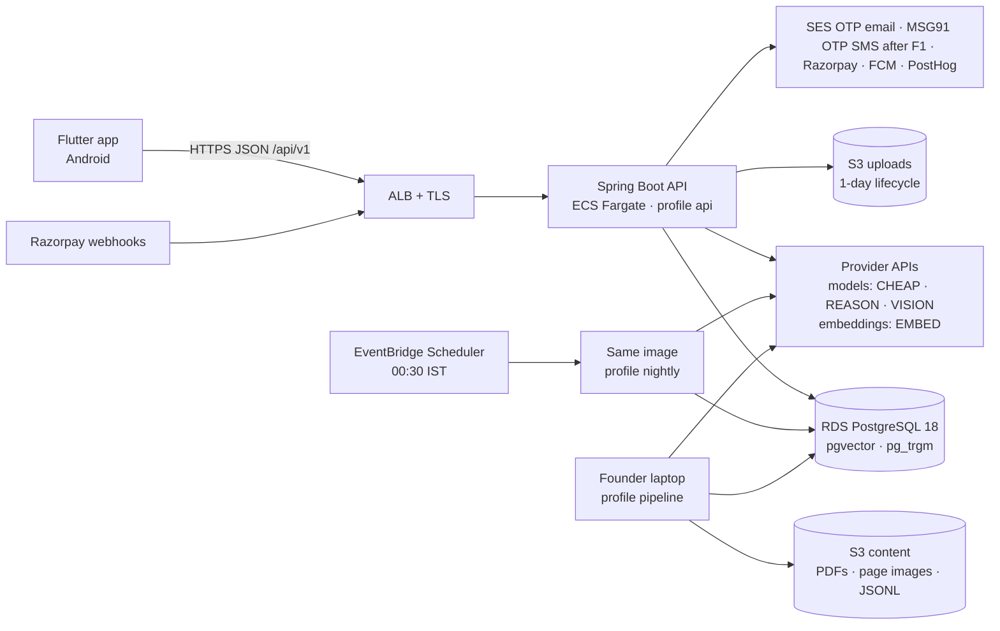
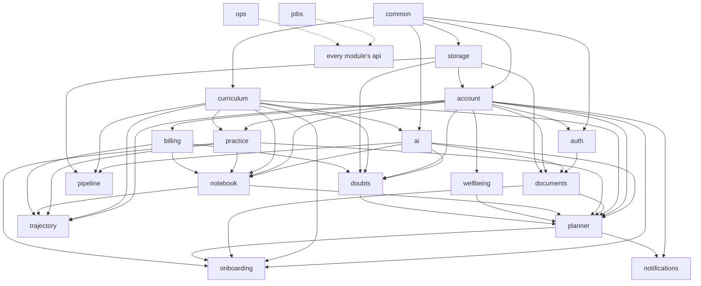

# MARG AI — Technical Plan v1.0 (D3)

**Status:** APPROVED 2026-09-04 by the founder (PLAN D3 ✅), with the eight decisions recorded in
§0.5. Drafted 2026-09-03; three spec-auditor passes before approval.
**Derived from:** docs/SPEC.md v2.0 (the contract). docs/DEV_SPEC.md §2–§12 was read as a worked
example and is confirmed, amended or replaced section by section in §0.3 below.
**Cite as:** `TECH_PLAN §n`. Rules, agents and slash commands that say "the D3-approved plan /
schema / API document in docs/" mean this file.

---

## 0. How to read this document

### 0.1 Precedence once approved

1. docs/SPEC.md — product contract. Wins every conflict.
2. CLAUDE.md and docs/DEV_SPEC.md §13 — working agreements and hard rules (authoritative,
   unchanged by this plan; where this plan proposes to reword a rule it says so in §0.4 and the
   founder decides).
3. docs/TECH_PLAN.md (this file) — how the product is built: architecture, data, API, AI, app,
   pipeline, infra, testing, conventions.
4. docs/PLAN.md — the schedule (it already supersedes DEV_SPEC §10 and decides timing questions
   such as when streaming lands); docs/TRACKER.md — live state; docs/DECISIONS.md — spec-silent
   choices.
5. docs/DEV_SPEC.md §2–§12 — reference only; where it differs from this file, this file wins.

Where this plan is silent, CLAUDE.md applies: choose the boring, maintainable option and record it
in DECISIONS.md. Where this plan turns out to conflict with SPEC, say so in the session and fix the
plan — never the behaviour.

### 0.2 What this plan changes about the repo today, and later

Nothing in code. It fixes the shape that D4 onwards fills in: package layout (§1), the migration
schedule (§2.9), the endpoint contract (§3), the AI seam (§4.1) and the app skeleton (§5).

On approval: CLAUDE.md's precedence list gets this file at position 3 (as in §0.1), and the
spec-silent rows of §14 go into DECISIONS.md. Conflict resolutions from §0.4 are recorded in the
TRACKER day log, not in DECISIONS.md (its header excludes conflicts).

Follow-on edits to working-agreement files that this plan implies, each made on its PLAN day and
surfaced in that session rather than now:

| Day | File | Edit |
|---|---|---|
| D4 | `.claude/rules/server.md`, `.claude/agents/db-migrator.md` | append-only tables (`practice_events`, `ai_calls`, `billing_events`) carry no `updated_at` (§2.1) |
| D5 | `.claude/rules/ai-layer.md` | "REASON only via the difficulty router" becomes "only with a `RouteDecision`: router, verification, generation" (§4.2) |
| D12 — **applied 2026-09-09** (not scheduled here; a PARKED item taken into the buffer, DECISIONS D12) | `scripts/precommit-gate.sh`, `eval/README.md` | the `AI_PATHS` router/routing/retrieval alternative is scoped to `server/` and `eval/` (the app's go_router under `app/lib/core/router/` tripped the eval stamp at D8) and matches either case, so §1.3's `curriculum.api.ParagraphRetrievalRepository` and `ai.retrieval.HybridRetriever` match as §1.3 says; the D23 row below is unchanged |
| D13 — **applied 2026-09-12** | `.claude/rules/pipeline.md` | `paths` adds `server/**/pipeline/**` (the first pipeline command lands at D13); founder inputs live in `pipeline/inputs/` (§6.2); command order per §6.3 — the DEV_SPEC §7 order the rule carried (backbone and cutoffs after stats) gave way to §6.3's, which loads both at D13; "Bedrock batch mode" becomes "`completeBatch`, batch above the configured minimum" (§4.11, §0.4 #2); the rule also names `pipeline/reports/<date>-<command>.md` as the committed evidence (§6.3) |
| D23 | `scripts/precommit-gate.sh`, `.claude/rules/ai-layer.md`, `eval/README.md`, `.gitignore` | the eval stamp becomes the committed `eval/last-pass.json` (§4.10); `cd eval && ./run.sh` stays the command |
| D24 — *CS-1 §9.2, added 2026-09-12* | `.claude/rules/pipeline.md` | the `collective` commands join the order as §6.3 has them — `from-pyq` momentum after `stats compute` (D22), its misconception half and `from-inputs`, `review`, `load` after `anchors link` (CS-1 §4 says "after pyq, stats and anchors"; anchors are not an input to `from-pyq`, and CS-1 §9.3 names D22) — and `pipeline/inputs/collective/` joins the founder-owned inputs, the excerpt files ignored by git (§6.2), read and never stored |
| D56 — *CS-1 §9.2, added 2026-09-12* | `.claude/rules/ai-layer.md` | reason lines and mentor notes carry an attribution; a collective-attributed line cites only the record, an individual one only the student's evidence keys (SPEC §10.9, §4.5) |
| D3 close — **applied 2026-09-04** (founder accepted the §0.4 #4 reading, §0.5 item 1a) | CLAUDE.md hard rule 1, `.claude/rules/server.md`, `.claude/commands/endpoint.md` step 4, `.claude/agents/spec-auditor.md` check 2, PLAN D31 ✅ wording | "`correct_key` never leaves the server" became "`correct_key` is never sent before that student's answer to the question is recorded server-side; judging is server-side". DEV_SPEC §13.2 keeps the original sentence; CLAUDE.md's note records the divergence. The offline clause for Option A (§0.5 item 1b) is added at D34 with the pack test |

### 0.3 Disposition of DEV_SPEC §2–§12

| DEV_SPEC | Verdict | Where in this plan | Why |
|---|---|---|---|
| §2 System architecture | Confirmed, amended | §1, §7 | Nightly work runs as a scheduled ECS task from the same image; Bedrock batch inference only above its minimum job size (§0.4 #2) |
| §2.1 Technology decisions | Confirmed | §4.9, §7.3 | Model IDs pinned in config; exact IDs to be confirmed in the console (DEV_SPEC §12 item 4) — settled 2026-09-06 by console checks #1 and #4 (§13.2): tier and embed defaults are `margai.ai.*` config since D5, DECISIONS D4 rows |
| §3 Data model | Amended | §2 | Enums as text + CHECK; HNSW index; arrays replaced by join tables where a foreign key matters; blocks get their own table; tables added for OTP, refresh tokens, sessions, consent, documents, notifications, idempotency, billing events, usage counters, audit |
| §4.1 AiClient | Replaced | §4.1 | One primitive (`complete`/`embed`) with typed feature tasks around it; ledger, breaker, retry and tier policy as decorators; REASON needs a route decision by construction |
| §4.2 Doubt pipeline | Amended, specified | §4.3 | Stages become named components with the enforcement point of each hard rule; the verifier is blind to the proposed solution (DEV_SPEC §4.1 passed it in); retrieval takes 8 + 8 candidates instead of 4 + 4; polling instead of streaming until D69; cross-language cache hits rendered, not re-solved |
| §4.3 Nightly re-planner | Confirmed, specified | §4.5 | Deterministic candidate builder spelled out; batch mode conditional; exam-season modes computed here |
| §4.4 Error classification | Confirmed | §4.6 | Async listener + sweeper; student correction wins |
| §4.5 Evaluation | Amended | §4.10 | Live eval is human-launched and writes a committed stamp; CI verifies the stamp and runs the fake-client layer (§0.4 #3) |
| §5 API | Amended, extended | §3 | Paths regrouped by module (`/onboarding/scorecard` → `/documents`, `DELETE /account` → `DELETE /me`, `/signals/batch-position` → `/plan/batch-position`, `correct-cause` → `cause`; OTP verify takes a `challenge_id`); endpoints added for consent, documents, devices, usage, danger zones, trajectory, paywall state, curriculum reads, export, admin |
| §6 Flutter | Confirmed, specified | §5 | Layering, packages, offline outbox, Hinglish locale |
| §6.1 Offline & sync | Confirmed, decided | §5.6, §0.4 #4 | Offline instant verdict vs server-side judging needed a founder decision — Option A at approval (§0.5 item 1b); the rule clause and the pack-only-carrier test land at D34 |
| §6.2 Notifications | Confirmed | §2.7, §4.5, §10 | One `notification_log` table drives cap, quiet periods and dispatch |
| §7 Content pipeline | Amended | §6 | AI-touching steps live in the Java server (profile `pipeline`) so they use `AiClient`; `pipeline/` holds founder-owned inputs and reports |
| §8 Feature rules | Confirmed with four amendments | cited where used | Product decisions consistent with SPEC. §8.1's on-the-fly plan is tagged `generated_by = fallback` (not `onboarding`) so the two origins stay distinguishable; §8.5's "queue as batch" is a deferred on-demand queue (§0.4 #2); §8.6's T-3 mode is named `light_recall` (§4.5); §8.6's "continuity offer is Phase 2" is overruled by SPEC §12, which excludes only referral and graduation automation (§0.4 #7) |
| §9 Non-functional | Confirmed | §8–§10 | Streaming NFR deferred to D69 by PLAN precedence |
| §10 Build plan (6 weeks) | Superseded | docs/PLAN.md | Already stated in CLAUDE.md |
| §11 Out of scope | Confirmed, one difference | §0.4 #7 | SPEC §12 plus the "NCERT licence badge"; DEV_SPEC §11 also lists "referral/graduation flows", which this plan reads per SPEC §12 as automation only, leaving continuity re-onboarding unscheduled rather than excluded |
| §12 Open items | Confirmed, extended | §13 | Adds batch-inference minimum, RDS PG18 availability, infra timeline |

Dispositions closed at D6 (2026-09-08, PLAN Week-1 gate; §12.1 D6 row): every verdict above is
final as a disposition. The two that waited on the founder or the console were settled by §0.5
item 1b (offline verdicts) and §13.2 items 1 and 4 (model ids). Two follow-ons stay scheduled and
are not reopened by this note: the §4.5 row's eval-gate arrangement (§0.4 #3) lands at D23, and
§13.2 item 1's live proof on the Anthropic profiles waits for the account's AWS ticket (D5 note
there). §14 was checked against DECISIONS.md the same day: 25 of 25 rows present; the DECISIONS
D3.18 row names `completeBatch` as §4.1 does, where the §14 row abbreviates to `complete` + `embed`.

### 0.4 Conflicts and gaps surfaced (not silently resolved)

1. **PLAN has no infrastructure day.** S3 `uploads/` is needed at D28, a deployed API and nightly
   task at D57/D60, backups and drills at D70. DEV_SPEC §10 W1 had "Terraform baseline"; PLAN
   supersedes §10 and dropped it. Proposal: founder workstream **F8** with the milestones in §7.6.
2. **Bedrock batch inference has a minimum job size** (100 records per job as last documented; to be
   confirmed in the console). A ≤50-student beta never reaches it, so "all nightly Bedrock calls use
   batch inference" (DEV_SPEC §2, SPEC §3 "batch processing for nightly jobs") is infeasible at
   beta scale. Proposal (§4.5, §4.11): on-demand calls with bounded concurrency below the threshold,
   batch above it, behind one config flag. The fair-use queue (DEV_SPEC §8.5) is a deferred
   on-demand queue, not a batch job.
3. **The eval gate cannot run in CI the way DEV_SPEC §4.5 describes.** CI holds no AWS credentials
   (DEV_SPEC §13.7: Claude never holds credentials; `aws` is denied) and `eval/.last-pass` is
   gitignored, so CI can neither call Bedrock nor check that a live run happened. Proposal (§4.10):
   the live eval is human-launched and writes a committed stamp; CI verifies the stamp against the
   AI-content hash and runs the fake-client layer of the suite. Decision lands at D23.
4. **The `correct_key` wording vs SPEC verdicts, online and offline.** CLAUDE.md says "`correct_key`
   never leaves the server", `.claude/rules/server.md` "never appears in any client payload", PLAN
   D31 ✅ "no correct answers in any client payload". SPEC §6.2 requires an instant verdict with the
   step solution after every answer, and SPEC §6.4 shows notebook entries as "your pick vs right":
   both display the correct option, so a literal reading of the rule contradicts the contract even
   online. This plan **proposes** the reading *the key is never sent before the student's answer for
   that question is recorded server-side, and judging is server-side*; the founder accepts or
   rejects it on approval (§13.4 item 1). Under that reading §3.7 returns the key only for answered
   questions — the judged-answer response, `GET /practice/sessions/{id}` for answered questions,
   and notebook entries — and §8.3 tests exactly those carriers. If accepted, CLAUDE.md,
   `server.md`, `endpoint.md`, `spec-auditor.md` and PLAN D31 ✅ are reworded at D3 close (§0.2).
   The **offline** case is a second, separate decision: an offline session cannot get a server
   verdict at all, so either the offline pack carries the keys for today's own blocks or offline
   play has no verdict — options in §5.6; needed before D31/D34.
5. **DEV_SPEC §7 "separate module `pipeline/`" vs `.claude/rules/pipeline.md` "AI calls go through
   `AiClient`".** Only satisfiable if the pipeline is Java or calls the server. Hence §6.1.
6. **DEV_SPEC §9 streaming vs PLAN D69.** PLAN schedules solver streaming at D69; until then answers
   are synchronous with polling (§3.6, §4.3). Resolved by PLAN precedence, recorded here.
7. **Five SPEC features have no PLAN day:** batch sync — the onboarding self-report, the timetable
   photo and the weekly batch-confirm card (SPEC §6.7); NCERT-style seed generation to ≥30 usable
   questions per topic (SPEC §9.3); "NTA trap" mining from PYQs (SPEC §9.4); in-app full mocks with
   the autopsy (SPEC §4 Phase 4, §7.1 — not excluded by §12); and the continuity re-onboarding for
   a student who falls short (SPEC §4 Fork B, §7.2, §8 screen 15 — SPEC §12 excludes only "referral
   & graduation automation"; DEV_SPEC §8.6 and §11 call the continuity offer Phase 2, and SPEC wins).
   §12.2 proposes where they could land; scheduling them is the founder's call.
8. **CLAUDE.md precedence list has no slot for this plan** while three rules/agents already cite it.
   Fixed on approval (§0.2).
9. **Two rule sentences are contradicted by the design and need rewording**, listed here so the
   founder sees them: `.claude/rules/ai-layer.md` "REASON-tier calls must pass through the difficulty
   router" — the verifier and variant/solution generation also need REASON, so §4.2 makes the rule
   "REASON only with a `RouteDecision` from one of three named producers" (edit at D5, §0.2); and
   `.claude/rules/pipeline.md` "AI calls go through `AiClient` … and Bedrock batch mode" — batch mode
   is conditional on the minimum job size (#2), so the sentence becomes "through `completeBatch`"
   (edit at D13, §0.2). A third, smaller one: `.claude/rules/server.md` and `db-migrator.md` list
   `created_at, updated_at` on every table; the append-only tables in §2.1 carry no `updated_at`
   (edit at D4, §0.2).
10. **(Added 2026-09-08, D7.) SPEC §3 "OTP SMS: DLT-compliant provider", §5 "phone number → OTP" and
    §8 screen 1 "auto-read" vs feasibility:** the DLT template (TRACKER F1) requires a registered
    company, which does not exist yet. Founder ruling at the D7 plan review: login by a *verified email*
    through SES until F1 lands, with the phone/SMS path designed in behind `margai.auth.otp.channels`;
    SPEC untouched (a temporary deviation, exit condition F1), dated amendments in §1.1, §1.2, §1.4,
    §1.5, §2.2, §2.9, §2.10, §3.2–§3.4, §3.7, §7.2–§7.4, §7.7, §9.6, DECISIONS row 1 of 2026-09-08,
    TRACKER F1/F10 and the D8/D11/gate notes.

### 0.5 Founder decisions at approval (2026-09-04)

The eight questions of §13.4, answered. Each row names where the plan reflects it.

| # | Decision | Where it lands |
|---|---|---|
| 1a | `correct_key` reading **accepted**: the key is never sent before that student's answer to the question is recorded server-side; judging is server-side | CLAUDE.md hard rule 1, `server.md`, `endpoint.md`, `spec-auditor.md`, PLAN D31 ✅ reworded at D3 close; §3.1 carriers stand |
| 1b | Offline verdicts: **Option A**. The pack carries judging data only for that student's own scheduled blocks of the day, obfuscated on device (best effort, not a security boundary), wiped after sync; server re-judging is authoritative for state, notebook and streaks | §5.6; the offline clause is added to the rule at D34 together with the test that the pack is the only pre-answer carrier |
| 2 | Mocks and autopsy **scheduled**: `kind = mock` on the session engine at D35, the autopsy (per-mark classification, gamble score, pace map) in D54's buffer; slips go to the TRACKER slippage log | §12.2; TRACKER D35, D54 |
| 3 | Batch sync: self-report at **D25**, timetable photo as a `doc_type` at **D29**; the weekly batch-confirm card **parked** until coaching students are in the beta; the nightly snapshot reads `batch_positions` when present | §2.7, §2.9 V11, §3.7, §12.2 |
| 4 | Crash reporting via PostHog error tracking **accepted** within the three-SDK rule; revisit at D73; Crashlytics only through an explicit rule amendment | D3.25 confirmed |
| 5 | Workstream **F8 accepted** with the §7.6 timeline. Terraform is drafted by Claude in a separate, explicitly permitted infra session profile (`terraform plan` allowed, `apply` denied) that is created when F8's first milestone comes due; the founder runs every apply | §7 intro; TRACKER F8 |
| 6 | Java pipeline **confirmed** (D3.4), with the D14 extraction-quality escape hatch | — |
| 7 | The founder runs the four console checks before D5 and reports in that session; if RDS Mumbai lacks PostgreSQL 18, the stack drops to 17 as a versions change | §13.2 lists every touch point, including SPEC §3 |
| 8 | Minors, **overruling the narrow gating**: the parent-consent OTP is part of the onboarding flow; until consent is complete, `CONSENT_REQUIRED` covers photo doubts as well as documents (text features stay available); after consent everything unlocks | §3.3, §3.7, §4.3 stage 1, §5.8, §9.6, decision D3.28 |

Reading of decision 8, confirmed by the founder on 2026-09-04 with two tightenings: a minor
completes onboarding and receives the first plan without waiting for consent (SPEC §5, value before
money; the first plan involves no upload). (1) The consent request **starts at the DOB step**: the
parent's phone is captured there and the consent OTP is sent immediately, so for most students
consent is done before they ever reach a gate. (2) A visible **"parent consent pending"** state on
Profile, plus a re-prompt with a resend at every gated moment (`CONSENT_REQUIRED` carries the deep
link), so the path to unlock is always one tap away. Legal review under DPDP may tighten this; that
is founder workstream F9, not a build blocker.

---

## 1. Architecture

### 1.1 System context



One deployable. The API, the nightly run, the content pipeline and the eval suite are the same
Spring Boot image started with different profiles (§1.2). No queue, no cache server, no second
service at beta; the places where a second instance would need one are listed in §13.3.

### 1.2 Run modes (Spring profiles)

*Amended 2026-09-12: the `bedrock` profile is now `live`, switched on by `AI_LIVE=1`, and which
provider it wires is `margai.ai.provider` — the switch outlives a provider change (DECISIONS; §4.11).*

| Profile | Started by | Does | AI client |
|---|---|---|---|
| `api` (default) | ECS service, `./mvnw spring-boot:run` locally | HTTP API, in-process notification dispatcher (every 60 s), sweepers (expired images hourly, unclassified errors every 5 minutes) *— and, since D11 (2026-09-09), the OTP delivery-rate log line every `margai.auth.otp.report-every`; scheduling is switched on in `common` for every profile, so the `nightly` and `pipeline` tasks carry a scheduler thread too, and each schedule stays with the module whose work it is (DECISIONS D11)* | `fake` unless `live` is also active |
| `nightly` | EventBridge → ECS RunTask at 00:30 IST; locally by hand | the `jobs` module's `NightlyRunner` (§1.3): §4.5 re-plan for every user active in 14 days, weekly trajectory + patterns on Sundays, purge job, ai spend rollup; exits when done | as above |
| `pipeline` | Founder's laptop with AWS SSO, `java -jar server.jar --spring.profiles.active=pipeline <command>` | §6 content commands (picocli) | `live` (human-launched) |
| `eval` | Founder's laptop, `AI_LIVE=1 ./mvnw -Peval verify` | §4.10 live eval suite | `live` |
| `live` | Added by the environment (`AI_LIVE=1` locally; task definition in AWS) | Swaps `FakeAiClient` for the provider `margai.ai.provider` names; cost breaker stays on | — |
| `local` | Developer default | Compose db, seed migrations (§2.9), fake OTP (`margai.auth.otp.sender = log`, the sandbox inbox for email and, after F1, SMS) / FCM / Razorpay adapters that log | `fake` |

### 1.3 Modules and package layout

Modular monolith under `com.margai`. Each module is one top-level package with `api` (public
types other modules may use), `internal` (everything else) and, where it owns HTTP, `web`. Spring
Modulith verifies the boundaries in a test from D4 on (§8.1). A module owns its tables; other
modules read them only through the owning module's `api` package or through events (§1.7). The one
component that needs SQL over another module's tables, hybrid retrieval, is split accordingly:
`curriculum.api.ParagraphRetrievalRepository` owns the vector and full-text queries over
`ncert_paragraphs` and `questions`; `ai.retrieval.HybridRetriever` composes and fuses their results.
Both names match the eval gate's `retriev*` path rule.

| Module | Owns (SPEC) | Tables (§2) | Depends on |
|---|---|---|---|
| `common` | error envelope, request id, IST clock, idempotency, pagination, config binding, message catalogs | `idempotency_keys` | — |
| `auth` | OTP login, tokens, rate limits, security filter chain, the parent-consent OTP (every OTP-backed fact), beta invite codes (§8 screens 1, 4) | `otp_challenges`, `refresh_tokens`, `parent_consents`, `invite_codes` | common, account |
| `account` | users, student profile, language, settings, export job and deletion (§5 DOB, §6.11, §8 screen 13) | `users`, `student_profiles`, `user_devices`, `data_export_jobs` | common, storage (export files) |
| `curriculum` | syllabus tree, prerequisites, archetype tracks, cutoffs, NCERT books/paragraphs, question bank, topic traps (§9) | `syllabus_nodes`, `syllabus_prerequisites`, `archetype_tracks`, `archetype_track_steps`, `cutoffs`, `ncert_books`, `ncert_paragraphs`, `questions`, `question_topics`, `question_anchors`, `topic_traps`, `topic_trap_evidence`, `collective_records` (CS-1: written by the pipeline through `curriculum.api`, read by planner and notebook) | common |
| `onboarding` | interview state machine, syllabus check-in, first plan trigger (§5, §8 screens 2, 5) | (writes through account, practice and planner apis) | common, account, curriculum, documents, planner, practice.api |
| `documents` | photograph → read → confirm → delete pattern (§6.8, §8 screen 3) | `document_extractions` | common, account, auth.api (consent state), ai, storage |
| `planner` | Today, blocks, nightly re-plan, negotiation chat, streaks, exam-season modes, batch position (§6.1, §6.7, §8 screens 7, 14) | `daily_plans`, `plan_blocks`, `mentor_messages`, `batch_positions` | common, account, curriculum, ai, notebook.api, practice.api, wellbeing.api, doubts.api (events), documents.api (events) |
| `practice` | sessions from a `SessionSpec` (node, band, count, drill, timer), question serving, server judging, events, diagnostic (§5.4, §6.2, §8 screens 6, 8). Block sessions are started by the planner through `practice.api.SessionStarter`; practice never reads plan tables | `practice_sessions`, `practice_session_questions`, `practice_events`, `chapter_status` | common, account, curriculum |
| `doubts` | solve pipeline orchestration, history, follow-ups, reports, free-tier meter (§6.3, §8 screen 9) | `doubts`, `doubt_evidence`, `doubt_cache`, `doubt_daily_usage` | common, account, curriculum, ai, storage, billing.api |
| `notebook` | error capture, classification, SRS, healed, danger zones, patterns (§6.4, §8 screen 10) | `error_entries`, `srs_reviews`, `notebook_patterns` | common, account, curriculum, ai, billing.api, practice.api (events) |
| `wellbeing` | mood chip, slump inference (§6.6) | `wellbeing_signals` | common, account |
| `trajectory` | weekly predicted band, peer line, deep report (§6.5, §8 screen 11) | `trajectory_snapshots` | common, account, curriculum, practice.api, notebook.api, billing.api |
| `billing` | subscriptions, Razorpay, webhooks, paywall triggers, cancel/refund, auto-pause (§6.9, §8 screen 12) | `subscriptions`, `payments`, `billing_events`, `paywall_impressions` | common, account |
| `notifications` | FCM devices, scheduling from plan events, 2/day cap, quiet periods, dispatcher (§6.10) | `notification_log` | common, account, planner.api (events) |
| `ai` | `AiClient`, one package per provider plus the fake, ledger, breaker, router, retrieval, prompts, verification, embeddings (§4) | `ai_calls`, `ai_spend_daily`, `audit_queue` | common, curriculum |
| `storage` | S3 port (uploads, content), signed URLs, deletion | — | common |
| `pipeline` | §6 CLI commands | — | common, curriculum (D13); ai, storage (D14) — *`common` added 2026-09-12 (DECISIONS): the run report's IST clock* |
| `jobs` | `NightlyRunner` (§4.5 orchestration), the purge and rollup jobs, the export executor (gathers every module's data for `data_export_jobs`, D64), the daily document-deletion verification job (§9.6, D64), the sweepers' schedules, the weekly dump | — | every `api` package |
| `ops` | founder admin peek, audit-queue review, cost views (`GET /admin/costs` D65, the rest D75) — *opened 2026-09-09 at D11 with `GET /admin/metrics/otp`, the §10.3 stub; declares `common :: api`, `auth :: api` today and gains each module's `api` as its routes arrive* | — | every `api` package (read-only) |

`chapter_status` sits in `practice` because ability estimates are written by practice and the
diagnostic; onboarding seeds it through `practice.api`. `audit_queue` sits in `ai` because every
producer of audit items is an AI outcome.

### 1.4 Dependency rules



Rules, enforced by the Modulith test from D4:

- Arrows point from the module that is used to the module that uses it; an event listener counts
  as a use of the publisher's `api` (the event record lives there), which is why `practice → notebook`,
  `doubts → planner`, `documents → planner` and `planner → notifications` appear. The graph is
  acyclic and stays so. A new edge needs a line in DECISIONS.md.
- `jobs` and `ops` sit on top: they may use every module's `api` and nothing uses them. `jobs`
  orchestrates (the nightly run calls `planner.api`, `trajectory.api`, `notebook.api`, `account.api`
  and `ai.api` in turn); `ops` only reads.
- Only `ai` talks to a model or embedding provider, and inside `ai` each provider is confined to one
  package (*extended 2026-09-12*): the model SDK to `ai.internal.anthropic`, the embedding provider's
  HTTP calls to `ai.internal.cohere`, `software.amazon.awssdk.services.bedrock*` to the dormant
  `ai.internal.bedrock`. Only `storage` imports S3. Only
  `billing` imports the Razorpay SDK; only `notifications` the FCM client; only `auth` the SMS client
  and, since the D7 ruling (2026-09-08, DECISIONS), the SES client for the email OTP channel — inside
  `auth` only its `internal.email` package, on the same principle (ArchUnit enforces all of these).
- Feature modules never read another module's tables directly; they call `<module>.api` or listen to
  events. `ops` is the one exception: read-only queries across `api` packages.
- Controllers live in `<module>.web`, are thin, and map to one service call.

### 1.5 Request lifecycle

1. ALB terminates TLS, forwards to the single task with `X-Forwarded-For` in its default `append`
   mode, so the *last* hop is the address the ALB saw and the only one a client cannot choose; the
   app keys per-address limits and `request_ip` on that last hop (D7; F8 keeps the mode at `append`).
2. `RequestIdFilter` takes `X-Request-Id` or mints one; puts `request_id` into the MDC and echoes
   it back. *On `/api/v1/auth/*` the `ClientTimeFilter` runs right after it and adds
   `client_skew_s` from `X-Client-Time` (§3.1; D9, 2026-09-09).*
3. Spring Security (stateless): bearer JWT → principal `{user_id, role, language}`; unauthenticated
   routes are `/auth/otp/*`, `/auth/refresh`, `/billing/webhook`, `/actuator/health` — and Boot's
   `/error` dispatch, so a failure inside a filter still renders the envelope (D7). *On those
   routes no bearer is read at all, so a stale token in a client's store cannot 401 the refresh
   meant to replace it; `/auth/logout` is not among them and needs a bearer (D10, 2026-09-09).*
4. `RateLimitFilter`: in-process token buckets keyed by user id, or by client address for the public
   `/auth/*` routes (D7: 10/hour on `otp/request`, 60/min on `otp/verify` and `refresh`; the
   per-destination cap is a durable check in the service), limits from config (§3.4).
5. `IdempotencyFilter` on routes marked idempotent: replays a stored response for a seen
   `Idempotency-Key` (§3.5).
6. Controller validates the DTO (Bean Validation) and calls one service method. *A `Principal`
   parameter on a controller is the caller published in step 3 (`common.internal
   .PrincipalArgumentResolver`; absent → `AUTH_REQUIRED`), so no module depends on Spring
   Security for it (D10, 2026-09-09). A body whose vocabulary is an enum — `PATCH /me` — is
   checked in one pass by its payload record instead of annotations, so every bad field is
   named at once and the enum stays the single source of the vocabulary (D10, DECISIONS).*
7. Service runs in one transaction; AI calls happen outside the transaction (§4.8) with their own
   ledger rows.
8. `ApiExceptionHandler` maps any exception to the envelope `{error:{code, message_en,
   message_user_lang}}` (§3.3) with the message catalogs in the principal's language.
9. Response DTOs are records serialised in snake_case; timestamps ISO-8601 UTC; dates are IST
   calendar dates (§11.1).

### 1.6 Nightly execution model

- EventBridge Scheduler fires at 19:00 UTC (00:30 IST) and runs the image as an ECS task with
  `--spring.profiles.active=nightly,live` *(2026-09-12: the profile was renamed from `bedrock`;
  a run left on the old name would start on `FakeAiClient` and fabricate plans)*. The task processes users in a fixed order, commits per
  user, and exits. Re-running it is safe: `daily_plans` is unique on `(user_id, plan_date)` and a
  rerun overwrites only plans it generated itself (`generated_by = nightly`), never a renegotiated one.
- If no plan exists for a user at `GET /plan/today`, the API builds the deterministic fallback on the
  spot and marks it `generated_by = fallback` (DEV_SPEC §8.1). A missing nightly run is visible as
  an alarm (§10.4), never as an empty morning.
- Locally: `./mvnw spring-boot:run -Dspring-boot.run.profiles=local,nightly` runs the same code
  against the compose db with `FakeAiClient`.
- Notifications are not sent by the nightly task. It writes `notification_log` rows with per-user
  send times; the API's in-process dispatcher (every 60 s) sends what is due. One mechanism serves
  the 07:00 plan, the 20:30 streak-save, SRS-due and Sunday trajectory (§2.7).

### 1.7 Cross-module communication

Spring application events, published after commit (`@TransactionalEventListener`) and handled in
the same JVM. They carry ids, not entities.

| Event | Published by | Consumed by | Effect |
|---|---|---|---|
| `PracticeAnswerRecorded` | practice | notebook | wrong answer → `error_entries` row + async classification (§4.6) |
| `PracticeSessionFinished` | practice | planner, trajectory | block status, ability updates already committed; planner marks block done |
| `DoubtSolved` | doubts | planner | weak-signal count per node for the next re-plan ("three Optics doubts") |
| `ErrorCauseUpdated` | notebook | planner | re-learn block candidate when a cause is upgraded |
| `SubscriptionChanged` | billing | doubts, notebook, trajectory | limits and locks re-evaluated on next request |
| `DocumentConfirmed` | documents | onboarding, planner | scorecard/marksheet fields into profile; timetable into batch positions |
| `UserDeleted` | account | every module | anonymise/purge own rows (§9.6) |
| `PlanGenerated` | planner (nightly, onboarding, fallback, renegotiation) | notifications | schedule the day's notification rows (§4.5 step 7) |
| `PlanChanged` | planner | notifications | reschedule the morning notification if the time moved |

Events are at-least-once within the process; every listener is idempotent on its natural key.
If the JVM dies mid-listener a sweeper in the owning module repairs the gap: every 5 minutes for
wrong answers without an `error_entries` row (§4.6), hourly for expired images and missing
notification rows.

### 1.8 Screen and feature ownership (coverage check)

| SPEC §8 screen | Owning module | Also touches |
|---|---|---|
| 1 Splash/Login | auth | account (profile on first login) |
| 2 Onboarding interview | onboarding | curriculum (grid), practice.api (chapter status), account |
| 3 Scorecard / marksheet / timetable capture + confirm | documents | onboarding, planner (timetable) |
| 4 Parent consent | auth (consent OTP and the consent record) | account (`is_minor`), documents (reads the consent state) |
| 5 First-plan reveal | onboarding | planner (deterministic first plan), curriculum (cutoffs for the target line; the weekly trajectory arrives D58) |
| 6 Diagnostic intro + session | practice | planner (day-1 block if deferred) |
| 7 Today | planner | wellbeing (mood chip), trajectory (mini card), notifications |
| 8 Practice session + summary | practice | notebook (sent-to-notebook list) |
| 9 Doubt capture + answer + history | doubts | ai, curriculum (anchor view), billing (meter/paywall) |
| 10 Notebook views | notebook | curriculum (weightage for danger zones), billing (30-error cap) |
| 11 Weekly report | trajectory | notebook (patterns), billing (deep version) |
| 12 Paywall · subscription management | billing | — |
| 13 Profile & settings | account | billing, notifications (time), planner (hours/target edits) |
| 14 Exam-mode variants of Today | planner | notifications (silence protocol) |
| 15 Result flows | onboarding (continuity re-onboarding, unscheduled — §0.4 #7, §12.2) | graduation package: Phase 2 (SPEC §12 "referral & graduation automation"); the auto-pause rule ships in billing (D63) |

Every SPEC §6 feature maps the same way: §6.1 planner · §6.2 practice · §6.3 doubts · §6.4 notebook
· §6.5 trajectory · §6.6 wellbeing · §6.7 planner + documents · §6.8 documents · §6.9 billing ·
§6.10 notifications · §6.11 account + billing.

## 2. Data model

### 2.1 Conventions (apply to every table)

- PostgreSQL 18, snake_case. `id UUID PRIMARY KEY DEFAULT gen_random_uuid()`,
  `created_at TIMESTAMPTZ NOT NULL DEFAULT now()`, `updated_at TIMESTAMPTZ NOT NULL DEFAULT now()`
  (Hibernate `@UpdateTimestamp`). Append-only tables (`practice_events`, `ai_calls`, `billing_events`)
  have no `updated_at`.
- Enumerations are `VARCHAR` columns with a `CHECK (col IN (...))` constraint; Java side
  `@Enumerated(EnumType.STRING)`. Adding a value is a one-line migration; PostgreSQL enum types are
  not used.
- Foreign keys are `ON DELETE RESTRICT`. Student data is anonymised (§9.6), never cascaded away.
- Time: `TIMESTAMPTZ` everywhere (UTC on the wire); `DATE` columns are IST calendar dates and are
  named `ist_date`, `plan_date`, `week_start` etc. (§11.1). Money is `BIGINT` paise.
- Vectors are `vector(1024)` with HNSW cosine indexes; full text is a stored generated `tsvector`
  with a GIN index.
- JSONB is used for shapes the app reads whole and never queries by key (extracted document fields,
  evidence trails, snapshots). Anything queried, joined or constrained gets columns or a join table.
  DEV_SPEC §3's `UUID[]` columns become join tables where a foreign key matters.
- Every table names the PLAN day it lands (§2.9). Column lists below are complete for D4 tables and
  key-complete for the rest (db-migrator fills types and indexes from these).

### 2.2 Identity and account (`account`, `auth`)

**users** — D4
```
id, phone VARCHAR(16) (E.164; unique via the partial index below; NULL after deletion), phone_verified_at TIMESTAMPTZ,
email VARCHAR(254) (lowercased; unique via a partial index; added by V6 under the D7 ruling — see the constraint note),
display_name VARCHAR(80), language VARCHAR(8) NOT NULL DEFAULT 'en' CHECK (en|hi|hinglish),
role VARCHAR(16) NOT NULL DEFAULT 'student' CHECK (student|admin),
status VARCHAR(16) NOT NULL DEFAULT 'active' CHECK (active|deleted),
deleted_at TIMESTAMPTZ, purge_after DATE, created_at, updated_at
```
Index: `phone` (unique, partial `WHERE phone IS NOT NULL`); `email` likewise (V6). Constraint, amended
2026-09-08 (D7 founder ruling, DECISIONS): `CHECK (status = 'deleted' OR phone IS NOT NULL OR email IS NOT NULL)` —
an active account has at least one *verified* identifier. The SMS DLT template (TRACKER F1) needs a
registered company, so login is by email until it exists; a phone can be attached later by phone OTP
(PARKED). Until D7 the check read `status = 'deleted' OR phone IS NOT NULL`; SPEC §3/§5 stay the target.

**student_profiles** (1:1 users) — D4; columns marked † are filled by later days but declared now so
the row shape is stable.
```
id, user_id UUID UNIQUE NOT NULL → users,
attempt_type VARCHAR(16) CHECK (fresher_1yr|fresher_2yr|dropper|repeater),
target_year SMALLINT, coaching_mode VARCHAR(16) CHECK (classroom|online|self_study|mix),
coaching_provider VARCHAR(16) CHECK (pw|aakash|allen|unacademy|other),
hours_weekday NUMERIC(3,1), hours_weekend NUMERIC(3,1),
goal VARCHAR(16) CHECK (govt_mbbs|private_ok|bds_other|qualify),
state_code CHAR(2), category VARCHAR(8) CHECK (general|obc|sc|st|ews),
dob DATE, is_minor BOOLEAN NOT NULL DEFAULT false,
last_neet_year SMALLINT, last_neet_score SMALLINT, last_neet_rank INTEGER,
scorecard JSONB †, board_marks JSONB †,
onboarding_step VARCHAR(24) NOT NULL DEFAULT 'intro', onboarding_completed_at TIMESTAMPTZ,
exam_date DATE †, morning_notification_time TIME NOT NULL DEFAULT '07:00',
current_streak INTEGER NOT NULL DEFAULT 0, longest_streak INTEGER NOT NULL DEFAULT 0,
last_active_ist_date DATE, created_at, updated_at
```
SPEC §5.1 Q1–Q7 map one-to-one: Q1 `attempt_type`, Q2 `target_year`, Q3 `coaching_mode` +
`coaching_provider`, Q4 → `chapter_status`, Q5 hours, Q6 `goal`/`state_code`/`category`
(category optional, DEV_SPEC §8.4), Q7 `last_neet_*` or `scorecard`/`board_marks` via documents.
`scorecard` and `board_marks` hold confirmed fields only (SPEC §5.2): never an image reference.

**parent_consents** — D27, owned by `auth` (it is an OTP-backed fact; §1.3): `user_id → users,
parent_phone VARCHAR(16), status CHECK (pending|consented|expired), otp_challenge_id →
otp_challenges, consented_at`. Partial unique `(user_id) WHERE status = 'consented'`.

**invite_codes** — D75, owned by `auth`: `code VARCHAR(16) UNIQUE, uses_left SMALLINT, expires_at,
note VARCHAR(80)`; `POST /auth/otp/verify` takes an optional `invite_code` while the beta flag
`margai.flags.invite_only` is on.

**otp_challenges** — D7 (amended 2026-09-08 at build under the D7 ruling): `channel CHECK (sms|email),
destination VARCHAR(254)` (the E.164 phone or the lowercased email) replace `phone`; `purpose CHECK
(login|parent_consent), code_hash CHAR(64)` (SHA-256 of pepper ‖ challenge id ‖ code; the code is never
stored), `attempts SMALLINT DEFAULT 0, expires_at, verified_at, request_ip INET`. Index
`(destination, created_at)` — the per-destination cap and the resend cooldown (§3.4) query it.
*`created_at` is stamped from `IstClock`, not Hibernate's VM clock, so those two checks compare
like with like (§11.1; D9 finding, 2026-09-09). A start with an ephemeral pepper retires every
pending challenge (`expires_at = now`), since none of them can match any more (D9).*

**refresh_tokens** — D7: `user_id → users, token_hash CHAR(64) UNIQUE, family_id UUID, expires_at,
revoked_at, replaced_by_id → refresh_tokens, device_label VARCHAR(80), last_used_at`. Index `user_id`,
`family_id`.

**user_devices** — D30: `user_id → users, fcm_token TEXT UNIQUE, platform VARCHAR(8), app_version
VARCHAR(16), last_seen_at`.

**data_export_jobs** — D64: `user_id → users, status CHECK (queued|ready|failed|expired), s3_key,
expires_at, error`. `account` owns the row and the endpoints; the `jobs` module's export executor
gathers each module's data through its `api` and writes the file through `storage` (§1.3).

### 2.3 Curriculum content (`curriculum`, read-mostly)

**syllabus_nodes** — D4
```
id, code VARCHAR(32) UNIQUE NOT NULL  (PHY.11.ROT · PHY.11.ROT.TORQUE; stable, used everywhere),
subject VARCHAR(16) NOT NULL CHECK (physics|chemistry|botany|zoology),
class_level SMALLINT CHECK (11|12), parent_id → syllabus_nodes,
kind VARCHAR(8) NOT NULL CHECK (subject|unit|chapter|topic),
name_en VARCHAR(160) NOT NULL, name_hi VARCHAR(160), sort_order INTEGER NOT NULL,
weightage_marks_avg NUMERIC(6,2) NOT NULL DEFAULT 0  (D22),
default_learn_minutes INTEGER, neet_relevant BOOLEAN NOT NULL DEFAULT true  (SPEC §6.2 "NTA never asked it"),
created_at, updated_at
```
Indexes: `parent_id`, `(subject, kind)`. Constraint: `kind = 'subject'` ⇒ `parent_id IS NULL`.

**syllabus_prerequisites** — D4 (loaded D13): `from_node_id → syllabus_nodes, to_node_id →
syllabus_nodes, PRIMARY KEY (from_node_id, to_node_id), CHECK (from_node_id <> to_node_id)`. The D13
acceptance "graph has no cycles" is a loader check plus a repository test; replaces the
`prerequisites UUID[]` column of DEV_SPEC §3.2.

**archetype_tracks** — D4 (config table): `code VARCHAR(16) UNIQUE CHECK
(fresher_2yr|fresher_1yr|dropper|repeater), name_en, name_hi, weeks SMALLINT, description_md`.
**archetype_track_steps** — D4: `track_id → archetype_tracks, node_id → syllabus_nodes, sequence
INTEGER, phase CHECK (learn|mock|revision), target_week SMALLINT, UNIQUE (track_id, sequence)`.
Loaded from `pipeline/inputs/archetypes.yaml` (SPEC §9.5; educator review is TRACKER F3).

**cutoffs** — D4 (config table): `year SMALLINT, category VARCHAR(8), quota_scope VARCHAR(8)
(AIQ or state code), seat_type VARCHAR(16) CHECK (govt_mbbs|private_mbbs|bds|qualifying),
qualifying_marks SMALLINT, source VARCHAR(120), UNIQUE (year, category, quota_scope, seat_type)`.

**collective_records** — D22 (CS-1 §2; approved rows from D24, `collective load`)
```
node_id → syllabus_nodes NOT NULL, season_version VARCHAR(16) NOT NULL ('2027-prep'),
status VARCHAR(8) NOT NULL CHECK (draft|approved),
struggle_score NUMERIC(3,2), pacing_multiplier NUMERIC(3,2),
momentum_trend VARCHAR(8) CHECK (rising|flat|falling),
misconceptions JSONB NOT NULL DEFAULT '[]'   ([{label, description, distractor_patterns[], question_ids[]}]),
season_notes JSONB NOT NULL DEFAULT '[]'     ([{month_offset, effect, prevalence, note}]),
strategy_notes JSONB NOT NULL DEFAULT '[]'   ([{note, source_count}]),
confidence NUMERIC(3,2) NOT NULL DEFAULT 0,
source_summary JSONB NOT NULL DEFAULT '{}'   ({pyq_years, questions, excerpt_files, excerpts, sources}),
reviewed_at, created_at, updated_at, UNIQUE (node_id, season_version, status)
```
Index `(node_id, season_version)`. Draft rows are what `collective from-pyq` and `collective from-inputs`
write and `collective review` reads; `collective load` writes the approved row from the founder-edited
sheet, so a review never touches what the planner reads mid-season. The planner reads approved rows of
the configured season (`margai.planner.collective.season`) with `confidence ≥
margai.planner.collective.min_confidence` (default 0.5) and treats the rest as absent (CS-1 §2, the
Evidence rule). Misconception question ids stay inside the JSONB and `collective load` refuses an id
that names no question — no join table (integration decision 4; DECISIONS 2026-09-12). The list
fields are JSONB because the review sheet edits them as text and their shape is CS-1 §2's, not a
query's. *Added 2026-09-12 with CS-1.*

**ncert_books** — D14: `code VARCHAR(16) UNIQUE (keph1 …), subject, class_level, part SMALLINT,
title_en, title_hi, edition_year SMALLINT, s3_key_en, s3_key_hi, pages_en, pages_hi`.

**ncert_paragraphs** — D14 (embedding D17)
```
book_id → ncert_books, chapter_no SMALLINT, section VARCHAR(16) ('7.9'), para_no SMALLINT,
node_id → syllabus_nodes (nullable; set by the D23 anchor pass),
text_en TEXT, text_hi TEXT, figure_refs JSONB, has_equations BOOLEAN,
embedding vector(1024), tsv tsvector GENERATED ALWAYS AS
  (to_tsvector('english', coalesce(text_en,'')) || to_tsvector('simple', coalesce(text_hi,''))) STORED,
extraction JSONB (page numbers, confidence, ai_call_id), UNIQUE (book_id, chapter_no, section, para_no)
```
Indexes: HNSW `embedding vector_cosine_ops`, GIN `tsv`, `node_id`. The unique key is the paragraph
address that anchors display as "Class 11 Physics, Ch 7, §7.9" (SPEC §6.3).

**questions** — D19
```
source VARCHAR(16) CHECK (pyq|generated), exam VARCHAR(8), year SMALLINT, paper_code VARCHAR(16),
question_no SMALLINT, node_id → syllabus_nodes NOT NULL,
stem_en TEXT NOT NULL, stem_hi TEXT, options JSONB NOT NULL ([{key, text_en, text_hi}]),
correct_key CHAR(1) NOT NULL,
solution_md_en TEXT, solution_md_hi TEXT, difficulty NUMERIC(3,2), avg_time_sec INTEGER,
distractor_map JSONB ({"B": "sign_error", …}), embedding vector(1024),
verified BOOLEAN NOT NULL DEFAULT false, audit_status VARCHAR(16) CHECK (auto|founder_ok|flagged),
verification JSONB, generated_from_error_entry_id UUID (variants, D51)
```
Natural key for PYQs: `UNIQUE (source, exam, year, paper_code, question_no)`. Indexes:
`(node_id, difficulty)`, `(source, year)`, partial on `verified`. **`correct_key` is server-only:**
the JPA entity field is `@JsonIgnore`, no response record carries it before an answer is judged, and
a test scans every pre-judging payload for the string (§8.3). Only the three carriers for
already-answered questions return it — the judged-answer response, answered questions inside a
session read, and notebook entries in any notebook view (§3.7, §0.4 #4) — plus the offline pack if
Option A is chosen (§5.6).

**question_topics** — D19: `question_id, node_id, PRIMARY KEY (question_id, node_id)` (secondary
topics). **question_anchors** — D23: `question_id, paragraph_id, PRIMARY KEY`.

**topic_traps** — unscheduled, proposed D24 buffer (§12.2): `node_id → syllabus_nodes, note_en TEXT,
note_hi TEXT, note_hinglish TEXT`.
**topic_trap_evidence** — same day: `trap_id, question_id, PRIMARY KEY`. A trap without at least one
evidence row is never created (service check + test): the Evidence rule for "How NTA twists this".

### 2.4 Practice (`practice`)

**chapter_status** — D4
```
user_id → users, node_id → syllabus_nodes,
status VARCHAR(16) NOT NULL DEFAULT 'untouched' CHECK (untouched|ongoing|covered),
feels_weak BOOLEAN NOT NULL DEFAULT false,
source VARCHAR(16) NOT NULL CHECK (self_report|inferred|timetable|diagnostic),
ability_estimate NUMERIC(3,2), ability_confidence NUMERIC(3,2), last_signal_at TIMESTAMPTZ,
UNIQUE (user_id, node_id), created_at, updated_at
```
Q4's three states plus long-press weak (SPEC §5.1) write `status` and `feels_weak` with
`source = self_report`; behaviour refines them later.

**practice_sessions** — D31: `user_id, block_id UUID (nullable, no foreign key: the planner passes
it in the `SessionSpec` and reads it back from `PracticeSessionFinished`; practice never joins plan
tables), kind CHECK (block|diagnostic|srs_review|mock), spec JSONB (node, band, count, drill,
timer), status CHECK (active|finished|abandoned), started_at, finished_at, summary JSONB`. Index
`(user_id, started_at)`.
**practice_session_questions** — D31: `session_id, question_id, position SMALLINT, answered BOOLEAN,
PRIMARY KEY (session_id, question_id)`.
**practice_events** — D33 (append-only): `user_id, session_id, question_id, chosen_key CHAR(1)
(NULL = skipped), is_correct BOOLEAN, time_taken_ms INTEGER, position_in_session SMALLINT,
occurred_at TIMESTAMPTZ, client_event_id UUID UNIQUE, created_at`. Indexes `(user_id, occurred_at)`,
`question_id`, `session_id`. `client_event_id` makes offline outbox replays idempotent (§5.6).

### 2.5 Doubts (`doubts`)

**doubts** — D37: `user_id, input_type CHECK (photo|text), raw_text, normalized_text, question_hash
CHAR(64), language, image_s3_key (NULL once deleted), image_deleted_at, subject, node_id (nullable),
cache_hit BOOLEAN, cache_id → doubt_cache (column added D41 with the cache table), model_tier CHECK
(cheap|reason|none), status CHECK (answered|pending|queued|unverified_fallback|failed), answer JSONB,
verified BOOLEAN, verification JSONB, parent_doubt_id → doubts (follow-ups, D46), reported BOOLEAN,
report_note, audit_status, latency_ms, created_at, updated_at`. Indexes `(user_id, created_at)`,
`question_hash`.
**doubt_evidence** — D37: `doubt_id, question_id, PRIMARY KEY`. The PYQs that back the answer's
trap note; the ids come from the model's `nta_trap.evidence_question_ids`, validated by the
assembler against the PYQs and topic-trap evidence it was given (§4.3 stages 6–9).
**doubt_cache** — D41: `question_hash CHAR(64), language, subject, node_id, canonical_question TEXT,
embedding vector(1024), answer JSONB, verified BOOLEAN NOT NULL CHECK (verified = true),
hit_count INTEGER, last_hit_at, source_doubt_id, invalidated_at, UNIQUE (question_hash, language)`.
HNSW on `embedding`; index `(subject, language)`. The CHECK constraint is the database half of
"cache writes only when verified" (§4.3 stage 10, §4.13).
**doubt_daily_usage** — D44: `user_id, ist_date, fresh_count SMALLINT, cached_count SMALLINT,
followup_count SMALLINT, reason_fresh_count SMALLINT, PRIMARY KEY (user_id, ist_date)`. Free-tier
arithmetic (`fresh + 0.5·(cached + followup)` against 5, §4.4) and the Pro fair-use cap read one
row; the IST day boundary is the key.

### 2.6 Notebook (`notebook`)

**error_entries** — D49: `user_id, question_id, practice_event_id UNIQUE, cause CHECK
(concept_gap|silly_slip|time_pressure|gamble|unclassified), cause_confidence NUMERIC(3,2),
cause_source CHECK (ai|student), student_corrected BOOLEAN, diagnosis JSONB, srs_stage SMALLINT
DEFAULT 0, next_review_ist_date DATE, healed_at, upgraded_at`. Indexes `(user_id, next_review_ist_date)
WHERE healed_at IS NULL`, `(user_id, healed_at)`, `(user_id, question_id)`.
**srs_reviews** — D51: `error_entry_id, stage SMALLINT, variant_question_id → questions,
scheduled_ist_date, practice_event_id, outcome CHECK (correct|wrong|skipped)`.
**notebook_patterns** — D53: `user_id, week_start DATE, kind VARCHAR(32), text_en, text_hi,
text_hinglish, evidence JSONB, sample_size INTEGER, UNIQUE (user_id, week_start, kind)`. A pattern
row exists only when `sample_size` meets the configured minimum (Evidence rule, PLAN D53 ✅).

### 2.7 Planner, wellbeing, trajectory, notifications

**daily_plans** — D29: `user_id, plan_date DATE, generated_by CHECK
(onboarding|nightly|fallback|renegotiation), mode CHECK
(normal|light|revision_only|final_week|light_recall|exam_eve|silence), mentor_note_md TEXT NOT NULL,
inputs_snapshot JSONB, ai_call_id → ai_calls, version INTEGER, UNIQUE (user_id, plan_date)`.
**plan_blocks** — D29: `plan_id → daily_plans, position SMALLINT, type CHECK
(learn|practice|revise|mock|diagnostic), node_id, minutes SMALLINT, reason_md TEXT NOT NULL
CHECK (length(reason_md) > 0), reason_evidence JSONB, attribution VARCHAR(10) NOT NULL CHECK
(collective|individual) (CS-1 §5.5; the D29 first plan already writes it — founder ruling 2026-09-12), payload JSONB, status CHECK
(pending|done|skipped|deferred) DEFAULT 'pending', status_at, session_id`. Blocks are rows rather than
DEV_SPEC's JSONB array because `POST /plan/blocks/{id}/status` addresses them and streaks count them.
`payload` for practice and revise blocks carries `drill ∈ {standard, easy_first, checking, pacing,
skip_discipline, recall}` — the cause-specific treatments of SPEC §6.4 (§4.5 step 4) and the light-day
recall drill (SPEC §6.6) — which the planner copies into the `SessionSpec` so the practice engine
can set the band, the per-question timer and the session copy without reading plan tables.
**mentor_messages** — D58: `user_id, direction CHECK (user|mentor), text, intent CHECK
(negotiate_plan|checkin|distress|other), resulting_plan_id`. Index `(user_id, created_at)`.
**batch_positions** — D25 for the self-report layer (§0.5 item 3; timetable source at D29, weekly confirm parked): `user_id, node_id, status CHECK (not_started|ongoing|done), source CHECK
(self_report|timetable|inferred|weekly_confirm), confidence NUMERIC(3,2), observed_at,
UNIQUE (user_id, node_id)`. The plan mentions the batch only when `confidence ≥ 0.7`
(DEV_SPEC §8.2).
**wellbeing_signals** — D59 (PLAN D59 "slump rules + mood chip wiring"): `user_id, ist_date, mood CHECK (good|ok|low),
inferred_slump BOOLEAN, slump_evidence JSONB, UNIQUE (user_id, ist_date)`.
**trajectory_snapshots** — D58: `user_id, week_start, predicted_min SMALLINT, predicted_max
SMALLINT, target_marks SMALLINT, cutoff_id → cutoffs, peer_percentile SMALLINT, insight_md,
inputs JSONB, confidence CHECK (humble|growing|solid), UNIQUE (user_id, week_start)`.
**notification_log** — D30: `user_id, kind CHECK
(morning_plan|streak_save|srs_due|weekly_trajectory|exam_eve|good_luck), scheduled_for TIMESTAMPTZ,
ist_date, status CHECK (scheduled|sent|skipped|failed), skip_reason CHECK (cap|quiet|silence|no_device),
deep_link, payload JSONB, sent_at, provider_message_id, UNIQUE (user_id, kind, ist_date)`. Index
`(status, scheduled_for)`. The 2/day cap is `COUNT(*) WHERE status='sent' AND ist_date=?` at dispatch.

### 2.8 Documents, billing, AI, ops

**document_extractions** — D28: `user_id, doc_type CHECK (neet_scorecard|board_marksheet|batch_timetable),
s3_key, status CHECK (uploaded|extracted|confirmed|discarded|deleted), extracted JSONB,
confirmed JSONB, ai_call_id, image_deleted_at, expires_at`. Index `(status, expires_at)`; the
hourly sweeper deletes S3 objects past `expires_at` (= created + 24 h) as the belt to the lifecycle's
braces.
**subscriptions** — D61: `user_id, plan CHECK (free|pro_monthly|pro_annual), provider, provider_sub_id
UNIQUE, provider_customer_id, status CHECK (pending|active|past_due|paused|cancelled), founding_price
BOOLEAN, current_period_start, current_period_end, cancel_at, paused_at, auto_pause_after DATE`.
Partial unique `(user_id) WHERE status IN ('pending','active','past_due')`.
**payments** — D61: `subscription_id, provider_payment_id UNIQUE, amount_paise BIGINT, currency
CHAR(3), status CHECK (captured|refunded|failed), refund_id, refunded_at, refund_deadline
TIMESTAMPTZ, raw JSONB`.
**billing_events** — D61 (webhook inbox, append-only): `provider_event_id UNIQUE, event_type,
payload JSONB, processed_at, error`. A row exists only for webhooks whose signature verified; a
failed signature is a `400`, a log line and a metric, never a row. The unique id is webhook
idempotency.
**paywall_impressions** — D62: `user_id, trigger CHECK (doubt_limit|notebook_cap|srs_lock|weekly_report),
context_key VARCHAR(64), outcome CHECK (shown|dismissed|paid), snooze_until, UNIQUE (user_id,
trigger, context_key)`. "Each trigger fires once per context; Not now = 48 h" (PLAN D62 ✅).
**idempotency_keys** — D28 (with the first **Idem** routes, `POST /documents/{id}/confirm|discard`;
used by every **Idem** route after): `key VARCHAR(64), user_id, route, request_hash CHAR(64),
response_status SMALLINT, response_body JSONB, expires_at, PRIMARY KEY (key, user_id)`.
**ai_calls** — D5 (append-only, the cost ledger)
```
id, user_id (nullable), feature VARCHAR(24) NOT NULL CHECK (doubt|doubt_route|doubt_verify|
  doubt_render|doubt_extract|plan|mentor_message|classify|srs_variant|extract_document|embed|
  pipeline_extract|pipeline_solution|pipeline_verify|pipeline_distractor|pipeline_difficulty|
  pipeline_trap|pipeline_generate|pipeline_collective|eval|smoke),   -- pipeline_collective: CS-1, with the D22 migration
model_id VARCHAR(120) NOT NULL, tier VARCHAR(8) NOT NULL CHECK (cheap|reason|vision|embed),
prompt_name VARCHAR(64), prompt_version SMALLINT,
input_tokens INTEGER, output_tokens INTEGER, cache_read_tokens INTEGER, cache_write_tokens INTEGER,
batch BOOLEAN NOT NULL DEFAULT false, latency_ms INTEGER,
status VARCHAR(16) NOT NULL CHECK (ok|error|timeout|breaker|invalid_output),
error_code VARCHAR(64), cost_paise BIGINT NOT NULL, request_id VARCHAR(64), created_at
```
Indexes `(feature, created_at)`, `(user_id, created_at)`. Written for every call including failures
and fake-client calls; `cost_paise` computed at insert from the price table (§4.8). Month
partitioning is PARKED until volume asks for it.
**ai_spend_daily** — D65: `ist_date, feature, calls INTEGER, cost_paise BIGINT, cache_hits INTEGER,
PRIMARY KEY (ist_date, feature)`; rebuilt by the nightly run.
**audit_queue** — D39: `kind CHECK (doubt_report|verification_failed|grounding_failed|render_mismatch|
pipeline_flag|generated_sample|eval_failure), doubt_id, question_id, user_id, reason, payload JSONB, status CHECK
(open|resolved|dismissed), resolution JSONB, resolved_at`. Index `(status, created_at)`. Resolution
may set `doubt_cache.invalidated_at` or `questions.audit_status`.

### 2.9 Migration schedule

Flyway, `V<n>__<snake_name>.sql`, drafted by the db-migrator agent with a `-- ROLLBACK:` block and
`rollback/U<n>__*.sql` where the undo is non-trivial. One migration per PLAN day that touches the
schema, never spanning days: an applied migration is never edited (`.claude/rules/server.md`).
Numbers are indicative; the agent takes the next free integer.

| Version | PLAN day | Creates |
|---|---|---|
| V1 `extensions` | D4 | `CREATE EXTENSION IF NOT EXISTS vector, pg_trgm` |
| V2 `identity` | D4 | users, student_profiles |
| V3 `curriculum_core` | D4 | syllabus_nodes, syllabus_prerequisites, archetype_tracks, archetype_track_steps, cutoffs |
| V4 `chapter_status` | D4 | chapter_status |
| V5 `ai_calls` | D5 | ai_calls |
| V6 `auth` | D7 | otp_challenges, refresh_tokens; also `users.email` + `users_email_key` and the identifier check replacing `users_phone_status_check` (D7 ruling, §2.2) |
| V7 `ncert` | D14 | ncert_books, ncert_paragraphs (embedding column nullable) |
| V8 `ncert_hnsw` | D17 | HNSW index on `ncert_paragraphs.embedding` (created once rows exist) |
| V9 `questions` | D19 | questions, question_topics |
| next free `collective_records` — *added 2026-09-12, CS-1* | D22 | collective_records (§2.3); the `ai_calls.feature` CHECK gains `pipeline_collective` (§2.8) |
| V10 `question_anchors` | D23 | question_anchors; HNSW on `questions.embedding` |
| V11 `batch_positions` | D25 | batch_positions (§0.5 item 3) |
| V12 `parent_consents` | D27 | parent_consents |
| V13 `documents` | D28 | document_extractions, idempotency_keys |
| V14 `plans` | D29 | daily_plans, plan_blocks (with `attribution`, CS-1) |
| V15 `notifications` | D30 | user_devices, notification_log |
| V16 `practice_sessions` | D31 | practice_sessions, practice_session_questions |
| V17 `practice_events` | D33 | practice_events |
| V18 `doubts` | D37 | doubts, doubt_evidence |
| V19 `audit_queue` | D39 | audit_queue |
| V20 `doubt_cache` | D41 | doubt_cache, `doubts.cache_id` |
| V21 `doubt_usage` | D44 | doubt_daily_usage |
| V22 `error_entries` | D49 | error_entries |
| V23 `srs_reviews` | D51 | srs_reviews |
| V24 `notebook_patterns` | D53 | notebook_patterns |
| V25 `planner_brain` | D58 | mentor_messages, trajectory_snapshots |
| V26 `wellbeing` | D59 | wellbeing_signals |
| V27 `billing` | D61 | subscriptions, payments, billing_events |
| V28 `paywall` | D62 | paywall_impressions |
| V29 `privacy` | D64 | data_export_jobs |
| V30 `ai_spend` | D65 | ai_spend_daily |
| V31 `invite_codes` | D75 | invite_codes |
| — | unscheduled (§12.2) | topic_traps and topic_trap_evidence with trap mining (proposed D24 buffer) |

Seed data for local and test profiles (the D4 "test taxonomy": a two-subject, six-chapter tree with
prerequisites, one archetype track and three cutoff rows) lives in `db/seed/R__test_taxonomy.sql`, a
Flyway *repeatable* migration in a second location that only the `local` and `test` profiles add to
`spring.flyway.locations`. Production never sees it; real taxonomy arrives through the D13 loader.

Reversibility (D4 ✅ "migrations reversible"): a Testcontainers test applies every migration, runs
the collected rollback scripts in reverse, and asserts only `flyway_schema_history` remains.

### 2.10 Retention and deletion

| Data | Rule | Mechanism |
|---|---|---|
| Uploaded images (doubts, documents) | gone ≤ 24 h; doubts deleted right after extraction; documents right after confirm/discard | S3 delete in the service + `expires_at` sweeper + bucket lifecycle (three layers) |
| Account deletion | immediate logout and anonymisation; purge in 30 days | `users.status = deleted`, phone/email/name/dob/parent phone nulled, refresh tokens and devices deleted, `purge_after = today + 30`; nightly purge deletes doubts' raw text and images, mentor messages, document extractions, exports; aggregate rows (events, plans, ledger) stay under the tombstone id |
| Data export | notebook PDF + full JSON | job writes to `exports/` in the uploads bucket, 24-hour signed URL |
| OTP challenges | 24 h | nightly purge |
| Idempotency keys | 24 h | nightly purge |
| ai_calls | kept (cost history); user_id nulled on account purge | — |
| Question bank, NCERT text | kept; NCERT text is retrieval-only and is displayed at most one anchored paragraph at a time (SPEC §9.2 "explains and anchors, never republishes") | `GET /curriculum/ncert/{id}` returns one paragraph plus neighbours' addresses, not text |

## 3. API surface

### 3.1 Ground rules

- Base path `/api/v1`, JSON only (multipart for the two image uploads). Field names snake_case;
  timestamps ISO-8601 UTC (`2026-09-03T01:30:00Z`); dates `YYYY-MM-DD` and always IST calendar
  dates; money `{amount_paise, currency}`; ids UUID strings.
- Additive changes only within v1 (new optional fields, new endpoints). A breaking change is a v2
  path, which the MVP does not plan to need.
- Every response carries `X-Request-Id`. Clients send `X-App-Version` and `X-Client-Time`
  (for clock-skew diagnostics in OTP flows, PLAN D9) — *implemented 2026-09-09 (D9): read on
  `/api/v1/auth/*` only, into the request's MDC as `client_skew_s`, with one WARN and the
  `auth.clock_skew{band}` counter past `margai.auth.clock-skew-warn` (2 min); never echoed, and
  never an input to token validation, which stays on the server clock (§9.1). The login flow
  itself compares durations, never wall clocks (D8), so a skewed phone still signs in.*
- Copy returned to the client is codes plus text in both `en` and the user's language, never text
  alone; generated content (plans, answers) comes in the user's language with a `language` field.
- `correct_key` is returned only for questions the student has already answered, through three
  carriers: the judged-answer response, answered questions inside a session read, and notebook
  entries in any notebook view (§3.7, §0.4 #4); the offline pack is a fourth under Option A (§5.6).
  Question payloads before judging never contain it; a test enforces this (§8.3).

### 3.2 Authentication and tokens

- `POST /auth/otp/request` sends a 6-digit code to the identifier given — by email through SES while
  the DLT template (F1) is blocked (D7 ruling, 2026-09-08, DECISIONS), by SMS through MSG91 once
  `margai.auth.otp.channels` includes `sms`; the code is stored hashed with a pepper; 5-minute expiry;
  5 attempts per challenge; 30-second resend cooldown.
- `POST /auth/otp/verify` returns `{access_token, refresh_token, expires_in, is_new_user, user}`.
  Access token: JWT HS256, 15 minutes, claims `sub` (user id), `role`, `lang`, `jti`. Refresh
  token: opaque 256-bit random, 30 days, stored as SHA-256 in `refresh_tokens`, one family per
  device; each refresh rotates the token and links `replaced_by_id`.
- Reuse of a rotated refresh token revokes the whole family and returns `AUTH_INVALID`; the app
  returns to login (DEV_SPEC §5, PLAN D10 "token rotation"). *Since D10 (2026-09-09) the reuse
  alarm is exactly that — a rotated-out token; a token revoked without a successor (logout) is a
  stale session and answers `AUTH_INVALID` without `auth.refresh.reuse`.*
- `POST /auth/logout` revokes the family. Account deletion revokes every family. *Implemented
  2026-09-09 (D10): authenticated (§1.5 step 3); the family of the presented token when it is the
  caller's, a no-op otherwise, 204 either way. On the device, an `AUTH_INVALID` on an
  authenticated call is first met with one refresh — the access token may simply predate the
  server's current signing key while the refresh token is still good — and the session ends only
  when the refresh itself, or the retried call, is still refused (§5.4).*
- Admin endpoints (§3.7 ops) require `role = admin`; the founder's user row is flagged by hand.

### 3.3 Error envelope and codes

```json
{ "error": { "code": "DOUBT_LIMIT_REACHED",
             "message_en": "You've used today's 5 free solves.",
             "message_user_lang": "Aaj ke 5 free solves ho gaye.",
             "details": { "resets_at": "2026-09-03T18:30:00Z", "paywall_trigger": "doubt_limit" } } }
```

| HTTP | Codes |
|---|---|
| 400 | `VALIDATION_FAILED` (details: field → *reason code* such as `not_blank`, `phone.invalid`, `channel.unavailable`, `code.digits` — the app renders the reason from its ARB copy; D7, so no prose lives in Java), `IMAGE_UNREADABLE`, `IDEMPOTENCY_CONFLICT` (same key, different body) |
| 401 | `AUTH_REQUIRED`, `AUTH_EXPIRED` (refresh now), `AUTH_INVALID` (re-login), `OTP_INVALID`, `OTP_EXPIRED` |
| 403 | `FORBIDDEN`, `CONSENT_REQUIRED` (minor without completed parent consent, on `POST /documents` and photo `POST /doubts` — §0.5 item 8; details carry the consent step deep link), `PRO_REQUIRED` (details: paywall_trigger) |
| 404 | `NOT_FOUND` |
| 409 | `STATE_CONFLICT` (e.g. answering a finished session, onboarding step out of order) |
| 422 | `DOUBT_LIMIT_REACHED` (details: resets_at), `DOUBT_UNVERIFIED` (the honest fallback, with the audit reference), `NOT_A_QUESTION` (photo has no question) |
| 429 | `RATE_LIMITED` (header `Retry-After`), `OTP_RATE_LIMITED` |
| 502/503 | `AI_UNAVAILABLE` (provider failure after retries, DEV_SPEC §4.1 "couldn't solve this right now"), `AI_BUDGET_EXCEEDED` (breaker; details: degraded mode) |
| 500 | `INTERNAL` (request id in details; never a stack trace) |

Messages come from `messages_{en,hi,hinglish}.properties` in `common` (server-side copy); the
app's ARB files own client copy. Both sides use the same code strings.

### 3.4 Rate limits (per user unless noted; values are config, defaults shown)

| Scope | Limit |
|---|---|
| default, authenticated | 60 requests/min |
| `/auth/otp/request` | 3/hour per destination (phone or email; D7), 30-second resend cooldown, 10/hour per IP — *the app also honours the cooldown and the cap's `retry_after_s` client-side, per destination: the button is disabled with a countdown on both steps and a different address lifts it (D9, 2026-09-09)* |
| `/auth/otp/verify` | 5 attempts per challenge; `verify` and `refresh` together 60/min per client address (D7, §1.5 step 4) |
| `POST /doubts` | 10/min, plus the free-tier and fair-use rules in §4.4 |
| `POST /plan/negotiate` | 10/min |
| `POST /documents` | 6/hour |
| `POST /billing/webhook` | none (signature-verified, idempotent) |

Implemented as in-process token buckets (Bucket4j) keyed by user id, phone or IP. This assumes one
API instance, which is the beta topology; the second-instance path is a shared store (§13.3).

### 3.5 Idempotency

Routes marked **Idem** below require `Idempotency-Key` (client-generated UUID). The filter stores
`(key, user_id) → response` for 24 hours and replays it on a repeat; a repeat with a different body
hash returns `IDEMPOTENCY_CONFLICT`. Practice answers and block-status updates carry a
`client_event_id` in the body instead, because they arrive from the offline outbox in bulk (§5.6).
`POST /billing/webhook` is idempotent on Razorpay's event id (`billing_events`).

### 3.6 Long-running work

Nothing streams before D69. A doubt solve has a 25-second budget; if the pipeline is still
verifying or the request was queued by fair use, the response is `202` with `status: pending|queued`
and the client polls `GET /doubts/{id}` every 2 s with backoff (the same object, eventually
`answered` or `unverified_fallback`). Exports follow the same pattern. Streaming (SSE on the same
routes, flag `margai.flags.streaming`) is the D69 change and does not alter these shapes.

### 3.7 Endpoint catalog

Column **Day** is the PLAN day the endpoint ships. **Auth** is `user` unless noted.

**Auth (`auth`)**

| Method, path | Day | Request → response | Notes |
|---|---|---|---|
| `POST /auth/otp/request` | D7 | `{phone}` or `{email}` (exactly one) → `{challenge_id, resend_after_s, channel}` | public; email via SES while F1 (DLT) is blocked, `sms` behind `margai.auth.otp.channels` (D7 ruling, 2026-09-08); the `log` sender is the sandbox |
| `POST /auth/otp/verify` | D7 | `{challenge_id, code, invite_code?}` → tokens + `user` + `is_new_user` | public; creates the `users` row on first login at D7 (the JWT `sub` needs it) and the empty `student_profiles` row at D10 *(done 2026-09-09: find-or-create on every login; a new account's language is the call's `Accept-Language`, SPEC §5 "auto-suggested")*; `invite_code` accepted from D7, required for new users while `margai.flags.invite_only` is on (D75) |
| `POST /auth/refresh` | D7 | `{refresh_token}` → tokens | public; rotation + reuse detection |
| `POST /auth/logout` | D10 | `{refresh_token}` → 204 | naturally idempotent: revoking a revoked family is a no-op |

**Account (`account`)**

| Method, path | Day | Request → response | Notes |
|---|---|---|---|
| `GET /me` | D10 | → `{user, profile, subscription, limits, consent_state}` | one call on app start. *D10 (2026-09-09) ships `{user, profile}` — `profile` is the scalar columns of §2.2; `subscription` (D61), `limits` (D37) and `consent_state` (D27) join as optional fields (§3.1). An account that cannot be served (deleted, or without its profile row) is `AUTH_INVALID`* |
| `PATCH /me` | D10 | `{language?, display_name?, morning_notification_time?, hours_weekday?, hours_weekend?, goal?, state_code?, category?}` → `me` | language switch regenerates future content only (DEV_SPEC §8.3). *D10: absent = unchanged, nothing can be cleared yet; every bad field is named at once with a reason code (`<field>.invalid`, `time.invalid`, `not_blank`, `size`, `decimal_min`, `decimal_max`); the app sends `language` today, the other fields are D25/D64's* |
| `POST /me/devices` | D30 | `{fcm_token, platform, app_version}` → 204 | upsert |
| `DELETE /me/devices/{token}` | D30 | → 204 | on logout |
| `POST /me/consent/request` | D27 | `{parent_phone}` → `{challenge_id, resend_after_s}` | minors only; called from the DOB step of onboarding and again from Profile's "consent pending" state or a gated re-prompt (§0.5 item 8); served by `auth.web` (§1.3) |
| `POST /me/consent/verify` | D27 | `{challenge_id, code}` → `{consent_state}` | unlocks `POST /documents` and photo `POST /doubts`; served by `auth.web` |
| `POST /me/export` | D64 | → `202 {job_id}` | notebook PDF + JSON |
| `GET /me/export/{job_id}` | D64 | → `{status, url?, expires_at?}` | 24-hour signed URL |
| `DELETE /me` **Idem** | D64 | `{confirmation: "DELETE"}` → 202 | anonymise now, purge in 30 days (§2.10) |

**Onboarding (`onboarding`)**

| Method, path | Day | Request → response | Notes |
|---|---|---|---|
| `GET /onboarding/state` | D25 | → `{step, answers, next_prompt, options, syllabus_grid?}` | grid = nodes by subject with current `chapter_status` |
| `PUT /onboarding/answers/{step}` | D25 | `{answer}` → `state` | upsert per step, back/edit allowed (PLAN D25 ✅) |
| `PUT /onboarding/syllabus` | D26 | `{nodes: [{code, status, feels_weak}]}` → `state` | bulk, skippable |
| `POST /onboarding/complete` | D29 | → `{plan, target_line, diagnostic_offer}` | deterministic first plan, < 6 s, no AI call |

**Documents (`documents`)** — the SPEC §6.8 pattern

| Method, path | Day | Request → response | Notes |
|---|---|---|---|
| `POST /documents` | D28 | multipart `{type, image}` → `{id, fields: [{name, value, confidence}], promise_copy}` | `CONSENT_REQUIRED` for minors without completed consent (§0.5 item 8); image ≤ 5 MB; types `neet_scorecard` D28, `board_marksheet` and `batch_timetable` D29 (§0.5 item 3) |
| `POST /documents/{id}/confirm` **Idem** | D28 | `{fields}` → `{applied_to}` | deletes the image, writes confirmed fields |
| `POST /documents/{id}/discard` **Idem** | D28 | → 204 | deletes the image |

**Plan (`planner`)**

| Method, path | Day | Request → response | Notes |
|---|---|---|---|
| `GET /plan/today` | D29 | → `{date, mode, mentor_note, blocks[], yesterday_unfinished[], streak, trajectory_card?, mood_prompt, exam_countdown}` | builds the fallback plan if none exists (DEV_SPEC §8.1) |
| `GET /plan/week` | D58 | → `{days: [{date, blocks_summary, status}]}` | |
| `POST /plan/blocks/{block_id}/status` | D33 | `{status, client_event_id, at}` → `{block, streak}` | outbox-safe |
| `POST /plan/blocks/{block_id}/session` | D31 | → the practice session payload (see `POST /practice/sessions`) | the planner builds the `SessionSpec` from the block (node, band, count, `drill`, timer) and starts it through `practice.api.SessionStarter` (§1.3); practice never reads plan tables |
| `POST /plan/negotiate` **Idem** | D58 | `{text}` → `{mentor_reply, plan?, trade_off}` | spends AI and rewrites a plan, hence idempotent; revised plan appears on Today immediately (SPEC §6.1) |
| `GET /plan/messages` | D58 | `?cursor` → page of `mentor_messages` | |
| `POST /plan/batch-position` | D25 (§0.5 item 3) | `{node_code, status}` → 204 | SPEC §6.7 self-report layer, asked after Q3 for coaching students; the weekly confirm card is parked |

**Practice (`practice`)**

| Method, path | Day | Request → response | Notes |
|---|---|---|---|
| `POST /practice/sessions` | D31 | `{kind: "diagnostic" | "srs_review"}` → `{session_id, kind, drill, questions: [{id, stem, options, time_limit_s, anchor_hint}], total}` | **no `correct_key`**; band + NEET-relevance filter; block sessions start via `POST /plan/blocks/{id}/session`, which returns this same payload |
| `POST /practice/sessions/{id}/answers` | D31 | `{question_id, chosen_key?, time_taken_ms, client_event_id}` → `{is_correct, correct_key, solution_md, anchor: {paragraph_id, display}, sent_to_notebook: bool}` | server judges; one of the three carriers of `correct_key` for an answered question (§0.4 #4, §8.3); `sent_to_notebook` is `!is_correct` by rule — the entry itself is created by the notebook listener (§4.6) |
| `POST /practice/sessions/{id}/finish` | D33 | → `{accuracy, avg_time_ms, norm_delta, sent_to_notebook: [question_id]}` | the wrong answers of the session; the app deep-links to the notebook for the diagnoses |
| `GET /practice/sessions/{id}` | D33 | → session + summary + questions; `correct_key` and solution present only on questions with a recorded answer by the caller, absent otherwise | second carrier; lets a resumed session show past verdicts |
| `GET /practice/offline-pack` | D34 | → today's practice blocks' questions (+ judging data per the §0.4 #4 decision) | cached by drift |
| `POST /practice/diagnostic` | D35 | → session (30 questions, adaptive) | ability estimates update `chapter_status` |

**Doubts (`doubts`)**

| Method, path | Day | Request → response | Notes |
|---|---|---|---|
| `POST /doubts` **Idem** | D37 (photo D38) | `{text}` or multipart `{image}` → `200 doubt` or `202 {id, status}` | `doubt` = `{id, status, question_text, answer: {steps_md, concept_md, anchor: {paragraph_id, display}, nta_trap: {note_md, evidence: [{question_id, year}]}?, followups[], verified}, language, usage}`; `usage` = `{fresh_left, weight_used_today, resets_at, plan}` (same shape as `GET /doubts/usage`). Multipart from a minor without completed consent → `CONSENT_REQUIRED` (§0.5 item 8); text is always allowed |
| `GET /doubts/{id}` | D37 | → `doubt` | polling target |
| `POST /doubts/{id}/followup` **Idem** | D46 | `{text}` or `{chip_index}` → `doubt` (child) | keeps parent context; spends AI, hence idempotent; weighs 0.5 toward the free limit like a cached hit (§4.4, decision D3.26) |
| `POST /doubts/{id}/report` | D40 | `{note}` → 204 | writes `audit_queue`; idempotent by nature (one report per doubt per user) |
| `GET /doubts` | D46 | `?cursor` → page | history |
| `GET /doubts/usage` | D44 | → `usage` | meter; the D44 limit meter reads this |

**Notebook (`notebook`)**

| Method, path | Day | Request → response | Notes |
|---|---|---|---|
| `GET /notebook/summary` | D50 | → `{by_subject, by_cause, patterns_line?, free_cap: {limit: 30, shown, hidden}}` | |
| `GET /notebook/entries` | D50 | `?cursor&subject&cause&state=open|healed` → page of `{question, your_key, correct_key, cause, confidence, srs_stage, next_review}` | third carrier of `correct_key`: every entry is an answered question (§0.4 #4, §8.3) |
| `POST /notebook/entries/{id}/cause` | D49 | `{cause}` → entry | student correction always wins |
| `GET /notebook/danger-zones` | D52 | → open errors ordered by node weightage | |
| `GET /notebook/healed` | D52 | `?cursor` → page | |

**Wellbeing, trajectory (`wellbeing`, `trajectory`)**

| Method, path | Day | Request → response | Notes |
|---|---|---|---|
| `POST /signals/mood` | D59 | `{mood, ist_date}` → 204 | outbox-safe, upsert; PLAN D59 "mood chip wiring" |
| `GET /trajectory/weekly` | D58 | → `{band, target, cutoff_line, insight, peer_line?, confidence, deep_report?}` | `deep_report` null for free with a teaser flag |

**Billing (`billing`)**

| Method, path | Day | Request → response | Notes |
|---|---|---|---|
| `GET /billing/status` | D61 | → `{plan, status, period_end, founding, can_refund_until?}` | |
| `POST /billing/subscribe` **Idem** | D61 | `{plan}` → Razorpay checkout params | mandate for monthly, order for annual |
| `POST /billing/webhook` | D61 | raw body + `X-Razorpay-Signature` → 200 | public; HMAC verified; idempotent on event id |
| `POST /billing/cancel` **Idem** | D63 | → `{status, refund?}` | one call: cancel + automatic refund within 7 days of a charge |
| `GET /billing/paywall` | D62 | `?trigger` → `{offer, show: bool, snooze_until?}` | once per context; Not now = 48 h |
| `POST /billing/paywall/dismiss` | D62 | `{trigger, context_key}` → 204 | |

**Curriculum (`curriculum`)**

| Method, path | Day | Request → response | Notes |
|---|---|---|---|
| `GET /curriculum/syllabus` | D13 | → tree `{subjects: [{code, name, chapters: [{code, name, topics}]}]}` | the read side of PLAN D13 ✅ "taxonomy queryable"; ETag; cached by the app |
| `GET /curriculum/ncert/{paragraph_id}` | D40 | → `{display, text (user language), book, chapter, section, neighbours: [addresses]}` | one paragraph at a time (§2.10) |

**Ops (`ops`)** — `role = admin`

| Method, path | Day | Request → response | Notes |
|---|---|---|---|
| `GET /admin/audit-queue` | D75 | `?status&cursor` → page | |
| `POST /admin/audit-queue/{id}/resolve` | D75 | `{action, note}` → item | may invalidate cache rows |
| `GET /admin/users/{id}/peek` | D75 | → read-only state summary | founder peek |
| `GET /admin/costs` | D65 | `?from&to` → `ai_spend_daily` rows | |
| `GET /admin/metrics/otp` | D11 | → `{since, channels: [{channel, sent, send_failed, verified, verified_first_attempt, wrong_codes, expired_unverified, success_rate?, first_attempt_rate?}]}` | the OTP delivery report since this instance started (§10.2, §10.3); every channel listed; the rates are absent when nothing was sent — *added 2026-09-09, D11 (DECISIONS)* |

Unauthenticated: `/actuator/health` (liveness for the ALB; no details). *`/actuator/metrics` is exposed
too and needs an admin bearer — the chain gates `/actuator/**` beyond health on the admin role
(D11, 2026-09-09).*

### 3.8 Language

The principal's `lang` claim decides `message_user_lang` and the language of generated content;
`Accept-Language` is honoured only on the public auth routes. Changing `language` via `PATCH /me`
re-issues the access token on next refresh and affects new content only (DEV_SPEC §8.3). The three
values `en | hi | hinglish` are the same strings on the server, in the JWT and in the app's locale
mapping (§5.5). *D10 (2026-09-09): the `Accept-Language` of the verify call is also the language a
brand-new account starts in (SPEC §5 "auto-suggested"); and the app refreshes its tokens right
after a `PATCH /me {language}`, so the claim and the UI agree from the next call on.*

### 3.9 Pagination

`?cursor=<opaque>&limit=<1..50>` → `{items, next_cursor}`; the cursor encodes `(created_at, id)` of
the last item, base64url. No offsets.

### 3.10 Coverage check

| SPEC §8 screen | Reads | Writes |
|---|---|---|
| 1 Login | — | otp request/verify, refresh |
| 2 Interview | onboarding/state, curriculum/syllabus | onboarding/answers, onboarding/syllabus, me (language), plan/batch-position (coaching students, D25), me/consent/* (minors, D27) |
| 3 Documents | — | documents, confirm, discard |
| 4 Parent consent | me (consent_state) | me/consent/* |
| 5 First-plan reveal | — | onboarding/complete |
| 6 Diagnostic | practice/sessions/{id} | practice/diagnostic, answers, finish |
| 7 Today (incl. plan chat and week view) | plan/today, plan/week, plan/messages, trajectory/weekly | plan/blocks/{id}/status, signals/mood, plan/negotiate |
| 8 Practice | practice/sessions/{id}, offline-pack | plan/blocks/{id}/session (block sessions), practice/sessions (diagnostic, SRS review), answers, finish |
| 9 Doubts | doubts, doubts/{id}, doubts/usage, curriculum/ncert/{id} | doubts, followup, report |
| 10 Notebook | notebook/summary, entries, danger-zones, healed | entries/{id}/cause |
| 11 Weekly report | trajectory/weekly | — |
| 12 Paywall · subscription | billing/status, billing/paywall | billing/subscribe, cancel, paywall/dismiss |
| 13 Profile & settings | me, billing/status | me, me/export, me (DELETE), me/devices, auth/logout |
| 14 Exam-mode Today | plan/today (`mode`) | same as 7 |
| 15 Result flows | graduation package: Phase 2; continuity re-onboarding: unscheduled (§12.2), would reuse onboarding/* with history kept | — |

## 4. AI pipeline

### 4.1 The AiClient seam (D5)

One interface, two primitives. Feature-specific behaviour lives in small task classes around it,
not in the interface, so the seam stays stable while features grow.

```java
package com.margai.ai.api;

public interface AiClient {
    <T> AiResponse<T> complete(AiRequest<T> request);        // text + optional images → typed JSON
    <T> List<AiResponse<T>> completeBatch(List<AiRequest<T>> requests);
                                                             // same contract for many requests: a provider
                                                             // batch submission when the flag and threshold
                                                             // allow (D55; §4.11), otherwise a bounded
                                                             // on-demand loop; one AiResponse and one
                                                             // ledger row per request either way
    AiResponse<float[]> embed(EmbedRequest request);         // text → vector(1024)
}

public record AiRequest<T>(
        AiFeature feature,            // ledger category (ai_calls.feature)
        Tier tier,                    // CHEAP | REASON | VISION
        RouteDecision route,          // REQUIRED when tier == REASON (§4.2); null otherwise
        PromptRef prompt,             // name + version, resolved from resources/prompts/
        Map<String, Object> variables,
        List<ImagePart> images,
        Class<T> outputType,          // JSON schema derived from the record; validated
        AiCallContext ctx) {}         // userId (nullable), requestId, batchable flag

public record AiResponse<T>(T output, Usage usage, String modelId, Duration latency, UUID aiCallId) {}
public record Usage(int inputTokens, int outputTokens, int cacheReadTokens, int cacheWriteTokens) {}
```

Implementations and decorators (innermost first):

| Class | Role |
|---|---|
| `AnthropicAiClient` + `CohereEmbeddingClient` (`@Profile("live")`, chosen by `margai.ai.provider`) | *Added 2026-09-12:* Messages API with forced tool use for JSON output, a cached system prefix, model id and request shape per tier from config; embeddings from their own provider, so the innermost client is the two halves joined (`CompositeAiClient`) |
| `BedrockAiClient` (`@Profile("live")`, `margai.ai.provider = bedrock`) | Converse API with forced tool-use for JSON output; prompt-cache checkpoint after the system prefix; model id per tier from config. *Dormant since 2026-09-12 — kept whole so the way back needs no code; its price rows come from the environment* |
| `FakeAiClient` (default) | returns fixtures from `src/main/resources/ai-fixtures/<prompt>.<case>.json` (main resources: the fake is the runtime default in `local`/`api` profiles and ships in the image; tests add cases under `src/test/resources/ai-fixtures/`) chosen by a variable (`fixture_case`) or a deterministic hash; realistic token counts so the ledger and breaker are exercised |
| `RetryingAiClient` | 2 retries with jitter on throttling/5xx; timeouts 20 s real-time, 10 min batch; maps failures to `AiUnavailableException` |
| `SchemaValidatingAiClient` | validates the JSON against the record's schema; one repair retry with the validation error in context; then `InvalidOutputException` |
| `TierPolicyAiClient` | rejects a REASON request without a `RouteDecision`; rejects a VISION request without images |
| `BudgetBreakerAiClient` | per-user and global daily spend from `ai_calls` (IST day); over budget → `AiBudgetExceededException`, ledger row with `status = breaker` |
| `LedgerAiClient` (outermost) | writes the `ai_calls` row for every outcome, including breaker and failure; computes `cost_paise` from the price table |

The bean wiring is the decorator chain over whichever implementation the profile selects, so
`FakeAiClient` runs under the same breaker and ledger as a live provider. The only callers of `AiClient`
are the task classes in `ai.tasks`, each owning one prompt and one output record, plus
`EmbeddingService`, the only caller of `embed`:

| Task | Tier | Used by |
|---|---|---|
| `DifficultyRouter` | CHEAP | doubts (§4.2) |
| `DoubtAnswerTask` | CHEAP or REASON per route | doubts |
| `NumericalVerifyTask` | REASON | doubts, SRS variants, pipeline `pyq verify` |
| `AnswerRenderTask` | CHEAP | cross-language cache hits (§4.3 stage 3) |
| `DocumentExtractTask` | VISION | photo doubts, documents |
| `PlanSelectTask` | CHEAP | nightly planner, negotiation |
| `MentorMessageTask` | CHEAP | negotiation intent and reply |
| `ErrorClassifyTask` | CHEAP | notebook |
| `VariantGenerateTask` | REASON | SRS variants |
| `PageExtractTask` | VISION | pipeline `ncert extract` |
| `PyqSolveTask` | REASON | pipeline `pyq solve` |
| `DistractorMapTask`, `DifficultyEstimateTask`, `TrapNoteTask` | CHEAP | pipeline `pyq distractors`, `stats compute`, `traps mine` |
| `QuestionGenerateTask` | REASON (generation decision) | pipeline `questions generate` (feature `pipeline_generate`), verified by `NumericalVerifyTask` before save |
| `CollectiveMineTask` | CHEAP (batch) | pipeline `collective from-inputs` (feature `pipeline_collective`; CS-1 §3–§4): thematic mining of founder-collected excerpt files into draft struggle, pacing, season and strategy signals with source counts — derived signals only, never quotes. `collective from-pyq` is deterministic over `questions` and `distractor_map` and makes no model call |
| `EmbeddingService` | EMBED | cache lookup, `HybridRetriever`, pipeline `ncert embed`, `anchors link` |

The D5 smoke test is a `smoke` feature call under `AI_LIVE=1` that asserts one `ai_calls` row
with non-zero token counts, then the profile is switched off (PLAN D5 ✅). *Re-run under the direct
providers on 2026-09-12 as `AiLiveSmokeTest`, which also covers what the switch left open: the
configured ids exist at the provider, the reasoning tier's own request shape, an image on the vision
tier, embeddings in both languages at the pinned width, and a one-record batch on the reasoning
model.*

### 4.2 Tiers and routing

| Tier | Config key | Used for |
|---|---|---|
| CHEAP | `margai.ai.tier.cheap` | routing, answers judged routine, plan selection, mentor notes, classification, translation/rendering, document extraction text |
| VISION | `margai.ai.tier.vision` | photo doubts, document images, pipeline page extraction (same model family as CHEAP with image input) |
| REASON | `margai.ai.tier.reason` | hard or numerical doubt answers, independent numerical verification, variant generation, pipeline PYQ solutions |
| EMBED | `margai.ai.embed.model` | paragraphs, questions, doubt normal forms |

`DifficultyRouter` (CHEAP, schema `{tier, is_numerical, subject, node_code_guess, answer_type:
option|numeric|text}`) is the only producer of a `RouteDecision` for doubts. Rule fixed in the
router, not the model: `is_numerical ⇒ tier = REASON`. Two other producers exist and are named
constants, each with a test: `RouteDecision.verification()` (the verifier always runs on REASON) and
`RouteDecision.generation()` (variant and pipeline solution generation). Nothing else can construct
one, so "REASON only via the router" is a compile-time property plus the `TierPolicyAiClient` check.

### 4.3 Doubt pipeline (D37–D46)

Orchestrated by `doubts.internal.DoubtSolveService`; each stage is its own class with its own tests.

| # | Stage | Component | What it does | Hard rule enforced here |
|---|---|---|---|---|
| 1 | Intake | `DoubtIntake` | text as-is; photo: a minor without completed parent consent gets `CONSENT_REQUIRED` before anything is stored (§0.5 item 8; text doubts stay available); otherwise → S3 `uploads/doubts/{user}/{id}.jpg` → `DocumentExtractTask` (VISION, schema `{question_text, options[], diagram_description, language_detected, is_question}`) → S3 delete immediately on success; `NOT_A_QUESTION` when `is_question = false` | minors' uploads gated by consent; image in the uploads bucket only; deleted after reading |
| 2 | Normalise | `QuestionNormalizer` | Unicode NFKC, lowercase Latin, strip numbering, whitespace, trailing punctuation; canonicalise math tokens (×→*, ÷→/, superscripts); Devanagari kept; `question_hash = sha256(normal_form)` | |
| 3 | Cache lookup | `DoubtCacheLookup` | exact `(hash, language)` → hit. Else `embed` (EMBED, ledger) → HNSW cosine within same subject and language, similarity > 0.93 (config) → hit. Exact hash in *another* language → `AnswerRenderTask` (CHEAP) renders the verified canonical answer in the user's language; the rendered `final_answer` must equal the canonical one exactly, else the render is discarded, an `audit_queue(render_mismatch)` row is written and the request continues as a fresh solve from stage 4 in the user's language (SPEC §6.3: always in their language). A matching render is stored in `doubt_cache` under the new language with the canonical `verified` flag and counts as a cache hit | cache rows stay verified; answers always in the user's language |
| 4 | Limit gate | `DoubtLimitGate` | weight 0.5 for a hit or a follow-up, 1.0 fresh; free tier refuses when `fresh + 0.5·(cached + followup) + weight > 5` → `DOUBT_LIMIT_REACHED` with paywall trigger; Pro: fair-use queue when `reason_fresh_count ≥ 30` (§4.4) | |
| 5 | Route | `DifficultyRouter` | see §4.2 | REASON only via router |
| 6 | Retrieve | `ai.retrieval.HybridRetriever` over `curriculum.api.ParagraphRetrievalRepository` | top-8 vector (same subject) ∪ top-8 `websearch_to_tsquery` over `tsv` (both languages) → reciprocal-rank fusion → dedupe by paragraph → cap 2,500 tokens. Evidence set alongside: ≤ 2 verified PYQs from the guessed node (anchor overlap or stem similarity) **and**, once trap mining has run (§12.2), the node's `topic_traps` rows with their `topic_trap_evidence` question ids. Zero paragraphs above the floor → retry without the node filter → still zero → **grounding failure**: honest fallback + `audit_queue(grounding_failed)` | no answer without retrieval grounding |
| 7 | Generate | `DoubtAnswerTask` | prompt `doubt_answer` with the retrieved paragraphs (ids visible), the PYQ set and the trap candidates (ids visible); output `{steps_md, concept_md, anchor_paragraph_id, final_answer: {value, unit}?, nta_trap: {note_md, evidence_question_ids[]}?, followups[2], language}`; the prompt states that a trap note may only restate a provided trap candidate or cite provided PYQ ids | |
| 8 | Verify | `NumericalVerifier` | when `route.is_numerical` or `answer_type = option`: `NumericalVerifyTask` (REASON, sees the question only, not the solution) → compare: numbers equal within 1% relative tolerance after unit normalisation, options by key. Mismatch → one regeneration with both attempts in context → verify again → mismatch → `status = unverified_fallback` + `audit_queue(verification_failed)` | numerical answers independently verified; never rendered unverified |
| 9 | Assemble | `AnswerAssembler` | rejects an answer whose `anchor_paragraph_id ∉ retrieved set`; keeps `nta_trap` only if every `evidence_question_ids` entry is a PYQ id from stage 6's evidence set (retrieved PYQs or topic-trap evidence) and the list is non-empty, otherwise drops the note (Evidence rule); those ids become `doubt_evidence` rows; renders the fallback copy for unverified numericals | anchor on every answer; trap only when PYQ-backed |
| 10 | Persist | `DoubtPersister` | `doubts` row, `doubt_evidence`, `doubt_daily_usage` increment, `DoubtSolved` event (planner weak signal), `DoubtCacheWriter` **only when `verified = true`** (the DB CHECK is the second lock) | cache writes only when verified |
| 11 | Respond | controller | contract JSON with `usage` (§3.7); `202 pending` when the 25 s budget is exceeded (work continues in a background executor) | |

Verified means: the answer is grounded (stage 9 accepted its anchor) **and**, whenever the router
flagged a numerical or option answer, the independent check in stage 8 matched. Any other outcome
is unverified and is never rendered as an answer. A follow-up (`POST /doubts/{id}/followup`)
re-enters at stage 4 (weight 0.5, §4.4) with the parent's question, answer and retrieved set in
context and the same stages after.

### 4.4 Limits and fair use

Config `margai.limits.doubts.free_per_day = 5`, `cached_weight = 0.5`, `pro_reason_fresh_per_day = 30`
(DEV_SPEC §8.5). Counters live in `doubt_daily_usage` keyed by the IST date, so "limit math across
the day boundary" (PLAN D44 ✅) is a table lookup, tested with a fixed IST clock. Weights: a fresh
solve 1.0, a cache hit 0.5, a follow-up 0.5 (spec-silent; decision D3.26 — a follow-up reuses the
parent's context and is usually CHEAP). Over the Pro fair-use cap, the solve is accepted, marked
`queued`, and processed by a low-priority single-thread executor with on-demand calls; the client
sees "in a few minutes" and polls. Nothing is refused for a Pro user (SPEC §6.3).

**Priority speed** (SPEC §6.9): Pro solves run on a dedicated executor (concurrency 4) while free
solves share a smaller one (concurrency 2); when the global breaker or Bedrock throttling bites,
free solves are queued first and Pro last. It is a scheduling preference, not a different pipeline.

### 4.5 Nightly re-planner (D55–D59)

Runs under the `nightly` profile for every user with activity in the last 14 days, one transaction
per user, in this order:

1. `SnapshotAssembler` builds `StudentStateSnapshot`: profile and hours, `chapter_status`, the last
   7 days of block outcomes, accuracy and speed by node, open `error_entries` due, the week's doubt
   nodes, `wellbeing_signals`, streak, days to exam, batch positions with confidence, the archetype
   track position, and — CS-1 — the season's approved collective record for every node in play with
   the node's individual evidence level and blend weight (the weighting paragraph below). The
   snapshot is stored in `daily_plans.inputs_snapshot` (the evidence trail).
2. `SlumpDetector` (deterministic, DEV_SPEC §4.3): trailing 3-day session minutes < 40% of the
   14-day median, or accuracy down > 15 points → `inferred_slump = true`.
3. `ModeResolver` (deterministic): `normal`; `light` (slump or `mood = low`: one or two recall
   blocks — `drill = recall`, easy band, ≤ 40% of the budget, no new learn block, the first block
   ≤ 10 minutes so the streak stays protectable; the streak-save notification is suppressed and the
   mentor note uses the slump copy, SPEC §6.6); `revision_only` from
   T-21 days (no new content, danger zones + high-yield recall, volume decreasing); `final_week` from
   T-7 (sleep protected, volume down); `light_recall` from T-3 (light recall only); `exam_eve` at T-1
   (one message); `silence` from T-0 to T+14. SPEC §4 Phases 5–6, DEV_SPEC §8.6. Thresholds are
   config (`margai.exam.*`). CS-1 §5.4 season prior: when the student's month of preparation
   (from the track start) matches a `season_notes` entry on any node in the day's snapshot (the nodes in play) whose prevalence ≥
   `margai.planner.collective.season_min_prevalence`, the resolver keeps the mode but applies the
   volume factor `margai.planner.collective.season_volume_factor` (default 0.85) and the softer
   note copy — before any individual slump signal fires; `SlumpDetector`'s individual signal always
   overrides, and the applied prior is named in the snapshot.
4. `CandidateBlockBuilder` (deterministic): SRS reviews due (capped at 40% of the day's minutes),
   practice for weak nodes (`feels_weak`, low ability, doubt signals), the next backbone learn node
   whose prerequisites are covered (mentions the batch only at confidence ≥ 0.7), a mock in mock
   season, danger-zone recall in revision modes, and the **cause-specific treatments of SPEC §6.4**
   from the week's open `error_entries` grouped by cause: `concept_gap` → a re-learn block (learn,
   the node's NCERT sections) followed by an `easy_first` practice drill (band lowered one step);
   `silly_slip` → a `checking` drill (same band, per-question "check units and signs" prompt, no new
   content); `time_pressure` → a `pacing` drill (per-question timer at the student's median minus
   20%); `gamble` → a `skip_discipline` drill (mixed band where skipping a question the student
   cannot place scores better than a wrong pick). Drills are practice blocks with `payload.drill`
   (§2.7) and the reason cites the error entries behind them ("31% of your Physics errors are
   unit slips — Friday's drill"). The minutes budget is the profile's hours for that weekday. Learn minutes for a node are
   `default_learn_minutes × pacing_multiplier` of its collective record until the student's measured
   pace on the node or its adjacent nodes exists (evidence `e_p ≥ pace_evidence`), then the measured
   pace (CS-1 §5.3); weak-node priority blends the collective `struggle_score` with measured accuracy
   by the node's weight (the weighting paragraph below). Every candidate carries `reason_evidence`
   keys and its attribution, `collective` or `individual` (CS-1 §5.5). Drill payloads land with the SRS work at D51–D52 and
   the candidate rules at D55.
5. `PlanSelectTask` (CHEAP; batch when the run has ≥ `margai.ai.batch_min_records` users, else
   on-demand with concurrency 4): chooses and orders a subset that fits the budget, writes
   `reason_md` per block and the `mentor_note_md`, softens the day when the mode says so. Output
   schema: block ids ⊆ candidates, minutes ≤ budget, every `reason_md` non-empty and citing at least
   one evidence key it was given, worded for the candidate's attribution (CS-1 §5.5): a collective
   reason quotes only the record ("carries ~12 marks; most students underestimate it — I've given it
   extra room"), an individual reason only the student's evidence keys, and the two are never blended
   (SPEC §10.9).
6. `PlanValidator` re-checks those constraints in Java, and two more: `mentor_note_md` must cite at
   least one evidence key from the snapshot (a note like "we lost the weekend" needs the skipped
   blocks behind it), and every quoted number in a reason or note must appear in the evidence it
   cites, and — CS-1 — a reason's attribution matches the keys it cites: a collective-attributed
   reason may cite only `collective:*` keys, an individual one only the student's. Any failure, timeout, breaker trip or missing model output → `DeterministicPlanner`
   produces the plan from the candidates with templated reasons and a templated note
   (`generated_by = fallback`). **A plan row always exists before the task moves to the next user**
   (PLAN D56 ✅ "no planless morning").
7. The planner publishes `PlanGenerated` (user, plan date, mode, morning time). The `notifications`
   module's listener writes `notification_log` rows for the morning plan (profile time), streak-save
   (20:30, only if nothing done by then, decided at dispatch; suppressed in `light` mode), SRS due,
   and on Sundays the weekly trajectory. In `exam_eve` mode it writes the single evening `exam_eve`
   message instead ("You've healed N errors since August…", N from the snapshot); on T-0 the single
   morning `good_luck` message; in `silence` mode nothing at all (SPEC §6.10, DEV_SPEC §8.6). The
   planner never touches `notification_log`.
8. On Sundays, called by the runner after the plans: `TrajectoryCalculator` (deterministic band from
   accuracy × weightage, widened while data is thin; `confidence` humble/growing/solid) writes the
   snapshot; its `insight_md` comes from a fixed rule table over measured deltas (e.g. "subject
   accuracy up ≥ 8 points on ≥ 40 questions this week → 'Physics accuracy up 9 points — the Optics
   drills worked'"), never from a model, and the deltas are stored in `inputs`. `peer_percentile` is
   filled only when the cohort (same `attempt_type`, active in 14 days) has at least
   `margai.limits.peer_min_cohort` users (default 30); otherwise the peer line is omitted (decision
   D3.27). `PatternsEngine` (rules over the notebook, minimum sample sizes from config) writes its
   rows the same way.

**Prior and posterior weighting (CS-1 §5.2; DECISIONS 2026-09-12).** Per node and student, an
*evidence level* `e ∈ [0, 1]` combines three saturating terms — practice `e_p = min(1,
attempts_on_node / P)`, diagnostic `e_d = min(1, diagnostic_items_on_node / D)`, doubts `e_q = min(1,
doubts_on_node / Q)` — as `e = 1 − (1 − e_p)(1 − e_d)(1 − e_q)`, so any one source can raise it and
none is required. The *individual weight* is the line `w = w0 + (w1 − w0) · e` (defaults `w0 = 0.10`,
`w1 = 0.95`: ~90/10 collective at zero evidence, CS-1 §5.2); at `e ≥ e_conflict` (default 0.6) the
individual value is used alone and the record is not consulted for that node. The blend applies to
priority (`(1 − w) · struggle_score + w · (1 − measured_accuracy)`, where `measured_accuracy` is the
student's accuracy over their attempts on the node and, with no attempts, `1 − struggle_score`, so
at zero evidence the blend equals the record), pacing (the multiplier until
`e_p ≥ pace_evidence`, then the measured pace) and attribution (`w < attribution_threshold`, default
0.5, → `collective`). Every constant lives under `margai.planner.collective.*` (`P`, `D`, `Q`, `w0`,
`w1`, `e_conflict`, `pace_evidence`, `attribution_threshold`, `min_confidence`, `season`,
`season_min_prevalence`, `season_volume_factor`), and the snapshot stores `{e_p, e_d, e_q, e, w,
record_confidence}` per node, so a reason is explainable from stored numbers alone ("12 questions on
this node → 65% your data") and the eval's `claim` fixtures (§4.10) can trace it. A record below
`min_confidence` counts as absent: the node is planned from the student's data and the backbone as
before CS-1, which is also what CS-1 §7 (c) measures by running the same synthetic students with the
records table empty.

`momentum_trend` and `strategy_notes` (CS-1 §2 defines them, §5 names no consumer; founder ruling
2026-09-12, DECISIONS): `momentum_trend` scales a node's weightage in candidate priority (`rising` ×
`margai.planner.collective.momentum_boost`, default 1.1; `falling` by its inverse; `flat` unchanged)
and may be cited as what it is, a PYQ-data claim ("NTA has asked this more in recent years" — the
Evidence rule's collective form); `strategy_notes` influence a node's block composition and order
("PYQ-first" → a practice block before its learn block) and the mentor copy, cited as collective
consensus. The standard riders apply to both: consumed only from records at or above
`min_confidence`, attributed as collective when cited, and never overriding a prerequisite edge or
an individual-evidence signal. Both sit in the snapshot.

The same `DeterministicPlanner` produces the onboarding first plan (D29, no AI call, < 6 s) and the
on-the-fly fallback in `GET /plan/today`. The D29 first plan reads the collective record (founder
ruling 2026-09-12, DECISIONS; CS-1 §1 "the day-1 plan reads two sources", §9.3 amended): pacing
multipliers, priority from `struggle_score`, templated collectively-attributed reasons and the
honest-ramp line of SPEC §6.1 — and it degrades gracefully: with records absent or below
`min_confidence` (the `from-inputs` half may slip, so D29 may see from-pyq-only records or none) a
node gets its default learn minutes, its backbone priority and a plain weightage-based reason, and
the plan is sound either way (PLAN D29 ✅ runs with the table populated and with it empty). The
first plan's snapshot stores `record_confidence` and the applied multiplier per node; the evidence
level and weight arrive with the nightly re-planner at D55–D56. `POST /plan/negotiate` runs `MentorMessageTask` (CHEAP)
to classify intent and extract constraints ("Fri–Sun unavailable"), then re-runs steps 4–6 for the
affected days with the constraints applied and `generated_by = renegotiation`. The `mentor_reply`
and `trade_off` are validated the same way: every block the reply says was moved or dropped must be
a block id in the before/after diff, and quoted numbers must come from the snapshot. A reply that
fails validation is replaced by a templated trade-off line built from the diff. Intent `distress`
(SPEC §6.6, §10.8): no plan change and no model-written reply — the app shows a templated,
mentor-voice message from the catalog that acknowledges, points to real help (helpline numbers and
links from `margai.copy.help_resources`) and keeps the door open; nothing about the message is
stored beyond the row and a `mentor.distress` metric, and no audit item is raised (privacy).

### 4.6 Error classification (D49)

`PracticeAnswerRecorded` with `is_correct = false` is handled by the notebook listener after the
practice transaction commits (§1.7): it writes the `error_entries` row (`cause = unclassified`,
idempotent on `practice_event_id`) and then runs `ErrorClassifyTask` (CHEAP) asynchronously with
`distractor_map[chosen_key]`, time taken vs the user's node median, position in session, the user's
history on the node, difficulty vs ability, and the user's last five corrections as examples, plus — CS-1 §6 — the node's approved
`misconceptions[]`: when `distractor_map[chosen_key]` matches a misconception's `distractor_patterns`,
the output may name it in `evidence.collective_misconception` and the notebook copy attributes it
collectively ("classic sign-convention trap — trips most students"), the student's own history and
corrections overriding as below. Output
`{cause, confidence, evidence}`; `confidence < 0.6` keeps `unclassified` and the UI asks the one-tap
question. `POST /notebook/entries/{id}/cause` sets `cause_source = student`, which no later
classification overwrites (SPEC §10.7). A 5-minute sweeper in `notebook` repairs both failure
modes: wrong answers with no `error_entries` row (listener lost) and entries still `unclassified`
with `cause_source IS NULL` after 5 minutes (classification lost).

### 4.7 SRS variants (D51)

Stages `[3, 10, 25]` days (config). `VariantSelector` prefers a verified question on the same node
sharing the distractor concept that the student has not seen in 60 days; otherwise
`VariantGenerateTask` (REASON via `RouteDecision.generation()`) writes a new question, which
`NumericalVerifier` must solve to the same key before it is saved with `source = generated,
audit_status = auto`; 10% of generated variants go to `audit_queue(generated_sample)`. Three correct
reviews → `healed_at`; a wrong review → stage reset and `upgraded_at`, which the planner turns into
a re-learn block candidate.

### 4.8 Cost ledger, prices and the breaker

- Every call, every outcome, one `ai_calls` row (§2.8), written by `LedgerAiClient` in its own
  transaction so a rolled-back feature transaction still leaves the cost on record.
- Price table: config JSON keyed by model id with per-million-token prices for input, output, cache
  read and cache write, plus `usd_inr`. `cost_paise` is computed at insert; a price change never
  rewrites history.
- **Measured 2026-09-12** (the D5 live re-run, TRACKER day log — first real numbers for this cost
  model): a reasoning call against a **cold** cache cost **232 paise**, of which 96% was the 9,860-token
  cache write; the same call **warm** is ≈ 28 paise. On the cheap model the write was 81 paise and each
  subsequent read 13 paise. So the ₹25 per-user daily cap is roughly **10 cold reasoning calls or 89
  warm ones** — the spread SPEC §6.3's free-tier limits and the breaker's thresholds should be
  reasoned about with, and the concrete case for SPEC §11's 55% cache-hit target being a cost lever
  rather than a nicety. Re-estimate at D65 against real ledger data (§10.5).
- Breaker: `margai.ai.budget.user_daily_paise` (default 2,500 = ₹25) and `global_daily_paise`
  checked before each call against today's IST sum. Over budget: doubts return `AI_BUDGET_EXCEEDED`
  with the honest copy and the solve is queued for after midnight; the planner uses the deterministic
  path; classification waits for the sweeper. Active in every profile, including `local` with the
  fake client (DEV_SPEC §13.7). The D65 acceptance simulates a runaway loop and expects the trip.
- Daily alarm: the nightly run rebuilds `ai_spend_daily`; CloudWatch metric `ai.cost.paise` per
  feature; *amended 2026-09-12 — the independent backstop is no longer AWS Budgets on a Bedrock
  line item but a spend limit and alert on the provider's own console workspace, set by the founder
  (F8 checklist). Ours stays ours: the daily alarm is computed from the `ai_calls` ledger and is
  provider-agnostic (§10.4). AWS Budgets still covers the AWS half of the bill.*

### 4.9 Embeddings and retrieval

- Model: Cohere Embed Multilingual v3 on Bedrock, 1,024 dimensions, `input_type` document vs query.
  Fallback if unavailable in the account: Titan Text Embeddings v2 at 1,024. Both to be confirmed in
  the console (§13.2) — confirmed 2026-09-06 (§13.2 item 4): Cohere Embed Multilingual v3 is
  on-demand in ap-south-1 itself, Titan v2 the fallback by config; the dimension is fixed at 1,024
  so the schema does not move.
  **Amended 2026-09-12 (DECISIONS):** embeddings come from Cohere's own API, and provider, model and
  dimension are pinned together in config (`margai.ai.embed.provider|model|dimensions`) because a
  stored vector is comparable only to vectors from the same three. Default: the v4 line at
  `output_dimension` 1,024 — 1,024 stays the schema's width, so no migration moves, and the width is
  sent explicitly only where the model accepts it (`send-output-dimension`; the v3 line errors on
  it), which is what makes the swap below config alone. **Changing any of the three is a corpus
  re-embedding and a re-index, never a config flip**: `EmbeddingDimensionTest` holds the config and
  the `vector(n)` columns equal, and D17's retrieval harness must cover Hindi and Hinglish queries —
  if the v4 line underperforms the v3 one there, the swap happens **before** the D16 corpus
  embedding, while it is still free (founder rider, 2026-09-12).
- Indexes: HNSW cosine on `ncert_paragraphs.embedding`, `questions.embedding`,
  `doubt_cache.embedding` (`m = 16, ef_construction = 64`); GIN on `ncert_paragraphs.tsv`.
- `HybridRetriever` is the one retrieval component (§4.3 stage 6) and is also used by the pipeline
  for anchor linking (D23) and PYQ linking. Its parameters (`k_vector`, `k_text`, `token_cap`,
  `similarity_floor`) are config and part of the eval-gated surface (`.claude/rules/ai-layer.md`).

### 4.10 Eval harness (D23, D47)

Two layers, one fixture set.

- **Fixtures** `eval/fixtures/<subject>/<id>.json`: `{id, subject, node_code, language, input:
  {text} | {image: "eval/images/<file>"}, expected: {type: option|numeric|text, value, unit?,
  tolerance?}, expected_anchor: {book_code, chapter_no}, is_numerical, tags[]}`. Hand-verified by
  the founder; ~60 at D23, ~150 at D47, ~200 target. The harness gains the `claim` fixture kind at D47 (CS-1 §7)
  — a reason or mentor-note line attributed as collective, sampled from generated plans, with the
  record it must trace to (`node_code`, `season_version`, field) — first populated from the D29
  first plan's templated reasons (attributed lines exist from D29, founder ruling 2026-09-12), the
  AI reason lines joining at D56 (§4.5); a claim that traces to no approved record fails the suite.
- **Live layer** (the real gate): `AI_LIVE=1 ./mvnw -Peval verify` runs `EvalSuiteIT`, which
  drives `DoubtSolveService` end to end with the live provider client against a Testcontainers database
  loaded with the NCERT and question tables from a snapshot in the content bucket. Per fixture it
  records correct/incorrect, anchor match, verified flag, tier, latency and cost. PASS = ≥ 97%
  correct final answers **and** zero fixtures where an unverified numerical would have rendered.
  On PASS it writes `eval/last-pass.json` `{ai_hash, pass_rate, unverified_served, fixtures, date,
  cost_paise}`, which is **committed**; `eval/results/<date>.json` holds the detail.
- **Fake layer** (runs everywhere, including CI): the same suite with `FakeAiClient` fixtures that
  replay recorded model outputs, against a Testcontainers database loaded with the seed taxonomy
  (§2.9) and a small committed corpus, `eval/corpus/` (~200 paragraphs with precomputed embeddings
  and ~50 verified questions, one chapter per subject, refreshed by `eval snapshot --corpus`). It
  cannot judge prompt quality; it catches regressions in normalisation, routing policy, retrieval
  plumbing, the assembler's rules and verification logic, and it fails if any path could render an
  unverified numerical. CI needs no AWS access for it.
- **Gate wiring**: `scripts/precommit-gate.sh` already refuses commits to AI-touching paths unless the
  stamp hash matches the current content; at D23 it reads `eval/last-pass.json` instead of the
  gitignored `.last-pass`, and CI's eval job verifies the same equality and runs the fake layer.
  Every prompt or parameter change therefore needs a founder-launched live run, whose cost
  (~200 fixtures, mostly CHEAP) is a few hundred rupees.

### 4.11 Provider specifics

*Retitled and amended 2026-09-12 (DECISIONS): model access is direct, so what used to be Bedrock
mechanics are now the providers' own. The structured-output and caching designs survive the switch
unchanged; the batch lane, the request shape and the region paragraph do not.*

- **Structured output**: a single tool whose input schema is the output record's JSON schema and
  `tool_choice` forced; the tool input is the answer. No free-text JSON parsing. *Forced tool use is
  supported on both configured models; where a future model removes it (one model line already has),
  the escape hatch is the API's structured-output format, which the SDK derives from the same
  record.*
- **Prompt caching**: the system prompt and format instructions form the cached prefix; the question
  and retrieved passages follow. `cache_read_tokens` land in the ledger. *A prefix below the model's
  **minimum cacheable length** is silently not cached — 4,096 tokens on the cheap model, 1,024 on the
  reasoning one — so `margai.ai.tier.<t>.cache-min-tokens` records each model's floor and the app
  warns at startup for every prompt that falls short of one (founder ruling, 2026-09-12). The single
  `cache_write` price remains the 5-minute rate (§4.8).
  **Measured 2026-09-12:** the two models tokenize the same rendered prefix differently — 6,595
  tokens on the cheap model against 9,860 on the reasoning one, +50% — which is why the floor is per
  model and not one number. It also bounds the tripwire: the startup check estimates ~4 characters
  per token, which came out 4% **high** for the cheap model, so a prompt designed to sit just above
  its 4,096 floor can still fail to cache while the check passes. **Design prompts with margin, not
  to the line**; the check catches an accident, it does not certify a near-miss.*
- **Per-model request shape**: *added 2026-09-12.* The models differ in what they accept, and a
  rejected field is a 400, not a default: the reasoning model refuses `temperature` and
  `budget_tokens`, the cheap model refuses `effort`. Each tier therefore configures
  `temperature`, `thinking` and `effort`, and an absent key means the field is not sent. The
  reasoning tier ships `thinking: disabled` with `effort: medium` so that a call fits the 20 s budget
  and the 1,024-token output cap; **D23/D39 compare thinking-on against thinking-off on the
  hard-numericals subset before beta, and if thinking-on materially improves accuracy,
  `max-output-tokens` and `call-timeout` are raised then, on that evidence** (founder rider,
  2026-09-12).
- **Batch inference**: *amended 2026-09-12.* The direct Batches API accepts the reasoning model, so
  the offline-reasoning lane is the same model as the real-time one — cheaper than the model the
  Bedrock allowlist had forced on it — at 50% off every token, cache reads and writes included,
  with results inside 24 h (an expiry, not an SLA). **It has no minimum record count**, so
  `margai.ai.batch_min_records` (default 100; 0 disables batch) stops being a platform floor and
  becomes a latency choice: below it, `completeBatch` runs the requests on-demand with concurrency 4
  through the same decorators, so the ledger is identical either way. Until the beta grows past the
  threshold, nightly work is therefore on-demand — conflict §0.4 #2, unchanged in effect. **Still
  D55 work**, and D55 owns three things, not one (founder ruling 2026-09-12): `completeBatch`
  overridden down the decorator chain rather than on the inner client alone, the `batch = true` and
  batch-price columns threaded into `LedgerAiClient`, and **the one-record live probe re-added to
  `AiLiveSmokeTest`** — it was removed on 2026-09-12 because a batch call outside the seam writes no
  `ai_calls` row and "every model call logs an `ai_calls` row" admits no test exception (§4.13); once
  the lane is ledgered the probe is an ordinary seam call and belongs back in the smoke. Until then
  the lane's support rests on the provider's own reference (§13.2 item 2), and what runs is the
  on-demand loop.
- **Timeouts and retries**: 20 s per real-time call, 2 retries with jitter on throttling and 5xx;
  batch jobs 10 min. A final failure is a typed error the UI renders honestly (`AI_UNAVAILABLE`).
  *A rate limit now carries the provider's own `retry-after`, which the retry decorator prefers over
  its computed backoff, capped at 30 s. The provider SDK runs with retries disabled, as the AWS one
  did: one retry policy in the stack (D5). This is the whole of the throttling design, deliberately:
  the account's rate limits are ~1,000× the daily spend the breaker allows (§13.2 item 1, read
  2026-09-12), so a 429 means something has gone wrong, not that we are running near capacity.*
- **Region**: calls from ap-south-1 to global inference profiles; the privacy copy discloses
  processing outside India. *Amended 2026-09-12: the calls now leave for the providers' own
  endpoints, so the disclosure still holds and the region is no longer ours to choose — except that
  the direct API exposes an `inference_geo` control Bedrock did not, which is PARKED against SPEC
  §6.11's residency copy rather than used today.*

### 4.12 Prompts

`server/src/main/resources/prompts/<name>.v<N>.st` (StringTemplate 4). `PromptRegistry` loads them
at startup, refuses duplicates, and stamps `prompt_name`/`prompt_version` on every ledger row. The
active version per prompt is config (`margai.ai.prompts.<name>.version`), so a rollback is a config
change. Every edit needs the live eval and a line in `docs/prompt-changelog.md`
(`.claude/rules/ai-layer.md`). Style contract for `doubt_answer` (DEV_SPEC §4.2): steps first, one
concept sentence, anchor line, optional trap note, ≤ 350 words, no meta-talk, user's language.

### 4.13 Hard-rule enforcement map

| Rule (CLAUDE.md, SPEC §3) | Code point | Test |
|---|---|---|
| No AI answer without retrieval grounding | `HybridRetriever` floor + `AnswerAssembler` anchor ∈ retrieved set | fake-layer eval fixture with empty retrieval expects the grounding fallback |
| Numerical answers independently verified; never rendered unverified | `NumericalVerifier` + `AnswerAssembler` fallback branch; `doubt_cache.verified` CHECK | seeded-mismatch fixture (PLAN D39 ✅) expects `unverified_fallback` and no cache row |
| REASON only via the router | `RouteDecision` constructors + `TierPolicyAiClient` | unit test: REASON request without a decision is rejected |
| Every model call logs an `ai_calls` row *(reworded 2026-09-12 with the provider switch)* | `LedgerAiClient` outermost decorator | ledger count equals call count for success, failure and breaker cases |
| Cache writes only when verified | `DoubtCacheWriter` guard + DB CHECK | repository test: inserting `verified = false` fails |
| Per-user AI cost breaker | `BudgetBreakerAiClient` | fixed-clock test crossing the cap; D65 runaway simulation |
| Model IDs, prices, limits from config | `@ConfigurationProperties` only; ArchUnit rule: no string literal matching a model-id pattern in `ai` | architecture test |
| *Added 2026-09-12:* each provider SDK confined to its own package | `ai.internal.anthropic` for the model SDK, `ai.internal.cohere` for the embedding provider's HTTP calls, `ai.internal.bedrock` for the dormant one | architecture test |
| *Added 2026-09-12:* the embedding width matches the schema | `margai.ai.embed.dimensions` is the one source; the client rejects a vector of any other length | `EmbeddingDimensionTest` over the migrations |
| NTA-trap only when PYQ-backed | `AnswerAssembler` drops unbacked notes; `topic_traps` need evidence rows | unit + repository tests |

## 5. Flutter app

### 5.1 Layers and layout

```
app/lib/
  main.dart                 ProviderScope + bootstrap (config, storage, locale)
  app.dart                  MaterialApp.router, theme, localisation delegates
  core/
    api/                    ApiClient (dio), interceptors, ApiFailure, envelope mapping
    auth/                   TokenStore (secure storage), AuthState notifier, refresh logic
    config/                 AppConfig from --dart-define (API_BASE_URL, POSTHOG_KEY, RAZORPAY_KEY_ID)
    l10n/                   generated AppLocalizations, LanguageMapper (server value ↔ Locale)
    offline/                drift database, outbox, SyncWorker (D34)
    router/                 go_router config, guards, deep links
    theme/                  Material 3 theme, spacing, one-hand layout constants
    widgets/                shared widgets (mentor bubble, reason line, anchor chip, offline banner)
  features/
    <feature>/
      models.dart           immutable data classes for wire shapes
      repository.dart       calls ApiClient, maps to models, owns caching for the feature
      providers.dart        Riverpod Notifier/AsyncNotifier classes and derived providers
      screens/              one file per SPEC §8 screen
      widgets/              feature-local widgets
```

Rule from `.claude/rules/app.md`: no logic in widgets. Widgets read providers and dispatch intents;
repositories talk to the API; notifiers hold state and orchestrate. A screen file that starts
computing is a smell the reviewer rejects.

### 5.2 State (Riverpod 3)

- `Notifier` for synchronous state, `AsyncNotifier` for anything that loads; `ref.watch` in
  widgets, `ref.read` in callbacks; `select` to narrow rebuilds on the Today screen.
- Providers are declared by hand (no `riverpod_generator`) until drift brings `build_runner` at D34;
  the decision is revisited then in DECISIONS.md, not before.
- Global providers: `authStateProvider`, `meProvider` (the `/me` payload), `localeProvider`,
  `connectivityProvider`, `outboxProvider`. Feature providers depend on those, never on each other's
  internals. *D10 (2026-09-09): `meProvider` is fetched once per sign-in by the landing screen and
  never retries on its own (Riverpod 3's automatic retry is off for it — one honest Retry instead);
  `localeProvider` follows the signed-in account and falls back to the device locale.*
- Tests inject fake repositories through `ProviderScope(overrides: …)` (§8.4).

### 5.3 Navigation and deep links

go_router with a `StatefulShellRoute` for the bottom bar **Today · Practice · Doubts · Notebook ·
Profile** (SPEC §8) and full-screen routes above it. Redirect guard: no tokens → `/login`;
onboarding incomplete → `/onboarding`; `mode = silence` shows the exam-eve/silence variant of Today.
Deep links from notifications: `margai://today`, `margai://practice/{block_id}`,
`margai://doubts/{id}`, `margai://notebook/due`, `margai://report/weekly`.

### 5.4 ApiClient

dio with interceptors, in order: request id (`X-Request-Id` UUID, logged), app version and client
time headers, bearer token, single-flight refresh on 401 `AUTH_EXPIRED` (one refresh in flight,
queued requests retried once, `AUTH_INVALID` → logout), envelope mapping (`ApiFailure(code,
messageEn, messageUser, details)`), connectivity fallback (`ApiFailure.offline` when there is no
network, so screens show the honest offline state rather than a timeout; *since D8/D9 there are
three client-only codes — `OFFLINE`, `MALFORMED` for a non-envelope answer such as a captive
portal's page, and `CERTIFICATE` for a failed TLS handshake, whose copy names the phone's date and
time — and Retry is offered after any of them, 2026-09-09*). Timeouts: 10 s connect,
30 s receive (doubt polling uses its own schedule). Base URL from `--dart-define=API_BASE_URL`
(local emulator: `http://10.0.2.2:8081`). *The refresh landed 2026-09-09 (D10): the client asks a
handler for a new access token on 401 `AUTH_EXPIRED` — and on `AUTH_INVALID`, since a token
signed by a previous server key looks the same while the refresh token is still good — and retries
the call once with it; `core/auth/SessionRefresher` keeps one refresh in flight for every caller
and stores the rotated pair beside the unchanged user; the session ends (device cleared, sign-out)
when the refresh answers `AUTH_INVALID` or the retried call is still refused with it; no bearer
is sent on `/auth/otp/*` or `/auth/refresh` (the server reads none there, §1.5).*

### 5.5 Localisation and the Hinglish decision

- ARB files `app_en.arb`, `app_hi.arb`, `app_hi_Latn.arb`. `hi-Latn` is a valid BCP-47 tag (Hindi
  in Latin script) that Flutter's gen-l10n supports through the script subtag, so Hinglish is a
  first-class locale with no custom plumbing: `Locale.fromSubtags(languageCode: 'hi', scriptCode:
  'Latn')`. `supportedLocales` lists all three. Verified on 2026-09-03 with `flutter gen-l10n` on
  Flutter 3.47.2 in a scratch project: `app_hi_Latn.arb` generated the `hi_Latn` locale and a
  `scriptCode` switch.
- `LanguageMapper` is the single place that maps the server value `en | hi | hinglish` to a `Locale`
  and back. The value travels in `/me`, in the JWT `lang` claim and in generated content.
- Device locale is only a suggestion for the mentor intro ("language auto-suggested, changeable",
  SPEC §5); the chosen value is saved with `PATCH /me` and locally, and wins on every later start.
  *Implemented 2026-09-09 (D10): the login flow sends the suggestion as `Accept-Language`, which
  seeds a new account's language (§3.8); signed in, `localeProvider` is the stored user's language;
  the Profile switch saves on the server, then locally, and the locale follows.*
- Hinglish copy is authored, not transliterated; the D67 mentor-voice pass reviews all three files.
  Server-side copy (`messages_hinglish.properties`) follows the same authored approach.

### 5.6 Offline and the outbox (D34)

- drift (sqlite) tables: `cached_plan` (today + yesterday), `cached_questions` (today's practice
  blocks from `GET /practice/offline-pack`), `cached_notebook_summary`, `outbox(id, kind, payload,
  created_at, attempts, last_error)`.
- Outbox kinds: `practice_answer`, `session_finish`, `block_status`, `mood`. Each carries its
  `client_event_id`; the server upserts on it, so replays are harmless. `SyncWorker` drains the
  outbox in order on app resume, on connectivity change and after each new entry; exponential
  backoff; entries never dropped, only surfaced after 20 failures.
- Doubts require network (`.claude/rules/app.md`); the capture screen shows the offline state and
  offers to keep the photo locally until online (one item, not a queue).
- **Decided at approval (§0.5 item 1b): Option A.**
  - *Option A — offline pack carries judging data for today's own blocks (chosen).* The pack
    includes `correct_key`, solution and anchor for the ≤ 75 questions scheduled for that student
    that day, stored obfuscated in drift (best effort, not a security boundary) and wiped after
    sync. The app judges locally for the verdict and solution sheet; the server still judges every
    synced event and its verdict is what state, notebook and streak use. Exposure: a student can
    read the keys to their own day's practice before answering. At D34 the rule gains the clause
    "…except inside that student's offline pack for their own scheduled blocks, obfuscated on device
    and wiped after sync; all judging that changes state is server-side", and D34 ships the test that
    the pack is the only pre-answer carrier.
  - *Option B — no verdicts offline.* Answers queue with no feedback; verdicts and solutions arrive
    on sync. Keeps the rule word for word; contradicts SPEC §6.2's instant verdict for the train
    scenario the rules themselves describe.
  - The plan is written for Option A; switching to B removes the judging fields from
    `GET /practice/offline-pack` and nothing else.

### 5.7 Device capabilities and third-party SDKs

| Need | Package | Day |
|---|---|---|
| OTP auto-read | `smart_auth` (Android SMS Retriever; no SMS permission) | ~~D8~~ the day the `sms` channel is enabled (TRACKER F1; D11 at the earliest) — *amended 2026-09-09, D8: login runs on email (§0.4 #10), and an email code has nothing to auto-read; the code field carries Android's one-time-code autofill hint instead* |
| Camera with frame guide, gallery fallback, compression to ≤ 1.5 MB JPEG | `camera`, `image_picker`, `image` | D28, D38 |
| Push | `firebase_core`, `firebase_messaging` (FCM) | D30 |
| Payments | `razorpay_flutter` | D61 |
| Analytics and crash reporting | `posthog_flutter` (events + PostHog error tracking) | D73 |
| Tokens at rest | `flutter_secure_storage` — *pinned to 10.x on 2026-09-09 (D8): 11.x compiles against Android 17, which the SDK ships only as the minor-versioned platform `android-37.0` and AGP 9.1.0 cannot resolve; revisit when the Flutter template's `compileSdk` passes 36 (DECISIONS)* | D8 |
| Offline store | `drift`, `sqlite3_flutter_libs` | D34 |
| Connectivity | `connectivity_plus` | D34 |
| Answer rendering | `flutter_markdown_plus` (community fork; the Flutter team discontinued `flutter_markdown` in 2025 — confirm the fork's health at D32, `markdown_widget` is the alternative), `flutter_math_fork` (LaTeX) | D32, D40 |
| Routing, HTTP, state | `go_router`, `dio`, `flutter_riverpod` | D8 |
| Misc | `intl`, `package_info_plus` (`X-App-Version`, since D8), `url_launcher` (support links) | as needed |

External services stay FCM, Razorpay and PostHog (`.claude/rules/app.md`): `firebase_core` is FCM's
own dependency, and `smart_auth` talks to the Android platform's SMS Retriever, not to a third-party
service, so neither widens the rule. Crash-free ≥ 99.5% (SPEC §11) is measured with PostHog's
error tracking; if it proves insufficient on Android, adding Crashlytics is a founder decision that
amends the rule (§13.4).

### 5.8 Screen → route → owner

| SPEC §8 screen | Route | Feature / notifier | Day |
|---|---|---|---|
| 1 Splash/Login | `/login`, `/login/otp` | `auth` · `LoginNotifier` | D8 |
| 2 Onboarding interview | `/onboarding/{step}` | `onboarding` · `InterviewNotifier`, `SyllabusGridNotifier` | D25–D26 |
| 3 Document capture + confirm | `/documents/{type}` | `documents` · `DocumentCaptureNotifier` | D28–D29 |
| 4 Parent consent | `/onboarding/consent` (entered from the DOB step; also reachable from Profile's "consent pending" state and from any `CONSENT_REQUIRED` re-prompt) | `auth` · `ConsentNotifier`; `account` · `SettingsNotifier` shows the pending state | D27 |
| 5 First-plan reveal | `/onboarding/plan` | `onboarding` · `FirstPlanNotifier` | D29 |
| 6 Diagnostic intro + session | `/practice/diagnostic` | `practice` · `SessionNotifier(kind: diagnostic)` | D35 |
| 7 Today | `/today` | `planner` · `TodayNotifier` (D29, D33), `PlanChatNotifier` (D58); `wellbeing` · `MoodNotifier` (D59) | D29, D33, D58, D59 |
| 8 Practice session + summary | `/practice/{session_id}`, `/practice/{session_id}/summary` | `practice` · `SessionNotifier`, `SummaryNotifier` | D32–D33 |
| 9 Doubt capture, answer, history | `/doubts`, `/doubts/new`, `/doubts/{id}` | `doubts` · `DoubtCaptureNotifier`, `DoubtAnswerNotifier`, `DoubtHistoryNotifier` | D38, D40, D46 |
| 10 Notebook views | `/notebook`, `/notebook/entries`, `/notebook/healed`, `/notebook/danger` | `notebook` · `NotebookNotifier` | D50, D52 |
| 11 Weekly report | `/report/weekly` | `trajectory` · `WeeklyReportNotifier` | D58 |
| 12 Paywall · subscription | `/paywall?trigger=`, `/profile/subscription` | `billing` · `PaywallNotifier`, `SubscriptionNotifier` | D61–D63 |
| 13 Profile & settings | `/profile`, `/profile/*` | `account` · `SettingsNotifier` | D10, D64 — *D10 (2026-09-09): the language switch and logout at `/profile`, a full-screen route reached from Today's bar until the D29 shell; the rest of §6.11 with D61–D64* |
| 14 Exam-mode Today | `/today` (variant by `mode`) | `planner` | with D55–D59, D68 |
| 15 Result flows | `/onboarding/*` reused for continuity | graduation package Phase 2; continuity re-onboarding unscheduled (§12.2) | — |

### 5.9 Build flavours

`--dart-define` for `API_BASE_URL`, `POSTHOG_KEY`, `RAZORPAY_KEY_ID`, `ENV`. Debug builds point at
the emulator host; the D74 internal-track build points at the beta ALB. Release signing keys are
human-held and never in the tree (`key.properties` is gitignored).

## 6. Content pipeline

### 6.1 Where it runs and why

AI-touching pipeline steps are Java, inside the server image, under the `pipeline` Spring profile
with picocli commands (`java -jar server.jar --spring.profiles.active=pipeline,live <command>`;
*the profile was renamed from `bedrock` on 2026-09-12 — the old name silently extracts on the fake*).
Reason: `.claude/rules/pipeline.md` requires every pipeline AI call to go through `AiClient` with the
cost ledger, and the entities, Flyway schema and `HybridRetriever` already exist there. PDF page
rendering uses PDFBox; paragraph extraction uses the VISION tier on page images rather than text
extraction, because NCERT layout (two columns, equations, boxed examples, Hindi legacy fonts in older
scans) defeats text extractors and the buffer day D18 exists for exactly that mess. The top-level
`pipeline/` directory holds founder-owned inputs (`pipeline/inputs/*.csv`, `*.yaml`, committed),
per-run reports (`pipeline/reports/`, committed) and its README; `pipeline/data/` stays the
gitignored scratch directory for downloaded PDFs and intermediate files, as `.gitignore` and
`.claude/rules/pipeline.md` already say. Alternative recorded and rejected for now: Python extraction to
JSONL plus Java ingest (two toolchains, and the AI calls would still need the Java seam).

### 6.2 Founder-owned inputs (committed data files, never edited by the pipeline)

| File | Content | Used by |
|---|---|---|
| `pipeline/inputs/taxonomy.csv` | `code, subject, class_level, parent_code, kind, name_en, name_hi, sort_order, default_learn_minutes, neet_relevant` | `taxonomy load` (D13) |
| `pipeline/inputs/prerequisites.csv` | `from_code, to_code` | `taxonomy prerequisites` (D13) |
| `pipeline/inputs/archetypes.yaml` | tracks with ordered steps `(node_code, phase, target_week)` | `backbone load` (D13; educator review F3 by W8) |
| `pipeline/inputs/cutoffs.csv` | `year, category, quota_scope, seat_type, qualifying_marks, source` | `cutoffs load` |
| `pipeline/inputs/books.yaml` | book codes, titles, edition year, S3 keys of the PDFs | `ncert register` (D14) |
| `pipeline/inputs/papers/<exam>-<year>.json` | PYQ papers as structured JSON (stem, options, key, paper code) | `pyq load` (D19) |
| `pipeline/inputs/collective/excerpts/*.md` (ignored by git) + `manifest.md` + `sources.csv` | founder-collected public-discourse and study-advice excerpts (per file: source, date collected, node codes) and the curated source list — CS-1 §3, founder workstream F11. The exception to this table's "committed": third-party text never enters the repo — the excerpt files are ignored like the syllabus PDFs (D13), `manifest.md` commits their names and SHA-256 and `sources.csv` the source list (DECISIONS 2026-09-12); read by the pipeline, never stored, never crawled | `collective from-inputs` (D24 buffer or any later buffer) |
| `pipeline/inputs/collective/review-<season>.csv` | the founder-edited review sheet: one row per node and field with the approved value and the evidence kept (CS-1 §4) | `collective load` (D24) |

Source PDFs, page images, JSONL artefacts and eval snapshots live in the content bucket, not in git.

### 6.3 Commands, order and natural keys

| Command | PLAN day | Upsert key | Report the founder spot-checks |
|---|---|---|---|
| `taxonomy load` · `taxonomy prerequisites` | D13 | `syllabus_nodes.code`; `(from, to)` | nodes per subject/kind, orphans, **cycle check** (Kahn's algorithm; non-empty remainder fails the run) |
| `backbone load` · `cutoffs load` | D13 | `archetype_tracks.code` + sequence; cutoff natural key | steps per track, nodes not in any track |
| `ncert register` | D14 | `ncert_books.code` | — |
| `ncert render --book --lang` | D14 | page image key `pages/{book}/{lang}/{page}.png` | pages rendered |
| `ncert extract --book --lang [--pages]` | D14–D15 | JSONL `extract/{book}/{lang}.jsonl`; one VISION call per page with the previous page's tail for paragraph continuity; output `{chapter_no, section, para_no, text, has_equations, figure_refs, confidence}` | pages processed, paragraphs, low-confidence pages, cost |
| `ncert load --book --lang` | D14–D15 | `(book_id, chapter_no, section, para_no)` | paragraphs upserted; **coverage % per book** (PLAN D15 ✅) |
| `ncert align --book` | D16 | same key | EN↔HI pairs by section and order, embedding-similarity outliers listed for the 20-pair check |
| `ncert embed --book` | D17 | paragraph id | embedded count; the 15 concept queries from `eval/retrieval-queries.json` run and print top-3 |
| `pyq load --paper` | D19 | `(source, exam, year, paper_code, question_no)` | **counts per year/subject** vs the paper's official count |
| `pyq solve --year --subject` | D20 | question id; skips `verified = true` | solutions written, cost; 50-question audit sample listed |
| `pyq verify --year --subject` | D20–D21 | question id | verified vs flagged; flagged → `audit_queue(pipeline_flag)` |
| `pyq distractors --year --subject` | D21 | question id | distractor maps written; 10% sample listed |
| `stats compute` | D22 | node id | **top-10 weightage chapters** (PLAN D22 ✅), difficulty distribution |
| `traps mine` | unscheduled; proposed for the D24 buffer (§12.2) | `(node_id, note)` with evidence rows | traps per node with their PYQ ids |
| `anchors link` | D23 | `(question_id, paragraph_id)` | anchor coverage %, questions with none |
| `collective from-pyq --season` | D22 (momentum, after `stats compute` — anchors are not an input, CS-1 §9.3 names D22), D24 (misconceptions, after `pyq distractors`) | draft row (node, season) | momentum per node from year-over-year tagged-question frequency (§6.5); misconception drafts from distractor clusters with ≥ 2 questions; no model call (CS-1 §4) |
| `collective from-inputs --season` | D24 buffer, may slip to any later buffer (CS-1 §8, §9.3) | draft row (node, season) | struggle, pacing, season and strategy signals per node with source counts (`CollectiveMineTask`, CHEAP batch); excerpts read, never stored; cost |
| `collective review --season` | D24 buffer, may slip with `load` (CS-1 §9.3) | — | the review sheet `pipeline/reports/<date>-collective-review.csv`: every draft value with its evidence and computed confidence, per node and field, for the founder to edit into `pipeline/inputs/collective/review-<season>.csv` |
| `collective load --season` | D24 buffer, may slip to any later buffer (CS-1 §9.3); the CS-1 §7 pipeline acceptance travels with it | approved row (node, season) | records approved; `confidence` written as `min(1, distinct sources in source_summary / margai.pipeline.collective.full_confidence_sources)` (default 6; a PYQ year and an excerpt source count one each), which the sheet may lower but never raise; confidence distribution; **top-50 weightage coverage at or above `min_confidence`** (CS-1 §7 ✅); misconception question ids that name nothing (refused) |
| `eval snapshot` | D23 | — | dumps curriculum tables to `snapshots/<date>/` for the eval database |
| `questions generate --node --target 30` | unscheduled (SPEC §9.3; §12.2) | generated question ids | verified vs rejected, audit sample |
| `cache seed --top 500` | D76 | `(question_hash, language)` | hits primed, cost |

Every command is idempotent and re-runnable, fails loudly and never half-writes (one transaction
per natural-key batch). Each writes `pipeline/reports/<date>-<command>.md`, which is committed as
the evidence for that day's ✅ check.

### 6.4 Embedding language choice

`ncert embed` embeds `text_en` (canonical) with the multilingual model; Hindi and Hinglish queries
rely on the model's cross-lingual space plus the `tsv` match on `text_hi` in the hybrid retriever.
The D17 acceptance (15 hand-written concept queries, at least 5 in Hindi) decides whether a second
pass embedding `text_hi` into a separate column is needed; that would be a D18 buffer item.

### 6.5 Stats and exam intelligence (D22)

`weightage_marks_avg` per node = mean over the last 15 years of (questions tagged to the node or its
descendants × 4 marks). `difficulty` for PYQs starts as a CHEAP-tier estimate on a 0–1 scale
(`DifficultyEstimateTask`, feature `pipeline_difficulty`; an estimate does not warrant REASON), recalibrated from
`practice_events` once students exist. `default_learn_minutes` comes from the
taxonomy CSV. `traps mine` clusters a node's PYQs by distractor concept and asks the CHEAP tier for
a one-line "how NTA twists this" note per cluster with ≥ 2 supporting questions; the note and its
evidence rows are written in one transaction that the service refuses when the evidence list is
empty, so an unbacked note cannot exist (a repository test inserts a trap with no evidence and
expects the rollback). `momentum_trend` (CS-1 §2) is the sign of the slope of tagged questions per
year over the last five years against the 15-year mean — rising, flat or falling with a dead band
from `margai.pipeline.collective.momentum_dead_band` — written to the node's draft collective record
by `collective from-pyq` (§6.3).

## 7. Infrastructure (AWS ap-south-1)

Infra code is founder-run: `infra/` is a human-only path (`scripts/block-paths.sh`, DEV_SPEC §13.3)
and `aws *` is denied to Claude. This section is the specification the founder builds from
(Terraform, one small stack), in the order §7.6 gives. Decided at approval (§0.5 item 5): Claude
drafts the Terraform in a separate infra session type with its own settings profile (`terraform
plan` allowed, `apply` denied), created when F8's first milestone comes due and not before; the
founder runs every apply by hand.

### 7.1 Environments

| Name | Where | Data | AI | Purpose |
|---|---|---|---|---|
| `local` | developer laptop, docker compose | compose Postgres, seed migrations | `FakeAiClient`; `AI_LIVE=1` opt-in with the breaker on | every PLAN day's build loop |
| `beta` | AWS ap-south-1, one account | RDS | the providers' own APIs, keys from SSM *(2026-09-12; was Bedrock via global inference profiles)* | the 50-student closed beta and everything from D57 on |

No staging until public launch (PARKED). Local is the pre-production environment; the beta stack is
rebuilt from Terraform if it drifts.

### 7.2 Components

| Component | Choice | Notes |
|---|---|---|
| Network | One VPC, two AZs; public subnets for the ALB and the Fargate tasks; private subnets for RDS | Tasks in public subnets with a security group that only accepts the ALB avoid a NAT gateway (the classic ~₹3k/month surprise). S3 gateway endpoint is free and added. |
| Ingress | ALB, ACM certificate, Route 53 record on the final domain (TRACKER F7) | HTTP → HTTPS redirect; health check `/actuator/health` |
| Compute | ECS Fargate service, 1 task, 1 vCPU / 2 GB, ARM64 (Graviton) | Java 25 with `-XX:MaxRAMPercentage=70`. Rolling deploy with min 100% / max 200% |
| Nightly | ECS RunTask from EventBridge Scheduler, same task definition with the `nightly,live` profiles *(renamed 2026-09-12)*, 2 vCPU / 4 GB | 60-minute timeout; failure alarm (§10.4) |
| Registry | ECR, one repository, images tagged with the git SHA | lifecycle: keep last 20 |
| Database | RDS PostgreSQL 18, `db.t4g.small`, single-AZ, 20 GB gp3, automated backups 7 days, deletion protection | `pgvector` and `pg_trgm` created by migration V1. PG18 availability on RDS and its pgvector version are a console check (§13.2) |
| Object storage | `margai-beta-uploads`: SSE-S3, block public access, lifecycle expires objects after 1 day, prefixes `uploads/doubts/`, `uploads/documents/`, `exports/`. `margai-beta-content`: source PDFs, page images, JSONL artefacts, weekly logical dumps; versioning on | The hard rule "uploaded images: uploads bucket only" (CLAUDE.md) maps to the first bucket |
| AI | *Amended 2026-09-12 (DECISIONS):* the providers' own APIs, reached with the two keys in SSM (§7.3) — no AWS-side model access, no inference profiles, no IAM statement for models. The dormant Bedrock path (§4.11) would need its model access re-enabled | Data may be processed outside India: disclosed in the privacy copy (SPEC §6.11) |
| Config and secrets | SSM Parameter Store under `/margai/beta/…`; SecureString for secrets | injected into the task as environment variables through the task definition's `secrets` (`valueFrom` SSM ARN). No library, no runtime fetch; a config change is a task restart (~2 min) |
| Scheduling | EventBridge Scheduler: nightly 19:00 UTC; weekly dump Sunday 21:00 UTC | both target ECS RunTask |
| Logs and metrics | CloudWatch Logs (JSON), 30-day retention; CloudWatch metrics from Micrometer; the daily AI spend alarm from the `ai_calls` ledger, with the provider's console workspace limit as the independent backstop and AWS Budgets for the AWS bill *(amended 2026-09-12, §10.4)* | §10 |
| Push, OTP, payments, analytics | FCM (Firebase project), SES (verified sender identity + production access via TRACKER F10; the OTP email channel since the D7 ruling), MSG91 (DLT template via TRACKER F1; SMS once it lands), Razorpay (KYC via F1), PostHog Cloud | credentials in SSM only; SES needs none (task role) |

### 7.3 Configuration and secrets layout

```
/margai/beta/db/url                    String       jdbc:postgresql://…/margai
/margai/beta/db/username               String
/margai/beta/db/password               SecureString
/margai/beta/jwt/secret                SecureString 256-bit, base64
/margai/beta/jwt/secret_previous       SecureString rotation window (§9.2)
/margai/beta/otp/pepper                SecureString
/margai/beta/otp/channels              String       email | email,sms — sms once F1 lands (D7 ruling)
/margai/beta/otp/sender                String       ses (log is the sandbox)
/margai/beta/otp/email_from            String       verified SES identity (TRACKER F10)
/margai/beta/msg91/auth_key            SecureString
/margai/beta/msg91/template_id         String
/margai/beta/razorpay/key_id           String
/margai/beta/razorpay/key_secret       SecureString
/margai/beta/razorpay/webhook_secret   SecureString
/margai/beta/fcm/service_account_json  SecureString
/margai/beta/posthog/api_key           SecureString
/margai/beta/ai/provider               String       anthropic | bedrock (2026-09-12)
/margai/beta/ai/anthropic/api_key      SecureString the model provider's key — the AI auth model (2026-09-12)
/margai/beta/ai/cohere/api_key         SecureString the embedding provider's key (2026-09-12)
/margai/beta/ai/tier/cheap/id          String       model id, pinned version
/margai/beta/ai/tier/cheap/…           String       temperature, thinking, effort, cache_min_tokens (§4.11, 2026-09-12)
/margai/beta/ai/tier/reason/id         String
/margai/beta/ai/tier/vision/id         String
/margai/beta/ai/embed/model            String       with embed/provider, embed/dimensions — pinned together (§4.9)
/margai/beta/ai/prices_json            String       {model_id: {input, output, cache_read, cache_write} per Mtok, USD}
/margai/beta/ai/usd_inr                String
/margai/beta/ai/budget/user_daily_paise String
/margai/beta/ai/budget/global_daily_paise String
/margai/beta/ai/batch_min_records      String       0 disables batch mode
/margai/beta/limits/…                  String       rate limits, free-tier counts (§3.4, §4.4)
/margai/beta/flags/…                   String       feature flags (§11.6)
/margai/beta/exam/date                 String       NEET date for the season (DEV_SPEC §8.6)
```

Every parameter maps to one `@ConfigurationProperties` field under the `margai.*` prefix (§11.5);
`application.yml` carries the local defaults for non-secret values and nothing for secrets. Model
IDs, prices, limits, flags and prompt versions never appear as code constants (`.claude/rules`).

### 7.4 Identity and access

- Task role: `bedrock:InvokeModel`, `bedrock:InvokeModelWithResponseStream`, `bedrock:CreateModelInvocationJob`
  and read on the batch job, scoped to the configured model ARNs; `s3:GetObject/PutObject/DeleteObject`
  on the two buckets; `logs:*` on its log group; `cloudwatch:PutMetricData`; `ses:SendEmail` on the
  verified sender identity (D7 ruling; F10); and `iam:PassRole` on the batch service role below.
  Nothing else.
  **Amended 2026-09-12 (DECISIONS):** the `bedrock:*` and `iam:PassRole` statements drop out — model
  access is an API key now, not an IAM identity, and the key reaches the task through SSM like every
  other secret. The task role keeps S3, logs, CloudWatch and SES; the execution role's
  `GetParameters` + KMS decrypt (below) is what makes the two provider keys reachable. Re-add the
  Bedrock statements only if `margai.ai.provider` ever goes back.
- Bedrock batch service role (used only when batch mode is on, §4.11): trusted by `bedrock.amazonaws.com`,
  read on `content/batch/in/`, write on `content/batch/out/`; its ARN is the `roleArn` of every batch
  job. *Not needed since 2026-09-12: the direct Batches API holds the records itself, so the batch
  lane needs no bucket and no service role.*
- Execution role: ECR pull, SSM `GetParameters` on `/margai/beta/*`, KMS decrypt for SecureStrings.
- GitHub Actions deploy role via OIDC (no long-lived keys): ECR push and `ecs:UpdateService` only.
  Deploy is a `workflow_dispatch` job the founder triggers after merging; automatic deploy on `main`
  is a D72 decision.
- Founder's laptop: AWS SSO profile for `pipeline`, `eval` and the D5 smoke test. No static keys
  anywhere, including `.env` files (CLAUDE.md).

### 7.5 Backups and recovery

- RDS automated snapshots, 7 days, plus a weekly `pg_dump` (custom format) from a scheduled ECS
  task into `margai-beta-content/dumps/`, 8 weeks retained.
- Restore drill at D70: new RDS from snapshot, point a test task at it, run the migration check and
  a read-only smoke; documented as a runbook in `docs/runbooks/`.
- S3 content bucket versioned; uploads bucket is ephemeral by design (nothing to back up).
- Recovery objectives for beta: RPO 24 h (nightly snapshot), RTO 2 h (Terraform re-apply + restore).

### 7.6 Infrastructure timeline (proposed founder workstream F8)

| By PLAN day | Needed for | Build |
|---|---|---|
| D5 | one live model smoke call | *amended 2026-09-12: two funded provider accounts, their keys in SSM, and a console spend limit per workspace — the AWS account and SSO profile stay for RDS, S3 and SES* |
| D14 | NCERT PDFs in S3 | content bucket |
| D28 | scorecard upload with 24-hour deletion | uploads bucket with the 1-day lifecycle, IAM for local dev |
| D55 | nightly loop, D57 two-device morning plans, D60 three unattended days | the full beta stack: VPC, RDS, ECR, ECS service + scheduled task, ALB + certificate, SSM parameters, log group |
| D64 | export and deletion promises | exports prefix, purge job scheduled |
| D70 | failure drills | backups, alarms, restore runbook |
| D73 | dashboards | CloudWatch dashboard, PostHog project, AWS Budgets alarm *(for the AWS bill; the AI spend alarm is the ledger's, §10.4)* |
| D74 | Play Store internal track | release signing key (human-held), `--dart-define` production API URL |

### 7.7 Beta cost estimate (monthly, order of magnitude)

| Item | Estimate |
|---|---|
| Fargate 1 vCPU / 2 GB ARM, 24×7 | ≈ $30 |
| ALB | ≈ $18 |
| RDS `db.t4g.small` + 20 GB | ≈ $28 |
| Nightly task, dumps, S3, CloudWatch, ECR | ≈ $8 |
| Bedrock, 50 active students | bounded by the breaker (50 × ₹25/day ≈ ₹37,500 worst case); expected ₹5k–10k with a 55% cache rate |
| SES OTP email (≈ $0.10 per 1,000; D7), MSG91 OTP SMS after F1, Razorpay fees, PostHog free tier, FCM | usage-based, small |

Roughly ₹7,500 of fixed infrastructure per month plus AI spend that the breaker caps. Figures are
list prices at the time of writing and are re-estimated at D65 with real ledger data.

## 8. Testing strategy

### 8.1 Server

| Layer | Tooling | Covers | Runs in |
|---|---|---|---|
| Unit | JUnit 5, AssertJ, Mockito (agent attached, see pom) | pure logic: normaliser, route policy, candidate builder, slump detector, mode resolver, streak, limit arithmetic, cost computation, cursor codec, token rotation rules | every `mvnw verify` |
| Repository slice | `@DataJpaTest` + Testcontainers `pgvector/pgvector:pg18` | migrations apply, constraints (CHECKs, partial uniques), vector and tsv queries, `HybridRetriever` SQL | every `mvnw verify` |
| Controller slice | `@WebMvcTest` + `MockMvcTester` | envelope for every error code, auth failures, validation, idempotency replay, **no `correct_key` before judging** | every `mvnw verify` |
| Module flow | `@SpringBootTest` + Testcontainers + `FakeAiClient` | end-to-end paths per PLAN day (onboarding → first plan; session → notebook entry; doubt → cache), events between modules, breaker and ledger behaviour | every `mvnw verify` |
| Architecture | Spring Modulith `ApplicationModules.verify()`, ArchUnit | §1.4 dependency rules, the per-provider SDK import restrictions, no model-id literals (models *and* embeddings), the embedding width against the migrations, controllers only in `web` | every `mvnw verify` |
| Live | `-Peval` profile, `AI_LIVE=1` *(renamed 2026-09-12; it is the one switch that unlocks billable calls)* | §4.10 live eval; D5 smoke | founder-launched |

Every service-layer change ships with tests in the same commit (CLAUDE.md). `./mvnw verify` stays
under ~3 minutes by keeping one shared Testcontainers instance per JVM (singleton container pattern)
and reusing the Spring context across module-flow tests.

### 8.2 Migrations

`MigrationReversibilityTest` (D4 ✅): start an empty container, run Flyway to latest, then execute the
`-- ROLLBACK:` blocks (and `rollback/U*.sql`) newest first, and assert the schema contains only
`flyway_schema_history`. A second test runs the seed location and checks the test taxonomy loads.
`ddl-auto: validate` in every profile makes an entity/migration mismatch a boot failure.

### 8.3 Contract tests for the hard rules

- `CorrectKeyNeverLeaksTest`: walks the JSON of every payload that can precede an answer —
  `POST /practice/sessions`, `POST /practice/diagnostic`, `GET /curriculum/*`, `GET /plan/*`, the
  unanswered questions inside `GET /practice/sessions/{id}`, and (under Option B) `GET
  /practice/offline-pack` — for the string `correct_key`; fails on any occurrence. It also asserts
  the three permitted carriers (§0.4 #4): the judged-answer response, the answered questions inside
  `GET /practice/sessions/{id}`, and `GET /notebook/entries` return the key only for questions with
  a recorded `practice_events` row by the caller, and for no other question. Under Option A the
  offline-pack test asserts the field appears only under `judging` and only for the caller's own
  scheduled blocks.
- `IdempotencyReplayTest` for every **Idem** route: same key + same body → identical response,
  no second side effect; same key + different body → `IDEMPOTENCY_CONFLICT`.
- `WebhookSignatureTest`: tampered body → 400, no `billing_events` row, one `billing.webhook.rejected`
  metric; replayed event id → 200 and still one row.
- `ImageLifecycleTest`: after confirm/discard the S3 port received a delete for the key; the sweeper
  deletes an expired unconfirmed upload.
- `IstBoundaryTest`: doubt limits, streaks and notification caps with a fixed clock at 23:59 and
  00:01 Asia/Kolkata (PLAN D44 ✅).
- `NotificationCapTest`: a day of simulated triggers never sends a third notification (PLAN D68 ✅).
- The AI-specific rules are mapped in §4.13.

### 8.4 App

- Unit tests for every notifier with fake repositories (`ProviderScope(overrides)`); state
  transitions for login, onboarding steps, session flow, doubt polling, outbox draining.
- Widget tests per screen state (loading, data, error envelope, offline) using the generated
  localisations in all three locales, so a missing ARB key fails a test.
- `flutter analyze` with `flutter_lints` plus `prefer_const_constructors`, `avoid_print`,
  `always_declare_return_types`; no `ignore:` without a reason comment.
- Device checks are the PLAN ✅ items themselves, run on the emulator (or a phone when available)
  and recorded with a screenshot in the day log. Golden tests are PARKED.

### 8.5 CI

The existing `.github/workflows/ci.yml` gains nothing new until D23 (eval stamp verification and the
fake-layer eval job) and D74 (`flutter build apk --release` on the deploy job). `mvnw verify`
already includes the architecture and migration tests once they exist.

### 8.6 Test data

`TestDataBuilder`s per module (`aUser()`, `aProfile().dropper().hours(6, 10)`, `aNode("PHY.11.ROT")`,
`aQuestion().numerical()`), the seed taxonomy from §2.9, `FakeAiClient` fixtures (defaults under
`src/main/resources/ai-fixtures/`, test-only cases under `src/test/resources/ai-fixtures/`), a
`MutableClock` bean for IST-boundary tests, and five synthetic
student histories (`fixtures/students/*.json`) that the D55 dry-run and the D59 slump test load.

## 9. Security and privacy

### 9.1 Transport and authentication

TLS at the ALB (ACM), HTTP redirected. Stateless Spring Security; JWT HS256 with a 256-bit key from
SSM, 15-minute lifetime, `jti` logged with every request. Refresh tokens: opaque, hashed at rest,
30 days, rotating, family reuse detection (§3.2). OTP: hashed with a pepper, 5-minute expiry,
attempt and request limits (§3.4), constant-time compare, codes never logged. Consent OTP for
minors is a separate `purpose` with the same machinery.

### 9.2 Secrets and rotation

All secrets in SSM SecureStrings, injected as environment variables by ECS (§7.3) — not AWS Secrets
Manager, whose rotation, multi-account and size features all miss us at beta, and which ECS resolves
through the same task-definition field, so the choice is reversible without touching code
(DECISIONS 2026-09-12; the triggers that would reverse it are in that row); locally in a
human-edited `.env` that Claude can neither read nor write (`.claude/settings.json`,
`scripts/block-paths.sh`); `scripts/detect-secrets.sh` scans every write and CI scans the tree.
JWT key rotation: `jwt/secret_previous` is accepted for 15 minutes after a rotation. Razorpay and
MSG91 keys rotate by SSM update plus task restart.

*Added 2026-09-12 (DECISIONS):* the two **AI provider keys** (`ai/anthropic/api_key`,
`ai/cohere/api_key`) are the auth model for every model and embedding call — there is no cloud role
behind those calls and no session to expire — so they rotate by SSM update plus a forced deployment,
and there is **no dual-accept window** like the JWT secret's: the overlap has to come from two valid
keys at the provider, because we do not decide what a key is worth. A live client refuses to start on
a blank key. The full procedure, including what a leaked key can and cannot reach, is
`docs/runbooks/ai-provider-keys.md`.

### 9.3 Authorisation and IDOR

Every repository method that touches student data takes the principal's user id as a parameter and
includes it in the query; there is no `findById` on a student table without the user id. A
`@WebMvcTest` per module requests another user's resource ids and expects `NOT_FOUND` (never
`FORBIDDEN`, which would confirm existence). Admin routes require `role = admin` via
`@PreAuthorize`; the admin peek is read-only by construction (no write repositories in `ops`).
*A `@PreAuthorize` refusal throws from inside the controller, past the chain's own denied handler,
so `common`'s `ApiExceptionHandler` maps Spring Security's `AccessDeniedException` to the
`FORBIDDEN` envelope — without it the catch-all answered a 500. Actuator endpoints carry no
annotation, so `/actuator/**` beyond health is gated on the admin role in the chain itself
(D11, 2026-09-09; DECISIONS).*

### 9.4 Input handling

Bean Validation on every DTO; sizes bounded (`text ≤ 2,000 chars`, images ≤ 5 MB, JPEG/PNG only by
magic bytes, re-encoded server-side before storage); S3 keys are server-generated, never
client-supplied; markdown from the model is rendered by the app's markdown widget with HTML
disabled; SQL only through JPA/JPQL or parameterised native queries (`HybridRetriever`).

### 9.5 Payments

Razorpay webhook: HMAC-SHA256 of the raw body against `webhook_secret`, compared in constant time
before parsing; `provider_event_id` unique in `billing_events`; subscription state is derived from
webhooks, never from the client. `POST /billing/subscribe` and `/cancel` are idempotent (§3.5);
amounts and plans come from config, never from the request. Refund within 7 days is automatic and
server-initiated (SPEC §6.9, DEV_SPEC §8.7).

### 9.6 Privacy and DPDP

- **PII inventory**: phone, email (D7), display name, DOB, parent phone, state, category (optional), confirmed
  scorecard/marksheet fields, doubt text and images, mentor chat. Everything else is behavioural
  data the product needs (SPEC §5 "collect only what powers features"; DEV_SPEC R6).
- **Minors**: DOB at onboarding; under 18 → `is_minor`, and the same step captures the parent's
  phone and sends the consent OTP at once (`POST /me/consent/request`), so consent is usually
  complete before any gate is reached; onboarding completes and the first plan is shown regardless.
  Until a `parent_consents` row is `consented`, `POST /documents` and photo `POST /doubts` return
  `CONSENT_REQUIRED` while text features stay available; Profile shows a "parent consent pending"
  state with resend, and every gated moment re-prompts with the deep link, so unlocking is one tap
  away; after consent everything unlocks (SPEC §6.8 "before any upload", founder decision 8 in §0.5
  with its two tightenings, decision D3.28, PLAN D27 ✅ and D38). DPDP legal review may tighten
  this — founder workstream F9.
- **Images**: uploads bucket only, deleted after reading (doubts) or confirm/discard (documents),
  `expires_at` sweeper, 1-day lifecycle: three independent layers (§2.10). The D28 acceptance checks
  the bucket is empty after confirm. The **document-deletion verification job** (PLAN D64, in
  `jobs`) runs daily: it lists the uploads bucket, alarms on any object older than 24 hours, and
  cross-checks `document_extractions` and `doubts` rows whose image key is still set past
  `expires_at`; its result is a metric and a line in the admin cost/ops view.
- **Deletion**: `DELETE /me` anonymises immediately and schedules the 30-day purge (§2.10); the
  purge job is part of the nightly run and logs what it removed (PLAN D64 ✅).
- **Export**: JSON of every table keyed by the user plus the notebook PDF (OpenPDF), delivered by
  24-hour signed URL.
- **Logging**: phones masked (`+91XXXXXX1234`), emails masked (`r***@example.com`; D7), no request bodies logged on auth or document
  routes, no doubt text in logs; request ids link logs to ledger rows instead.
- **AI processing abroad**: disclosed in the privacy copy (SPEC §6.11); no third-party SDKs beyond
  FCM, Razorpay, PostHog (DEV_SPEC §9).
- **Consent text** at signup and the plain-language privacy page are copy tasks for D64/D67.

### 9.7 Hygiene (D71 checklist seed)

Dependency audit (`mvn versions:display-dependency-updates`, OWASP dependency-check, `flutter pub
outdated`), OWASP Top 10 walk-through per module, rate-limit probes, IDOR probes from the tests in
§9.3 run against the beta stack, secret scan of the tree, ECS task role least-privilege review,
RDS not publicly accessible, S3 block-public-access on both buckets.

## 10. Observability and cost operations

### 10.1 Logs

Logback with the logstash JSON encoder → stdout → CloudWatch Logs (30 days). MDC on every line:
`request_id`, `user_id` (when authenticated), `route`, `module`; the nightly run adds `run_id` and
`plan_date`; the public auth routes add `client_skew_s` when the app sent `X-Client-Time` (§3.1;
D9, 2026-09-09), and `jti` travels with `user_id` (D7). Levels: `WARN` for honest fallbacks (grounding failure, unverified fallback, breaker
trip), `ERROR` for anything that pages. No PII in messages (§9.6).

### 10.2 Metrics (Micrometer → CloudWatch, 1-minute)

`http.server.requests` by route and status; `ai.calls` and `ai.cost.paise` by feature, tier and
status; `ai.latency` by tier; `doubt.cache.hit_rate`; `doubt.verify.mismatch`; `otp.sent`,
`otp.verified`, `otp.failed`, `otp.send_failed` (D7) *— every one tagged `channel`, and `otp.verified`
also `first_attempt` = `true|false`, the numerator of SPEC §11's "≥ 98% first attempt";
`auth.api.OtpMetrics` reads them back, adds the count of codes that expired unverified (the one
delivery signal no counter can carry) and answers the report of §10.3 (D11, 2026-09-09)*,
`auth.refresh.reuse` (D7), `auth.clock_skew{band}`
(D9); `nightly.users`, `nightly.fallbacks`, `nightly.duration`;
`notifications.sent/skipped` by kind and reason; `outbox.sync_lag_s` (reported by the app through
PostHog, not CloudWatch); `practice.judge.latency`; CS-1 §7 (integration decision 2: here, not in
SPEC §11): `plan.blocks.completion{day_since_start}` (the day-1 → day-7 completion trend, the
"visible responsiveness" promise), `plan.reasons{attribution}` (collective vs individual),
`plan.collective.coverage` (the share of served blocks whose node has an approved record).

### 10.3 Dashboards (D73)

- **Product funnel** (PostHog): install → OTP success → first plan (< 5 min) → first doubt (48 h) →
  D7 active; paywall shown/dismissed/paid by trigger; cache hit rate as seen by the client; the CS-1
  responsiveness view — day-1 → day-7 plan-block completion, reason lines by attribution, collective
  coverage of served blocks (D73).
- **Operations** (CloudWatch): p95 latency per route against DEV_SPEC §9 targets (plan fetch 400 ms,
  judge 250 ms, cached doubt 1.5 s, fresh CHEAP 8 s, REASON with verify 25 s), 5xx rate, ALB
  health, RDS CPU/storage/connections, nightly run status.
- **Cost** (admin `GET /admin/costs`, D65): `ai_spend_daily` by feature, cost per active free and
  Pro user, cache hit rate trend, breaker trips.
- **OTP delivery** (admin `GET /admin/metrics/otp` and, for the raw counters, `/actuator/metrics`
  — both admin only; D11): per channel since the instance started — sent, send failures, verified
  (on the first attempt or not), wrong codes, codes that died unverified, `success_rate` and
  `first_attempt_rate`; the same numbers go to the log every `margai.auth.otp.report-every`
  (an hour) as one `key=value` line per enabled channel for Logs Insights. *The stub until the
  CloudWatch dashboard above exists (F8/D73), when the counters become one-minute series and the
  window stops being the process lifetime — added 2026-09-09, D11 (DECISIONS).*

### 10.4 Alarms

| Alarm | Condition | Why |
|---|---|---|
| API errors | 5xx > 2% over 5 min | reliability is a feature (R5) |
| Nightly missing | no `nightly.duration` datapoint by 06:00 IST | no planless morning; the API fallback covers users meanwhile |
| AI spend *(reworded 2026-09-12)* | `ai.cost.paise` daily sum > `global_daily_paise`, and a spend limit + alert on the provider's console workspace, set by the founder (F8) | cost surprise bounded (PLAN risk register). Ours is computed from the `ai_calls` ledger and is provider-agnostic; the provider's own limit is the independent backstop that AWS Budgets used to be, and AWS Budgets still covers the AWS bill |
| Verification mismatches | `doubt.verify.mismatch` > 5% over 1 h | prompt or model regression |
| OTP failure | `otp.failed / otp.sent` > 5% over 1 h | OTP ≥ 98% first attempt (SPEC §11) — *`otp.failed` counts wrong-code attempts, not deliveries: SPEC §11's number is `otp.verified{first_attempt=true} / otp.sent` (the report's `first_attempt_rate`), and a code that never arrives shows as `expired_unverified`; the D73 alarm text says which of the three it watches (D11, 2026-09-09)* |
| RDS | free storage < 20%, CPU > 80% for 15 min | |
| Audit queue | open items > 50 | founder review backlog |

Alarms notify the founder by email and, later, a Telegram bot; there is no on-call rotation.

### 10.5 Cost operations

The ledger is the single source: every rupee spent on AI has an `ai_calls` row with feature, user
and prompt version. Weekly, the founder reads cost per active user and the cache hit rate (SPEC
§11 "cost health"); the free-tier limits and the breaker thresholds are config knobs turned from
that reading, not code changes.

### 10.6 Client analytics (PostHog)

Events: `app_open`, `otp_requested`, `otp_verified`, `onboarding_step` (step), `first_plan_shown`,
`block_status` (type, status), `session_finished` (accuracy, offline), `doubt_asked` (input, cache_hit,
tier, latency), `doubt_reported`, `notebook_cause_corrected`, `paywall_shown/dismissed/paid`
(trigger), `notification_opened` (kind), `sync_drained` (count, lag). No PII in properties; the
PostHog distinct id is the user id (UUID), and account deletion calls PostHog's delete API.

## 11. Cross-cutting conventions

### 11.1 Time

One `IstClock` bean (`ZoneId.of("Asia/Kolkata")`) is the only way code learns "today"; tests inject
a `MutableClock`. *Its instants are truncated to microseconds — `TIMESTAMPTZ` precision — so a
stored instant reads back equal to the clock that wrote it; Linux JDKs give nanoseconds and
Postgres rounds them up (D9 CI finding, 2026-09-09, DECISIONS).* Storage is `TIMESTAMPTZ` (UTC); IST calendar dates are `DATE` columns named
`*_ist_date`, `plan_date`, `week_start` (Monday). Wire format: instants ISO-8601 `Z`, dates
`YYYY-MM-DD`. The study day, streaks, limits, notification caps and the nightly run all key on the
IST date.

### 11.2 Money

`BIGINT` paise in the database, `long` in Java wrapped in a `Money` record with `INR` only, `{amount_paise,
currency}` on the wire. Prices (₹499 list, ₹299 founding, ₹2,999 annual) are config, shown struck or
highlighted by the app from the `GET /billing/paywall` payload (SPEC §6.9).

### 11.3 Identifiers and JSON

UUID v4 primary keys; stable string codes for curriculum (`PHY.11.ROT`); Jackson snake_case naming
strategy globally; Java records for every request/response; unknown fields ignored on input (forward
compatibility), nulls omitted on output.

### 11.4 Java style

Java 25, records, sealed interfaces for typed outcomes, constructor injection, package-private by
default, no Lombok, no field injection, no static mutable state. One class per stage or task (§4.3)
so a file rarely passes 200 lines. Exceptions: a sealed `ApiException` hierarchy that carries the
error code; everything else is a bug and maps to `INTERNAL`.

### 11.5 Configuration

`@ConfigurationProperties(prefix = "margai")` records, validated at startup (`@Validated`, fail-fast
on a missing secret in the `live` profile — *renamed from `bedrock` on 2026-09-12; a blank provider
key refuses to start*). Tree: `margai.ai.*` (*provider, per-tier model + request shape, the embed
pin, provider keys*, prices, budget, batch, prompts), `margai.limits.*`, `margai.srs.*` (stages), `margai.exam.*` (date, mode thresholds),
`margai.notifications.*` (caps, quiet hours), `margai.billing.*` (prices, refund window),
`margai.flags.*`, and — CS-1 — `margai.planner.collective.*` (the §4.5 weighting, attribution,
season and momentum constants) and `margai.pipeline.collective.*` (`momentum_dead_band`,
`full_confidence_sources`; §6.3, §6.5). Environment variables follow Spring's relaxed binding (`MARGAI_AI_TIER_CHEAP`),
which is what the ECS task definition sets from SSM (§7.3).

### 11.6 Feature flags

Booleans under `margai.flags.*`, read at request time from the config records: `streaming` (D69),
`batch_inference`, `diagnostic_offer`, `paywall.<trigger>`, `annual_front_and_center` (January,
SPEC §6.9). A flag flip is a config change and a task restart; no flag service.

### 11.7 Copy

Server: error and notification copy in `messages_{en,hi,hinglish}.properties`, addressed by the
error code or notification kind; responses carry `code`, `message_en`, `message_user_lang`. App:
ARB in three locales. Generated content is produced in the user's language by the model and never
machine-translated. Mentor-voice rules (warm, direct, never guilt-tripping, never fake-human) apply
to every string on both sides and are the subject of the D67 pass.

### 11.8 Repository and delivery

Per-day branch `dN-<topic>`, one conventional commit per task, PR to `main` with CI green, the
founder reviews and merges (memory of D2 preferences). `docs/TRACKER.md` updated every session;
spec-silent choices to `docs/DECISIONS.md`; prompt changes to `docs/prompt-changelog.md`.

## 12. PLAN mapping and gaps

### 12.1 What each PLAN day consumes from this plan

| PLAN days | Sections that define the work |
|---|---|
| D4 core schema | §2.1–§2.4 (D4 tables column by column), §2.9 V1–V4 and the seed location, §8.2 reversibility test, §1.3 first module packages, Modulith verification |
| D5 AiClient seam | §4.1, §4.8 ledger and breaker, §2.8 `ai_calls`, §1.2 `live` profile *(renamed 2026-09-12)*, §4.1 smoke |
| D6 buffer / Week-1 gate | §0.3 dispositions closed, §14 in DECISIONS.md |
| D7–D12 auth | §3.2, §3.4, §3.7 auth and account, §2.2 auth tables, §9.1, §5.4 refresh interceptor, §5.8 login |
| D13 taxonomy | §6.2, §6.3 `taxonomy`, `backbone`, `cutoffs` commands; §2.3 |
| D14–D18 NCERT | §6.1, §6.3 `ncert *`, §6.4, §2.3 `ncert_*`, §4.9 |
| D19–D24 PYQ + eval v1 | §6.3 `pyq *`, `stats`, `traps`, `anchors`, `eval snapshot`, `collective *` (CS-1); §2.3 questions, `collective_records`; §4.10; §6.5 |
| D25–D30 onboarding + first plan | §3.7 onboarding, documents (timetable `doc_type` at D29), consent (inside the flow, D27, §0.5 item 8); §2.2, §2.7 `batch_positions` (self-report at D25, §0.5 item 3); §4.5 `DeterministicPlanner` with the first plan's collective read and graceful degradation (CS-1; the D29 ruling), `plan_blocks.attribution` (§2.7); §5.5 language; §5.8 screens 2–5; §2.7 `notification_log`, `user_devices` |
| D31–D36 practice | §3.7 practice and `POST /plan/blocks/{id}/session`, §2.4, §5.6 offline Option A (§0.5 item 1b) with the D34 pack test, §8.3 correct-key test, §4.6 trigger; `kind = mock` sessions at D35 (§0.5 item 2) |
| D37–D48 doubts | §4.2–§4.4, §4.9, §4.11–§4.13, §3.6, §3.7 doubts, §2.5, §5.8 screen 9, §4.10 expansion at D47 |
| D49–D54 notebook | §4.6 (with the CS-1 misconception seed), §4.7, §2.6, §3.7 notebook, §5.8 screen 10; the `payload.drill` variants (§2.7, §4.5 step 4) at D51–D52; the mock autopsy in D54's buffer (§0.5 item 2): per-mark cause classification over a `kind = mock` session, gamble score (marks lost to answered questions the student should have skipped), pace map (time per question vs the norm), all deterministic over `practice_events` plus the §4.6 causes |
| D55–D60 nightly brain | §4.5 (with the CS-1 two-source read and weighting paragraph), §1.6, §2.7, §7.2 scheduled task, §3.7 plan negotiate/week, trajectory; the AI-reason `claim` eval fixtures (§4.10) at D56 |
| D61–D66 money & trust | §3.7 billing and account export/delete, §2.8, §9.5, §9.6 (incl. the D64 document-deletion verification job), §2.10, §1.3 `jobs` export executor, §4.8 breaker demo, §10.3 cost view |
| D67–D72 hardening | §11.7 copy, §2.7 and §8.3 notification caps, §10.3 p95 targets, §7.5 drills, §9.7 checklist |
| D73–D78 beta prep | §10.3 dashboards (with the CS-1 §10.2 metrics), §5.9 flavours, §3.7 ops and the D75 `invite_code` on OTP verify (§2.2 `invite_codes`), §6.3 `cache seed`, §7.6 D74 |

### 12.2 Gaps between SPEC and PLAN (founder to schedule or park)

| Gap | SPEC | Proposal |
|---|---|---|
| Infrastructure provisioning | §3 (AWS), every deployed check from D57 | founder workstream F8 per §7.6 |
| Batch sync: onboarding self-report (`POST /plan/batch-position`, `batch_positions`), the timetable photo (documents type 3) and the weekly batch-confirm card | §6.7, §6.8 | **Decided (§0.5 item 3):** self-report at D25 (Q3 asks about coaching); timetable photo at D29 (shared pattern, one more `doc_type`); the weekly confirm card parked until coaching students appear in the beta. D55's snapshot reads `batch_positions` when it exists and ignores it otherwise |
| Seed generation to ≥ 30 usable questions per topic | §9.3 | `questions generate` exists in §6.3; run it in the D24 buffer for the top-weightage nodes, and again at D76 |
| "NTA trap" mining (`traps mine`, `topic_traps`) | §9.4, §6.3 answer contract | fits the D24 buffer after anchors exist (D23); without it the doubt pipeline still shows traps backed by retrieved PYQs (§4.3), only the precomputed candidates are missing |
| In-app full mocks and the autopsy | §4 Phase 4, §7.1, §6.1 "later Mock" | **Decided (§0.5 item 2): scheduled.** Mocks reuse the session engine (`kind = mock`, 180 questions) at D35 with the diagnostic; the autopsy (per-mark classification, gamble score, pace map) reuses D49 classification and lands in D54's buffer; the founder accepts that this consumes the D36/D54 buffers and any slip goes to the TRACKER slippage log |
| Exam-season planner modes (T-21 revision-only, T-3 light recall, exam eve, silence) | §4 Phases 5–6, §8 screen 14, DEV_SPEC §8.6 | deterministic `ModeResolver` in §4.5 lands with D55–D56; the Today variants at D59; notification silence at D68 — no new day needed, but the days' scopes should name it |
| Crash reporting SDK | §11 crash-free ≥ 99.5% | PostHog error tracking (§5.7); amend the SDK rule only if it proves insufficient |
| Offline verdicts | §6.2 vs §3 | decision §5.6 before D31 |
| Continuity re-onboarding after a result that falls short (SPEC §4 Fork B, §7.2, §8 screen 15) | §4 Phase 6, §7.2 | not excluded by §12 (which names referral and graduation automation only); it is a re-run of onboarding with history kept and the dropper track, so it fits a later day once results exist — after the beta window; the founder decides whether to schedule or park. Graduation package and referral gift stay Phase 2; the auto-pause rule ships at D63 |
| Collective intelligence — the `from-inputs` half depends on founder-collected excerpts (F11); `review` and `load` on a founder review | CS-1 §3–§4, §8, §9.3; SPEC §9.6 | `from-pyq` in D22–D24 after the PYQ bank exists; `from-inputs`, `review` and `load` in the D24 buffer with explicit permission to slip to any later buffer (D36, D48, D54, D60, D72) with no schedule change (CS-1 §8, §9.3) — the Week-4 gate never waits on a founder review; a season with only the from-pyq half still ships momentum and misconception seeds, and the planner treats missing fields and unapproved records as absent |

## 13. Risks and open questions for the founder

### 13.1 Risks this plan carries

| Risk | Mitigation in the plan |
|---|---|
| Content quality (solutions, extraction) — the biggest, per PLAN §5 | vision extraction with confidence reports, verification pass before `verified = true`, founder audit samples in every pipeline command, the eval gate, buffer days D18/D24 |
| Model availability and IDs in the account | config-only IDs, fallback embedding model, console check before D5 |
| Vision extraction cost for ~7,000 pages × 2 languages | CHEAP/VISION tier, page-range flags for reruns, cost printed per command; expected a few thousand rupees total |
| Single-instance assumptions (§13.3) | written down with the upgrade path; beta topology is one task |
| Hindi legacy fonts in older NCERT scans | vision extraction reads glyphs as images; alignment report catches the misses |
| NCERT licensing (TRACKER F2) | the app shows one anchored paragraph at a time and never a chapter (§2.10); text is retrieval-only |
| Solo-founder operations | alarms to email, admin peek, runbooks from D70, no on-call rotation pretended |
| ~~Bedrock batch minimum~~ *(void 2026-09-12: the direct batch endpoint has no minimum; the threshold is a latency choice)*; ~~provider rate-limit tier~~ *(read 2026-09-12, §13.2 item 1: the breaker binds ~1,000× sooner than the limiter, so neither a tier upgrade nor a throttling layer is needed)* | on-demand path is the default; batch is a flag (§4.11) |

### 13.2 Facts to confirm in the AWS console (extends DEV_SPEC §12 item 4)

1. Exact model IDs and inference profiles available for CHEAP, REASON, VISION and EMBED from
   ap-south-1, with prompt caching and forced tool use supported.
   **Listed 2026-09-06** (founder, `list-foundation-models` and `list-inference-profiles` in
   ap-south-1): every current Anthropic model is `INFERENCE_PROFILE`-only, and the current
   generation is reachable only through `global.` profiles — the `apac.` profiles stop at Claude
   Sonnet 4 / 3.7. Active `global.` profiles: `claude-haiku-4-5-20251001-v1:0`, `claude-sonnet-5`,
   `claude-opus-5`, `claude-fable-5`, `claude-fable-5-1` and the 4.x line (all TEXT + IMAGE);
   `global.cohere.embed-v4:0` is the only embedding profile (item 4). Proposed config defaults,
   founder to confirm: CHEAP = VISION = the Haiku 4.5 profile, REASON = the Sonnet 5 profile
   (Opus 5 or Fable 5.1 by config if the D20 audit or the D23 eval asks for more); `global.`
   routing is what §4.11 assumed and the privacy copy discloses. Still open inside this item:
   Anthropic model access granted in this account, prompt caching and forced `toolChoice` on
   the chosen profiles (the D5 smoke call proves both: a `cachePoint` prefix and a forced tool,
   with `cacheReadInputTokens` in the usage block on the second call), and the per-token prices
   for the ledger (§4.8) from the Bedrock pricing page.
   **Access confirmed 2026-09-06:** a Converse call on `global.anthropic.claude-haiku-4-5-20251001-v1:0`
   from ap-south-1 returned `ok` (14 input / 4 output tokens) and its usage block carries
   `cacheReadInputTokens` (0 on this uncached call), so the ledger's cache accounting has a
   source on this model. Open: the same call on the REASON profile, the tier defaults, prices.
   **Sonnet 5 gated, 2026-09-06:** the same call on `global.anthropic.claude-sonnet-5` failed with
   `AccessDeniedException: anthropic.claude-sonnet-5 is not available for this account … contact
   AWS Sales` — an account allowlist, not a region or model-access-page matter. The listing shows
   a model; it does not promise the account may invoke it. REASON therefore comes from a model
   this account can call: probe `global.anthropic.claude-opus-5`, then the 4.x line
   (`global.anthropic.claude-sonnet-4-6`, `global.anthropic.claude-opus-4-8`); whichever of the
   strongest invocable models fits the ₹ budget becomes the REASON default, the gated ones stay
   an allowlist request (F8 note) rather than a build dependency.
   **Resolved 2026-09-06:** probes from ap-south-1 — `global.anthropic.claude-opus-5` and
   `global.anthropic.claude-opus-4-8` are gated for this account (same AccessDenied wording as
   Sonnet 5); `global.anthropic.claude-sonnet-4-6` answers (14 in / 4 out). Tier defaults
   therefore: CHEAP = VISION = `global.anthropic.claude-haiku-4-5-20251001-v1:0`,
   REASON = `global.anthropic.claude-sonnet-4-6`, EMBED per item 4 — all `margai.ai.*` config at
   D5, nothing in code. The gated Claude 5 family and Opus 4.x line become an AWS Sales allowlist
   request under F8 (upgrade path by config, evaluated by the D23 eval). The D5 smoke call proves
   caching and forced tool use.
   **Prices recorded 2026-09-06** (Bedrock pricing page, Asia Pacific (Mumbai), global cross-region
   inference, USD per 1M tokens; the geo/in-region table lists the current generation as N/A, which
   matches the profile listing). These seed the §4.8 price table at D5:

   | Model | input | output | batch in | batch out | cache write 5 m | cache write 1 h | cache read |
   |---|---|---|---|---|---|---|---|
   | Haiku 4.5 (CHEAP, VISION) | 1.00 | 5.00 | 0.50 | 2.50 | 1.25 | 2.00 | 0.10 |
   | Sonnet 4.6 (REASON) | 3.00 | 15.00 | 1.50 | 7.50 | 3.75 | 6.00 | 0.30 |
   | Sonnet 5 (gated) | 2.00 | 10.00 | — | — | 2.50 | 4.00 | 0.20 |
   | Opus 5 (gated) | 5.00 | 25.00 | 2.50 | 12.50 | 6.25 | 10.00 | 0.50 |
   | Fable 5.1 (gated) | 10.00 | 50.00 | — | — | 12.50 | 20.00 | 0.25 |
   | Cohere Embed 3 Multilingual (EMBED, on-demand in-region) | 0.10 | — | — | — | — | — | — |

   The ledger's single `cache_write` price is the 5-minute rate (the default `cachePoint` TTL and
   the plan's per-request prefix); a 1-hour cache point would be a separate price key.
   `usd_inr` is config beside the table. Reserved-tier and provisioned pricing are not relevant at
   beta volume. **Item 1 closed.**
   **D5 smoke, 2026-09-08:** caching and forced tool use proven on Bedrock through the seam, but
   on `apac.amazon.nova-lite-v1:0` — the account's AWS Marketplace subscription for the Anthropic
   models is refused (`INVALID_PAYMENT_INSTRUMENT`, AWS ticket open), although the 2026-09-06
   probes above had answered. Findings: a 5,976-token system prefix was written to the cache on
   the first call and read on the second; `inputTokens` excludes the cached tokens (the §4.8
   formula's assumption holds); the forced tool returned the record. The same proof on the
   Anthropic profiles, and the tier defaults above, stand as recorded; rerun the smoke when the
   ticket clears.
   **Item 1 reopened and closed differently, 2026-09-12 (founder decision, DECISIONS):** the
   Marketplace subscription needs invoicing / a registered entity and approval is uncertain, so this
   item stops being a Bedrock question. Model access is direct: the cheap and vision tiers take the
   4.5 cheap model, REASON the current Sonnet — **not gated on the direct API**, since the
   `AccessDenied` of 2026-09-06 was an AWS account allowlist and not a model matter. Ids are bare
   (`claude-…`, no `global.` prefix and **no date suffix**), and per-token rates are the same
   numbers this table records, with cache reads a tenth of input, a 5-minute cache write 1.25×, and
   batch half. The gap this item can no longer close from a console: **rate limits** — the account
   tier's RPM/ITPM/OTPM per model, which the founder reads from the provider console (F8) and which
   the batch runner's throttling is sized from. Bedrock access facts above are kept as the record of
   why the switch happened; `margai.ai.provider = bedrock` is the way back.
   **Rate limits read 2026-09-12** (founder, provider console; screenshots in the day log), and they
   close the last gap: per model, both the cheap model and the reasoning model allow **10,000
   requests/min, 10M input tokens/min excluding cache reads, and 2M output tokens/min**; across all
   models, **4,000 batch submissions/min with a 500,000-request queue**, web search 30 uses/s and
   1,000 GB of Files API storage (we use neither). **No tier upgrade is needed and no throttling
   layer is worth building**, because the cost breaker binds thousands of times sooner than the rate
   limiter: the global daily cap of ₹500 (§4.8) is about **$5.60**, which on the cheap model is
   ≈ 5.6M input tokens — roughly **34 seconds** of one minute's input allowance, for a whole day.
   Even 50 students each spending their full ₹25 is ≈ 84 seconds of it. The heaviest planned run,
   D19–D21's PYQ solutions (≈ 2,700 questions), is under a minute of input allowance in total and
   executes at concurrency 4 against a 20 s timeout — about 12 calls/min, ≈ 0.6% of the output
   allowance — and its largest conceivable batch is ≈ 2,700 records against a 500,000 queue. The
   retry decorator's two jittered retries plus the provider's `retry-after` (§4.11) therefore cover
   a 429 we should essentially never see. One caveat: these are per-minute allowances for the whole
   organisation, so they are shared if this account ever runs another workload.
   **Live proof 2026-09-12 17:42 IST** (`AiLiveSmokeTest`, founder-run; rows in the TRACKER day
   log): six calls across the three configured ids, all `ok`. Forced tool use, prompt caching
   (written by one call and read by the next two, 81 → 13 paise on the cheap model), an image on the
   vision tier, the reasoning tier answering on its own request shape in 2.07 s, and 1,024-wide
   embeddings in English and Hindi from `embed-v4.0`. **Item 1 closed on direct-API terms** — the
   only thing it leaves open is the embedding *price*, which is the founder's to confirm and is
   tracked in the F8 row, not here.
2. Bedrock batch inference minimum record count and whether the chosen models support it.
   **Partial 2026-09-06:** the Mumbai pricing page lists batch prices for both chosen models
   (Haiku 4.5 0.50 / 2.50, Sonnet 4.6 1.50 / 7.50 — half of on-demand), so both support batch
   through their global profiles; Sonnet 5 and Fable 5.1 show no batch price.
   **Resolved 2026-09-06** (AWS General Reference, Bedrock quotas; Bedrock user guide, "Supported
   Regions and models for batch inference"): "Minimum number of records per batch inference job"
   is **100** for Claude Haiku 4.5 and for Claude Sonnet 4.6, each supported Region, not
   adjustable — the plan's `margai.ai.batch_min_records` default stands; "Records per batch
   inference job" (maximum) is 100,000 for both, adjustable. Batch support for both models is
   via cross-region inference profiles and the list includes ap-south-1 (Haiku 4.5 has no
   single-region batch support anywhere; Sonnet 4.6 only in eu-west-2), so `completeBatch`
   submits with the same `global.` profile IDs as real-time calls. **Item 2 closed.**
   **Superseded 2026-09-12 (DECISIONS):** on the direct API this is a different endpoint with
   different limits, and a strictly better answer. The reasoning model is supported — the "no batch
   price" reading of the Bedrock pricing page was a fact about Bedrock, not about the model — so the
   offline lane and the real-time lane are one model. There is **no minimum record count** (the
   ceiling is 100,000 requests or 256 MB per batch, results within 24 h), which turns
   `batch_min_records` from a platform floor into a latency choice, and the 50% discount covers cache
   reads and writes too. Taken from the provider's own reference; the live confirmation is the
   one-record probe in `AiLiveSmokeTest`. Batch on Bedrock was also the only lane that needed the
   content bucket and a service role (§7.4); the direct API needs neither.
3. RDS for PostgreSQL 18 availability in ap-south-1 and its pgvector version (HNSW needs ≥ 0.5).
   If PostgreSQL 18 is not offered, the founder decided (§0.5 item 7) to drop to 17 as a versions
   change. Every place that touches: SPEC §3 (fixes "PostgreSQL 18" — a founder amendment to the
   contract, recorded in the day log), CLAUDE.md stack line, `docker-compose.yml` image
   `pgvector/pgvector:pg18`, the Testcontainers image in `server/src/test/java/com/margai/
   MargaiApplicationTests.java`, `server/README.md`, the root `README.md`, `scripts/dev-setup.sh`
   comments, DEV_SPEC §2.1 (reference), this plan's §2.1, §7.2 and D3.11, and the PARKED `uuidv7()`
   item (PostgreSQL 18 only). The migrations themselves use nothing 18-specific by design
   (`gen_random_uuid()`, HNSW from pgvector, generated columns). Protocol if the fallback is
   forced (founder ruling at D3 close, now a CLAUDE.md session rule): the SPEC §3 amendment is made
   by the founder, or by Claude only on an explicit per-edit instruction in that session, with a
   DECISIONS.md row citing the console finding; the version changes elsewhere follow as ordinary
   task work in the D5 session.
   **Resolved 2026-09-04:** RDS ap-south-1 offers PostgreSQL 18.1–18.6 and `db.t4g.small` is
   orderable for 18.6 (both via the API — the console create screen initially hid 18.x); RDS PG18
   ships pgvector 0.8.1 (AWS release notes; the in-instance check is the `pg_available_extensions`
   query in `docs/runbooks/f8-infrastructure.md`). Fallback not needed; DECISIONS.md D4 row.
4. Cohere Embed Multilingual v3 access; otherwise Titan Text Embeddings v2 at 1,024 dimensions.
   **Listed 2026-09-06** (`list-foundation-models --by-output-modality EMBEDDING`, ap-south-1):
   `cohere.embed-multilingual-v3` is ON_DEMAND in the region itself — the first choice, 1,024
   dimensions, and unlike the Claude tiers it needs no `global.` profile, so embedding traffic
   stays in Mumbai; `amazon.titan-embed-text-v2:0` is ON_DEMAND as the fallback;
   `cohere.embed-v4:0` exists only through `global.cohere.embed-v4:0`.
   **Access confirmed 2026-09-06:** `invoke-model` on `cohere.embed-multilingual-v3` from
   ap-south-1 with one English and one Hindi text (`input_type: search_document`) returned
   `embeddings_floats`, 2 vectors × 1,024 dimensions — the `vector(1024)` columns of §2.3 hold
   as designed. EMBED = `cohere.embed-multilingual-v3` (`margai.ai.embed.model`), Titan v2 the
   fallback by config. Price (Mumbai on-demand, 2026-09-06): 0.10 USD per 1M input tokens
   (Embed 4 would be 0.12); recorded in the item 1 table. **Item 4 closed.**
   **Reopened and closed differently, 2026-09-12 (DECISIONS):** embeddings come from the provider's
   own API. The wire contract is the same one this item verified — `input_type` document vs query,
   `truncate: END`, floats back — plus `output_dimension`, which the v4 line accepts at 256/512/1024/
   1536 and the v3 line rejects. Default is the v4 line pinned to **1,024**, so §2.3's `vector(1024)`
   columns are untouched and **no migration is needed** (none of them exists yet either: V1 creates
   the extension only). Titan stops being the fallback — the fallback is now the v3 line, two config
   keys away (§4.9). Open for the founder: the exact model id string and the direct-API price, both
   confirmed when the provider account is funded; the price row carries the Bedrock figure as a
   placeholder until then.

### 13.3 Single-instance assumptions and their upgrade path

| Assumption | Holds while | Upgrade when it breaks |
|---|---|---|
| In-process rate limiting (Bucket4j) | one API task | ElastiCache (Valkey) backend for Bucket4j |
| In-process notification dispatcher and sweepers | one API task | ShedLock on the Postgres table, or move them into the nightly/ops task family |
| Async classification via Spring events + `@Async` | one JVM, restarts tolerated by the sweeper | SQS queue with the same listener code |
| Idempotency keys in Postgres | always fine | — |
| Batch inference disabled | < 100 users active *(a latency choice since 2026-09-12, not a provider minimum)* | flip `margai.ai.batch_min_records`, and build the ledgered batch path (§4.11, D55) |

### 13.4 Decisions only the founder can take

All eight were taken at approval on 2026-09-04; the outcomes are in §0.5 and the questions are
kept here as asked.

1. **The `correct_key` rule, two halves** — (a) accept or reject the online reading proposed in
   §0.4 #4 (the key is returned only for already-answered questions; rules reworded at D3 close per
   §0.2); (b) offline verdicts, Option A or B in §5.6 (needed before D31/D34).
2. **Mocks and autopsy** — schedule (D35 + D54) or park (§12.2).
3. **Batch timetable photo and weekly confirm card** — D29/D58 or park.
4. **Crash reporting** — accept PostHog error tracking, or amend the SDK rule now.
5. **Infrastructure workstream F8** — accept the §7.6 timeline; decide whether Claude drafts
   Terraform in a separately permitted session.
6. **Pipeline in Java** (§6.1) — confirm, or choose the Python-extraction alternative before D14.
7. **Console checks** in §13.2 — before D5.
8. **Minors and photo doubts** — SPEC §6.8 says minors need parent consent "before any upload";
   DEV_SPEC §8.4 narrows that to document uploads. This plan gates `POST /documents` only, so a
   minor can photograph a doubt before consent (the photo is deleted within seconds, §4.3). Confirm
   that reading, or extend `CONSENT_REQUIRED` to photo doubts (D38).

## 14. Decisions to record in DECISIONS.md on approval

Format there: `date · day · decision · why · revisit when`. Each row below becomes one entry.
Conflict resolutions are deliberately absent from this table — DECISIONS.md excludes them — and
live in §0.4 and the D3 day log instead: the precedence order (§0.1), synchronous answers until D69
streaming (§0.4 #6), the eval stamp and CI arrangement (§0.4 #3), the batch-inference threshold
(§0.4 #2), the infrastructure workstream (§0.4 #1), the two rule rewordings (§0.4 #9) and the
proposed `correct_key` reading (§0.4 #4, which the founder accepts or rejects on approval).

| # | Decision | Why | Revisit when |
|---|---|---|---|
| D3.1 | One technical plan document, `docs/TECH_PLAN.md`, cited by section | one place for rules and agents to point at | never |
| D3.3 | Hinglish is the `hi_Latn` locale (`app_hi_Latn.arb`); server value `hinglish` | valid BCP-47 tag, zero custom plumbing; verified with gen-l10n | never |
| D3.4 | Content pipeline in Java inside the server (`pipeline` profile, picocli); VISION-tier page extraction; `pipeline/inputs/` holds founder data, `pipeline/reports/` the run reports | pipeline.md requires `AiClient`; one toolchain; layout-proof extraction | D14 if extraction quality disappoints |
| D3.5 | Enumerations as `VARCHAR` + `CHECK`, never PG enum types | one-line migrations to extend | never |
| D3.6 | pgvector HNSW cosine indexes (not ivfflat) | no training step, better recall at this scale | > 5M vectors |
| D3.8 | In-process rate limiting, dispatcher, sweepers and async listeners; single API task | beta topology; upgrade path in §13.3 | second API task |
| D3.9 | Flutter: go_router, dio, flutter_secure_storage, Riverpod without codegen, drift at D34, flutter_markdown_plus + flutter_math_fork | boring, well-supported; codegen only when drift forces build_runner | D34; markdown package health at D32 |
| D3.10 | One AWS environment `beta`; Fargate in public subnets behind the ALB (no NAT gateway); RDS single-AZ; secrets injected by ECS from SSM | cost and simplicity; no staging until public launch | public launch |
| D3.11 | IST for every "today"; `TIMESTAMPTZ` storage; paise integers; UUID v4 keys (uuidv7 parked) | correctness at the day boundary; boring ids | never |
| D3.12 | JWT HS256 15 min + opaque rotating refresh tokens (30 d) with family reuse detection | DEV_SPEC §5 made concrete | never |
| D3.13 | Config via `@ConfigurationProperties` records bound from environment; `application.yml` holds non-secret local defaults | fail-fast validation, no runtime SSM client | never |
| D3.14 | Spring Modulith verifies module boundaries in a test from D4 | boundary rules that a test enforces, not a paragraph | never |
| D3.15 | Nightly run is the same image as a scheduled ECS task; notifications dispatched by the API's in-process scheduler from `notification_log` | API latency unaffected; one dispatch mechanism for all notification kinds | second API task |
| D3.16 | Join tables instead of `UUID[]` where foreign keys matter; plan blocks are rows | referential integrity; blocks are addressed by id | never |
| D3.17 | Doubt cache keyed by `(question_hash, language)`; a cross-language exact hit renders the verified canonical answer (CHEAP) and counts as a hit | keeps the 55% hit-rate target reachable in three languages without re-solving | D41 metrics |
| D3.18 | `AiClient` = `complete` + `embed`; feature tasks around it; ledger, breaker, tier policy, schema validation and retry as decorators | stable seam; every rule enforced once | never |
| D3.20 | Seed data as a repeatable Flyway migration in a `db/seed` location enabled only in `local`/`test` | production never sees test data | never |
| D3.21 | Structured model output via Bedrock Converse forced tool use, validated against the record schema | no JSON parsing heuristics | never |
| D3.22 | Doubt images deleted immediately after extraction; documents after confirm/discard; sweeper and lifecycle as backstops | the 24-hour promise becomes minutes | never |
| D3.23 | REASON tier reachable only with a `RouteDecision` (router, verification, generation) | the "router only" rule as a type | never |
| D3.24 | Java records, sealed types, constructor injection; no Lombok | Java 25 makes Lombok unnecessary | never |
| D3.25 | Crash reporting through PostHog error tracking, within the three-SDK rule | founder-confirmed at approval (§0.5 item 4); Crashlytics only through an explicit rule amendment | D73 |
| D3.26 | A doubt follow-up weighs 0.5 toward the free-tier limit, like a cached hit | SPEC §6.3 is silent; follow-ups reuse context and are usually CHEAP, and charging a full solve for a tap-to-ask chip would punish the answer contract's own affordance | D44 metrics |
| D3.27 | The anonymous peer percentile is shown only when the cohort has ≥ 30 active students of the same attempt type | Evidence rule at beta scale: a percentile over a handful of users is noise | D58 |
| D3.28 | Minors: the parent-consent OTP is a step of the onboarding flow; until consent is complete, `CONSENT_REQUIRED` covers photo doubts as well as documents, text features stay available; after consent everything unlocks | founder decision 8 at approval; SPEC §6.8 says "before any upload" and a doubt photo is an upload; DEV_SPEC §8.4's narrower "document upload" reading is overruled | never |
