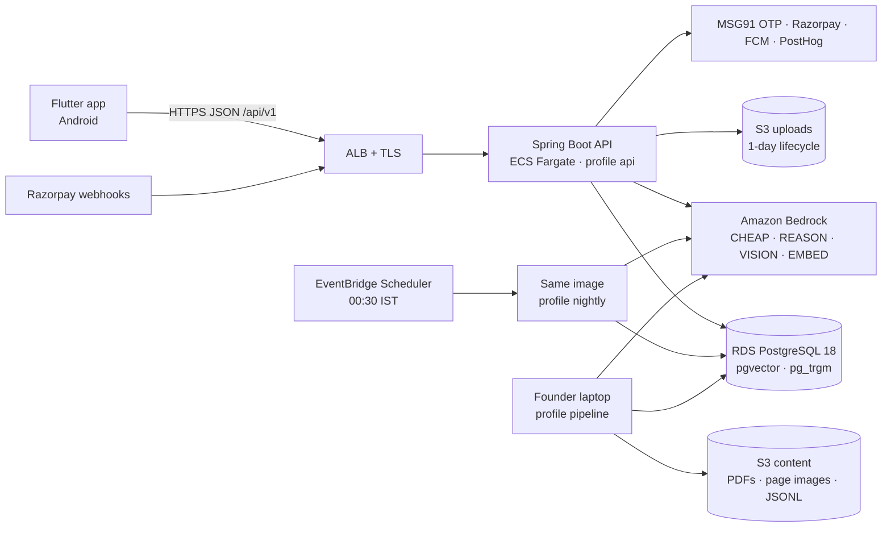
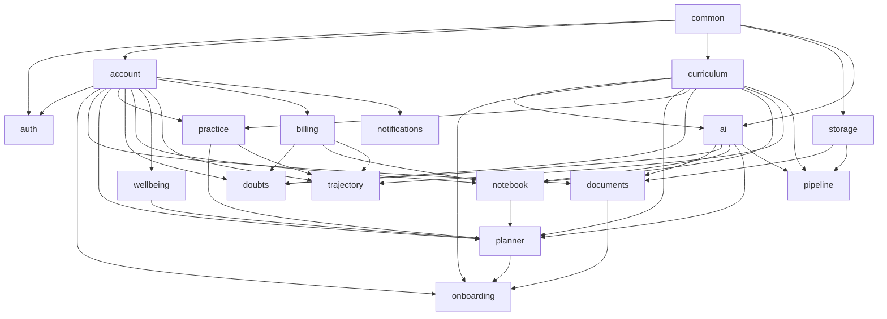

# MARG AI — Technical Plan v1.0 (D3)

**Status:** DRAFT — under founder review (PLAN D3, 2026-09-03). Becomes APPROVED when the founder
says so; the status line is the only thing that changes at that moment.
**Derived from:** docs/SPEC.md v2.0 (the contract). docs/DEV_SPEC.md §2–§12 was read as a worked
example and is confirmed, amended or replaced section by section in §0.3 below.
**Cite as:** `TECH_PLAN §n`. Rules, agents and slash commands that say "the D3-approved plan /
schema / API document in docs/" mean this file.

---

## 0. How to read this document

### 0.1 Precedence once approved

1. docs/SPEC.md — product contract. Wins every conflict.
2. docs/TECH_PLAN.md (this file) — how the product is built: architecture, data, API, AI, app,
   pipeline, infra, testing, conventions.
3. docs/DEV_SPEC.md §13 — working agreements (authoritative, unchanged).
4. docs/DEV_SPEC.md §2–§12 — reference only; where it differs from this file, this file wins.
5. docs/PLAN.md — the schedule; docs/TRACKER.md — live state; docs/DECISIONS.md — spec-silent choices.

Where this plan is silent, CLAUDE.md applies: choose the boring, maintainable option and record it
in DECISIONS.md. Where this plan turns out to conflict with SPEC, say so in the session and fix the
plan — never the behaviour.

### 0.2 What this plan changes about the repo today

Nothing in code. It fixes the shape that D4 onwards fills in: package layout (§1), the migration
schedule (§2.9), the endpoint contract (§3), the AI seam (§4.1) and the app skeleton (§5). It also
adds one line to CLAUDE.md's precedence list on approval, and its §14 is copied into DECISIONS.md.

### 0.3 Disposition of DEV_SPEC §2–§12

| DEV_SPEC | Verdict | Where in this plan | Why |
|---|---|---|---|
| §2 System architecture | Confirmed, amended | §1, §7 | Nightly work runs as a scheduled ECS task from the same image; Bedrock batch inference only above its minimum job size (§0.4 #2) |
| §2.1 Technology decisions | Confirmed | §4.9, §7.3 | Model IDs pinned in config; exact IDs to be confirmed in the console (DEV_SPEC §12 item 4) |
| §3 Data model | Amended | §2 | Enums as text + CHECK; HNSW index; arrays replaced by join tables where a foreign key matters; blocks get their own table; tables added for OTP, refresh tokens, sessions, consent, documents, notifications, idempotency, billing events, usage counters, audit |
| §4.1 AiClient | Replaced | §4.1 | One primitive (`complete`/`embed`) with typed feature tasks around it; ledger, breaker, retry and tier policy as decorators; REASON needs a route decision by construction |
| §4.2 Doubt pipeline | Confirmed, specified | §4.3 | Stages become named components with the enforcement point of each hard rule; polling instead of streaming until D69; cross-language cache hits rendered, not re-solved |
| §4.3 Nightly re-planner | Confirmed, specified | §4.5 | Deterministic candidate builder spelled out; batch mode conditional; exam-season modes computed here |
| §4.4 Error classification | Confirmed | §4.6 | Async listener + sweeper; student correction wins |
| §4.5 Evaluation | Amended | §4.10 | Live eval is human-launched and writes a committed stamp; CI verifies the stamp and runs the fake-client layer (§0.4 #3) |
| §5 API | Confirmed, extended | §3 | Endpoints added for consent, documents, devices, usage, danger zones, trajectory, paywall state, curriculum reads, export, admin |
| §6 Flutter | Confirmed, specified | §5 | Layering, packages, offline outbox, Hinglish locale |
| §6.1 Offline & sync | Confirmed with one open conflict | §5.6, §0.4 #4 | Offline instant verdict vs server-side judging needs a founder decision |
| §6.2 Notifications | Confirmed | §2.7, §4.5, §10 | One `notification_log` table drives cap, quiet periods and dispatch |
| §7 Content pipeline | Amended | §6 | AI-touching steps live in the Java server (profile `pipeline`) so they use `AiClient`; `pipeline/` holds founder-owned inputs and reports |
| §8 Feature rules | Confirmed verbatim | cited where used | They are product decisions consistent with SPEC |
| §9 Non-functional | Confirmed | §8–§10 | Streaming NFR deferred to D69 by PLAN precedence |
| §10 Build plan (6 weeks) | Superseded | docs/PLAN.md | Already stated in CLAUDE.md |
| §11 Out of scope | Confirmed | — | Identical to SPEC §12 |
| §12 Open items | Confirmed, extended | §13 | Adds batch-inference minimum, RDS PG18 availability, infra timeline |

### 0.4 Conflicts and gaps surfaced (not silently resolved)

1. **PLAN has no infrastructure day.** S3 `uploads/` is needed at D28, a deployed API and nightly
   task at D57/D60, backups and drills at D70. DEV_SPEC §10 W1 had "Terraform baseline"; PLAN
   supersedes §10 and dropped it. Proposal: founder workstream **F8** with the milestones in §7.6.
2. **Bedrock batch inference has a minimum job size** (100 records per job as last documented; to be
   confirmed in the console). A ≤50-student beta never reaches it, so "all nightly Bedrock calls use
   batch inference" (DEV_SPEC §2, SPEC §3 "batch processing for nightly jobs") is infeasible at
   beta scale. Proposal (§4.5, §4.11): on-demand calls with bounded concurrency below the threshold,
   batch above it, behind one config flag. The fair-use queue (DEV_SPEC §8.5) is a deferred
   on-demand queue, not a batch job.
3. **The eval gate cannot run in CI the way DEV_SPEC §4.5 describes.** CI holds no AWS credentials
   (DEV_SPEC §13.7: Claude never holds credentials; `aws` is denied) and `eval/.last-pass` is
   gitignored, so CI can neither call Bedrock nor check that a live run happened. Proposal (§4.10):
   the live eval is human-launched and writes a committed stamp; CI verifies the stamp against the
   AI-content hash and runs the fake-client layer of the suite. Decision lands at D23.
4. **Offline practice verdicts vs server-side judging.** SPEC §6.2 wants instant verdicts and offline
   play for today's blocks; SPEC §3 and CLAUDE.md say answers are judged server-side and
   `correct_key` never leaves the server. Both cannot hold for an offline session. Options in §5.6;
   founder decision needed before D31/D34.
5. **DEV_SPEC §7 "separate module `pipeline/`" vs `.claude/rules/pipeline.md` "AI calls go through
   `AiClient`".** Only satisfiable if the pipeline is Java or calls the server. Hence §6.1.
6. **DEV_SPEC §9 streaming vs PLAN D69.** PLAN schedules solver streaming at D69; until then answers
   are synchronous with polling (§3.6, §4.3). Resolved by PLAN precedence, recorded here.
7. **Three SPEC features have no PLAN day:** batch timetable photo and the weekly batch-confirm card
   (SPEC §6.7), NCERT-style seed generation to ≥30 usable questions per topic (SPEC §9.3), and
   in-app full mocks with the autopsy (SPEC §4 Phase 4, §7.1 — not excluded by §12). §12.2 proposes
   where they could land; scheduling them is the founder's call.
8. **CLAUDE.md precedence list has no slot for this plan** while three rules/agents already cite it.
   Fixed on approval (§0.2).

---

## 1. Architecture

### 1.1 System context



One deployable. The API, the nightly run, the content pipeline and the eval suite are the same
Spring Boot image started with different profiles (§1.2). No queue, no cache server, no second
service at beta; the places where a second instance would need one are listed in §13.3.

### 1.2 Run modes (Spring profiles)

| Profile | Started by | Does | AI client |
|---|---|---|---|
| `api` (default) | ECS service, `./mvnw spring-boot:run` locally | HTTP API, in-process notification dispatcher, hourly sweepers (image deletion, unclassified errors) | `fake` unless `bedrock` is also active |
| `nightly` | EventBridge → ECS RunTask at 00:30 IST; locally by hand | §4.5 re-plan for every user active in 14 days, weekly trajectory + patterns on Sundays, purge job, ai spend rollup; exits when done | as above |
| `pipeline` | Founder's laptop with AWS SSO, `java -jar server.jar --spring.profiles.active=pipeline <command>` | §6 content commands (picocli) | `bedrock` (human-launched) |
| `eval` | Founder's laptop, `BEDROCK_LIVE=1 ./mvnw -Peval verify` | §4.10 live eval suite | `bedrock` |
| `bedrock` | Added by the environment (`BEDROCK_LIVE=1` locally; task definition in AWS) | Swaps `FakeAiClient` for `BedrockAiClient`; cost breaker stays on | — |
| `local` | Developer default | Compose db, seed migrations (§2.9), fake SMS/FCM/Razorpay adapters that log | `fake` |

### 1.3 Modules and package layout

Modular monolith under `com.margai`. Each module is one top-level package with `api` (public
types other modules may use), `internal` (everything else) and, where it owns HTTP, `web`. Spring
Modulith verifies the boundaries in a test from D4 on (§8.2). A module owns its tables; other
modules read them only through the owning module's `api` package or through events (§1.7).

| Module | Owns (SPEC) | Tables (§2) | Depends on |
|---|---|---|---|
| `common` | error envelope, request id, IST clock, idempotency, pagination, config binding, message catalogs | `idempotency_keys` | — |
| `auth` | OTP login, tokens, rate limits, security filter chain (§8 screen 1) | `otp_challenges`, `refresh_tokens` | common, account |
| `account` | users, student profile, language, settings, minors' consent, export, deletion (§5 DOB/consent, §6.11, §8 screens 4, 13) | `users`, `student_profiles`, `parent_consents`, `user_devices`, `data_export_jobs` | common |
| `curriculum` | syllabus tree, prerequisites, archetype tracks, cutoffs, NCERT books/paragraphs, question bank, topic traps (§9) | `syllabus_nodes`, `syllabus_prerequisites`, `archetype_tracks`, `archetype_track_steps`, `cutoffs`, `ncert_books`, `ncert_paragraphs`, `questions`, `question_topics`, `question_anchors`, `topic_traps`, `topic_trap_evidence` | common |
| `onboarding` | interview state machine, syllabus check-in, first plan trigger (§5, §8 screens 2, 5) | (writes through account + planner apis) | common, account, curriculum, documents, planner |
| `documents` | photograph → read → confirm → delete pattern (§6.8, §8 screen 3) | `document_extractions` | common, account, ai, storage |
| `planner` | Today, blocks, nightly re-plan, negotiation chat, streaks, exam-season modes, batch position (§6.1, §6.7, §8 screens 7, 14) | `daily_plans`, `plan_blocks`, `mentor_messages`, `batch_positions` | common, account, curriculum, ai, notebook.api, practice.api, wellbeing.api |
| `practice` | sessions, question serving, server judging, events, diagnostic (§5.4, §6.2, §8 screens 6, 8) | `practice_sessions`, `practice_session_questions`, `practice_events`, `chapter_status` | common, account, curriculum |
| `doubts` | solve pipeline orchestration, history, follow-ups, reports, free-tier meter (§6.3, §8 screen 9) | `doubts`, `doubt_evidence`, `doubt_cache`, `doubt_daily_usage` | common, account, curriculum, ai, billing.api |
| `notebook` | error capture, classification, SRS, healed, danger zones, patterns (§6.4, §8 screen 10) | `error_entries`, `srs_reviews`, `notebook_patterns` | common, account, curriculum, ai, billing.api |
| `wellbeing` | mood chip, slump inference (§6.6) | `wellbeing_signals` | common, account |
| `trajectory` | weekly predicted band, peer line, deep report (§6.5, §8 screen 11) | `trajectory_snapshots` | common, account, curriculum, practice.api, billing.api |
| `billing` | subscriptions, Razorpay, webhooks, paywall triggers, cancel/refund, auto-pause (§6.9, §8 screen 12) | `subscriptions`, `payments`, `billing_events`, `paywall_impressions` | common, account |
| `notifications` | FCM devices, scheduling, 2/day cap, quiet periods, dispatcher (§6.10) | `notification_log` | common, account |
| `ai` | `AiClient`, Bedrock/Fake, ledger, breaker, router, retrieval, prompts, verification, embeddings (§4) | `ai_calls`, `ai_spend_daily`, `audit_queue` | common, curriculum |
| `storage` | S3 port (uploads, content), signed URLs, deletion | — | common |
| `pipeline` | §6 CLI commands | — | ai, curriculum, storage |
| `ops` | founder admin peek, audit-queue review, cost views (PLAN D75) | — | every `api` package |

`chapter_status` sits in `practice` because ability estimates are written by practice and the
diagnostic; onboarding seeds it through `practice.api`. `audit_queue` sits in `ai` because every
producer of audit items is an AI outcome.

### 1.4 Dependency rules



Rules, enforced by the Modulith test from D4:

- Arrows point from the module that is used to the module that uses it; the graph above is acyclic
  and stays so. A new edge needs a line in DECISIONS.md.
- Only `ai` imports `software.amazon.awssdk.services.bedrock*`. Only `storage` imports S3. Only
  `billing` imports the Razorpay SDK; only `notifications` the FCM client; only `auth` the SMS client.
- Feature modules never read another module's tables directly; they call `<module>.api` or listen to
  events. `ops` is the one exception: read-only queries across `api` packages.
- Controllers live in `<module>.web`, are thin, and map to one service call.

### 1.5 Request lifecycle

1. ALB terminates TLS, forwards to the single task with `X-Forwarded-For`.
2. `RequestIdFilter` takes `X-Request-Id` or mints one; puts `request_id` into the MDC and echoes
   it back.
3. Spring Security (stateless): bearer JWT → principal `{user_id, role, language}`; unauthenticated
   routes are `/auth/otp/*`, `/auth/refresh`, `/billing/webhook`, `/actuator/health`.
4. `RateLimitFilter`: in-process token buckets keyed by user id (or phone/IP for `/auth/*`), limits
   from config (§3.4).
5. `IdempotencyFilter` on routes marked idempotent: replays a stored response for a seen
   `Idempotency-Key` (§3.5).
6. Controller validates the DTO (Bean Validation) and calls one service method.
7. Service runs in one transaction; AI calls happen outside the transaction (§4.2) with their own
   ledger rows.
8. `ApiExceptionHandler` maps any exception to the envelope `{error:{code, message_en,
   message_user_lang}}` (§3.3) with the message catalogs in the principal's language.
9. Response DTOs are records serialised in snake_case; timestamps ISO-8601 UTC; dates are IST
   calendar dates (§11.1).

### 1.6 Nightly execution model

- EventBridge Scheduler fires at 19:00 UTC (00:30 IST) and runs the image as an ECS task with
  `--spring.profiles.active=nightly,bedrock`. The task processes users in a fixed order, commits per
  user, and exits. Re-running it is safe: `daily_plans` is unique on `(user_id, plan_date)` and a
  rerun overwrites only plans it generated itself (`generated_by = nightly`), never a renegotiated one.
- If no plan exists for a user at `GET /plan/today`, the API builds the deterministic fallback on the
  spot and marks it `generated_by = fallback` (DEV_SPEC §8.1). A missing nightly run is visible as
  an alarm (§10.4), never as an empty morning.
- Locally: `./mvnw spring-boot:run -Dspring-boot.run.profiles=local,nightly` runs the same code
  against the compose db with `FakeAiClient`.
- Notifications are not sent by the nightly task. It writes `notification_log` rows with per-user
  send times; the API's in-process dispatcher (every 60 s) sends what is due. One mechanism serves
  the 07:00 plan, the 20:30 streak-save, SRS-due and Sunday trajectory (§2.7).

### 1.7 Cross-module communication

Spring application events, published after commit (`@TransactionalEventListener`) and handled in
the same JVM. They carry ids, not entities.

| Event | Published by | Consumed by | Effect |
|---|---|---|---|
| `PracticeAnswerRecorded` | practice | notebook | wrong answer → `error_entries` row + async classification (§4.6) |
| `PracticeSessionFinished` | practice | planner, trajectory | block status, ability updates already committed; planner marks block done |
| `DoubtSolved` | doubts | planner | weak-signal count per node for the next re-plan ("three Optics doubts") |
| `ErrorCauseUpdated` | notebook | planner | re-learn block candidate when a cause is upgraded |
| `SubscriptionChanged` | billing | doubts, notebook, trajectory | limits and locks re-evaluated on next request |
| `DocumentConfirmed` | documents | onboarding, planner | scorecard/marksheet fields into profile; timetable into batch positions |
| `UserDeleted` | account | every module | anonymise/purge own rows (§9.6) |
| `PlanChanged` | planner | notifications | reschedule the morning notification if the time moved |

Events are at-least-once within the process; every listener is idempotent on its natural key.
If the JVM dies mid-listener the hourly sweeper in the owning module repairs the gap (e.g. wrong
answers without an `error_entries` row).

### 1.8 Screen and feature ownership (coverage check)

| SPEC §8 screen | Owning module | Also touches |
|---|---|---|
| 1 Splash/Login | auth | account (profile on first login) |
| 2 Onboarding interview | onboarding | curriculum (grid), practice.api (chapter status), account |
| 3 Scorecard / marksheet / timetable capture + confirm | documents | onboarding, planner (timetable) |
| 4 Parent consent | account | auth (consent OTP) |
| 5 First-plan reveal | onboarding | planner (deterministic first plan), trajectory (target line) |
| 6 Diagnostic intro + session | practice | planner (day-1 block if deferred) |
| 7 Today | planner | wellbeing (mood chip), trajectory (mini card), notifications |
| 8 Practice session + summary | practice | notebook (sent-to-notebook list) |
| 9 Doubt capture + answer + history | doubts | ai, curriculum (anchor view), billing (meter/paywall) |
| 10 Notebook views | notebook | curriculum (weightage for danger zones), billing (30-error cap) |
| 11 Weekly report | trajectory | notebook (patterns), billing (deep version) |
| 12 Paywall · subscription management | billing | — |
| 13 Profile & settings | account | billing, notifications (time), planner (hours/target edits) |
| 14 Exam-mode variants of Today | planner | notifications (silence protocol) |
| 15 Result flows | — | Phase 2 (SPEC §12); only the auto-pause rule ships, in billing |

Every SPEC §6 feature maps the same way: §6.1 planner · §6.2 practice · §6.3 doubts · §6.4 notebook
· §6.5 trajectory · §6.6 wellbeing · §6.7 planner + documents · §6.8 documents · §6.9 billing ·
§6.10 notifications · §6.11 account + billing.

## 2. Data model

_Written in task 3._

## 3. API surface

_Written in task 4._

## 4. AI pipeline

_Written in task 5._

## 5. Flutter app

_Written in task 6._

## 6. Content pipeline

_Written in task 6._

## 7. Infrastructure (AWS ap-south-1)

Infra code is founder-run: `infra/` is a human-only path (`scripts/block-paths.sh`, DEV_SPEC §13.3)
and `aws *` is denied to Claude. This section is the specification the founder builds from
(Terraform, one small stack), in the order §7.6 gives. Claude may draft Terraform in a separate,
explicitly permitted session; it never applies it.

### 7.1 Environments

| Name | Where | Data | AI | Purpose |
|---|---|---|---|---|
| `local` | developer laptop, docker compose | compose Postgres, seed migrations | `FakeAiClient`; `BEDROCK_LIVE=1` opt-in with the breaker on | every PLAN day's build loop |
| `beta` | AWS ap-south-1, one account | RDS | Bedrock via global inference profiles | the 50-student closed beta and everything from D57 on |

No staging until public launch (PARKED). Local is the pre-production environment; the beta stack is
rebuilt from Terraform if it drifts.

### 7.2 Components

| Component | Choice | Notes |
|---|---|---|
| Network | One VPC, two AZs; public subnets for the ALB and the Fargate tasks; private subnets for RDS | Tasks in public subnets with a security group that only accepts the ALB avoid a NAT gateway (the classic ~₹3k/month surprise). S3 gateway endpoint is free and added. |
| Ingress | ALB, ACM certificate, Route 53 record on the final domain (TRACKER F7) | HTTP → HTTPS redirect; health check `/actuator/health` |
| Compute | ECS Fargate service, 1 task, 1 vCPU / 2 GB, ARM64 (Graviton) | Java 25 with `-XX:MaxRAMPercentage=70`. Rolling deploy with min 100% / max 200% |
| Nightly | ECS RunTask from EventBridge Scheduler, same task definition with the `nightly,bedrock` profiles, 2 vCPU / 4 GB | 60-minute timeout; failure alarm (§10.4) |
| Registry | ECR, one repository, images tagged with the git SHA | lifecycle: keep last 20 |
| Database | RDS PostgreSQL 18, `db.t4g.small`, single-AZ, 20 GB gp3, automated backups 7 days, deletion protection | `pgvector` and `pg_trgm` created by migration V1. PG18 availability on RDS and its pgvector version are a console check (§13.2) |
| Object storage | `margai-beta-uploads`: SSE-S3, block public access, lifecycle expires objects after 1 day, prefixes `uploads/doubts/`, `uploads/documents/`, `exports/`. `margai-beta-content`: source PDFs, page images, JSONL artefacts, weekly logical dumps; versioning on | The hard rule "uploaded images: uploads bucket only" (CLAUDE.md) maps to the first bucket |
| AI | Bedrock model access enabled for the CHEAP, REASON, VISION and EMBED models named in config; global cross-region inference profiles called from ap-south-1 | Data may be processed outside India: disclosed in the privacy copy (SPEC §6.11) |
| Config and secrets | SSM Parameter Store under `/margai/beta/…`; SecureString for secrets | injected into the task as environment variables through the task definition's `secrets` (`valueFrom` SSM ARN). No library, no runtime fetch; a config change is a task restart (~2 min) |
| Scheduling | EventBridge Scheduler: nightly 19:00 UTC; weekly dump Sunday 21:00 UTC | both target ECS RunTask |
| Logs and metrics | CloudWatch Logs (JSON), 30-day retention; CloudWatch metrics from Micrometer; AWS Budgets for the Bedrock daily spend alarm | §10 |
| Push, SMS, payments, analytics | FCM (Firebase project), MSG91 (DLT template via TRACKER F1), Razorpay (KYC via F1), PostHog Cloud | credentials in SSM only |

### 7.3 Configuration and secrets layout

```
/margai/beta/db/url                    String       jdbc:postgresql://…/margai
/margai/beta/db/username               String
/margai/beta/db/password               SecureString
/margai/beta/jwt/secret                SecureString 256-bit, base64
/margai/beta/jwt/secret_previous       SecureString rotation window (§9.2)
/margai/beta/otp/pepper                SecureString
/margai/beta/msg91/auth_key            SecureString
/margai/beta/msg91/template_id         String
/margai/beta/razorpay/key_id           String
/margai/beta/razorpay/key_secret       SecureString
/margai/beta/razorpay/webhook_secret   SecureString
/margai/beta/fcm/service_account_json  SecureString
/margai/beta/posthog/api_key           SecureString
/margai/beta/ai/tier/cheap             String       model id, pinned version
/margai/beta/ai/tier/reason            String
/margai/beta/ai/tier/vision            String
/margai/beta/ai/embed/model            String
/margai/beta/ai/prices_json            String       {model_id: {input, output, cache_read, cache_write} per Mtok, USD}
/margai/beta/ai/usd_inr                String
/margai/beta/ai/budget/user_daily_paise String
/margai/beta/ai/budget/global_daily_paise String
/margai/beta/ai/batch_min_records      String       0 disables batch mode
/margai/beta/limits/…                  String       rate limits, free-tier counts (§3.4, §4.4)
/margai/beta/flags/…                   String       feature flags (§11.6)
/margai/beta/exam/date                 String       NEET date for the season (DEV_SPEC §8.6)
```

Every parameter maps to one `@ConfigurationProperties` field under the `margai.*` prefix (§11.5);
`application.yml` carries the local defaults for non-secret values and nothing for secrets. Model
IDs, prices, limits, flags and prompt versions never appear as code constants (`.claude/rules`).

### 7.4 Identity and access

- Task role: `bedrock:InvokeModel`, `bedrock:InvokeModelWithResponseStream`, `bedrock:CreateModelInvocationJob`
  and read on the batch job, scoped to the configured model ARNs; `s3:GetObject/PutObject/DeleteObject`
  on the two buckets; `logs:*` on its log group; `cloudwatch:PutMetricData`. Nothing else.
- Execution role: ECR pull, SSM `GetParameters` on `/margai/beta/*`, KMS decrypt for SecureStrings.
- GitHub Actions deploy role via OIDC (no long-lived keys): ECR push and `ecs:UpdateService` only.
  Deploy is a `workflow_dispatch` job the founder triggers after merging; automatic deploy on `main`
  is a D72 decision.
- Founder's laptop: AWS SSO profile for `pipeline`, `eval` and the D5 smoke test. No static keys
  anywhere, including `.env` files (CLAUDE.md).

### 7.5 Backups and recovery

- RDS automated snapshots, 7 days, plus a weekly `pg_dump` (custom format) from a scheduled ECS
  task into `margai-beta-content/dumps/`, 8 weeks retained.
- Restore drill at D70: new RDS from snapshot, point a test task at it, run the migration check and
  a read-only smoke; documented as a runbook in `docs/runbooks/`.
- S3 content bucket versioned; uploads bucket is ephemeral by design (nothing to back up).
- Recovery objectives for beta: RPO 24 h (nightly snapshot), RTO 2 h (Terraform re-apply + restore).

### 7.6 Infrastructure timeline (proposed founder workstream F8)

| By PLAN day | Needed for | Build |
|---|---|---|
| D5 | one live Bedrock smoke call | AWS account, Bedrock model access, SSO profile on the laptop |
| D14 | NCERT PDFs in S3 | content bucket |
| D28 | scorecard upload with 24-hour deletion | uploads bucket with the 1-day lifecycle, IAM for local dev |
| D55 | nightly loop, D57 two-device morning plans, D60 three unattended days | the full beta stack: VPC, RDS, ECR, ECS service + scheduled task, ALB + certificate, SSM parameters, log group |
| D64 | export and deletion promises | exports prefix, purge job scheduled |
| D70 | failure drills | backups, alarms, restore runbook |
| D73 | dashboards | CloudWatch dashboard, PostHog project, AWS Budgets alarm |
| D74 | Play Store internal track | release signing key (human-held), `--dart-define` production API URL |

### 7.7 Beta cost estimate (monthly, order of magnitude)

| Item | Estimate |
|---|---|
| Fargate 1 vCPU / 2 GB ARM, 24×7 | ≈ $30 |
| ALB | ≈ $18 |
| RDS `db.t4g.small` + 20 GB | ≈ $28 |
| Nightly task, dumps, S3, CloudWatch, ECR | ≈ $8 |
| Bedrock, 50 active students | bounded by the breaker (50 × ₹25/day ≈ ₹37,500 worst case); expected ₹5k–10k with a 55% cache rate |
| MSG91 OTP, Razorpay fees, PostHog free tier, FCM | usage-based, small |

Roughly ₹7,500 of fixed infrastructure per month plus AI spend that the breaker caps. Figures are
list prices at the time of writing and are re-estimated at D65 with real ledger data.

## 8. Testing strategy

_Written in task 7._

## 9. Security and privacy

_Written in task 7._

## 10. Observability and cost operations

_Written in task 7._

## 11. Cross-cutting conventions

_Written in task 7._

## 12. PLAN mapping and gaps

_Written in task 7._

## 13. Risks and open questions for the founder

_Written in task 7._

## 14. Decisions to record in DECISIONS.md on approval

_Collected as sections land; finalised in task 8._
